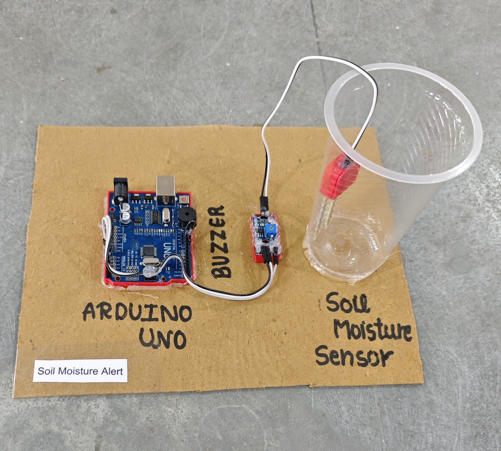

# 💧 Soil Moisture Alert

This project demonstrates a simple **soil moisture alert system** using an **Arduino**, a **soil moisture sensor**, an **LED**, and a **buzzer**.  
When the soil becomes **too dry**, the system **alerts the user** with a buzzer sound and LED indication.

## 🧩 Required Components
- 1 x Arduino UNO  
- 1 x Soil Moisture Sensor Module  
- 1 x Buzzer  
- 1 x LED (Red)  
- 1 x 220Ω Resistor (for LED)  
- Breadboard & Jumper Wires  
- USB Cable / Power Supply  
- 3D Model (Reference): [**Thingiverse**](https://www.thingiverse.com)

## 🔌 Connections

<table>
  <thead>
    <tr>
      <th align="center">Component</th>
      <th align="center">Component Pin</th>
      <th align="center">Arduino Pin</th>
    </tr>
  </thead>
  <tbody>
    <tr>
      <td rowspan="3" align="center"><b>Soil Moisture Sensor Module</b></td>
      <td align="center">VCC</td>
      <td align="center">5V</td>
    </tr>
    <tr>
      <td align="center">GND</td>
      <td align="center">GND</td>
    </tr>
    <tr>
      <td align="center">AO (Analog Out)</td>
      <td align="center">A0</td>
    </tr>
    <tr>
      <td rowspan="2" align="center"><b>Buzzer</b></td>
      <td align="center">+ (Signal)</td>
      <td align="center">Pin 11</td>
    </tr>
    <tr>
      <td align="center">- (GND)</td>
      <td align="center">GND</td>
    </tr>
    <tr>
      <td rowspan="2" align="center"><b>LED</b></td>
      <td align="center">Anode (+) via 220Ω Resistor</td>
      <td align="center">Pin 12</td>
    </tr>
    <tr>
      <td align="center">Cathode (-)</td>
      <td align="center">GND</td>
    </tr>
  </tbody>
</table>

> ⚠️ **Important:**  
> - Always use a **220Ω resistor** with the LED to prevent damage.  
> - Adjust the soil moisture sensor potentiometer if using digital output modules.

## 💻 Software Used
- [**Arduino IDE**](https://www.arduino.cc/en/software/)

## 📁 Project Files
- 💻 [**Source Code**](./code/Soil_Moisture_Alert.ino)  
- 📸 [**Project Photo**](./photos/Soil_Moisture_Alert.jpg)

## 📸 Demo

  

## ⚙️ Working
- The soil moisture sensor outputs an **analog value (0–1023)** based on soil condition.  
- Arduino reads the value from **A0**.  
- When the soil is **too dry** (value crosses the threshold):  
  - The **buzzer turns ON**.  
  - The **LED turns ON**.  
- When the soil moisture is sufficient:  
  - The **buzzer and LED turn OFF**.  
- Live values can be monitored on the **Serial Monitor** for easy calibration.

## 🚀 Future Improvements
- Add **LCD/OLED display** for moisture percentage.  
- Add **IoT alerts** using ESP8266/ESP32 (Telegram / App notification).  
- Add **SMS alert** using GSM module.  
- Add **battery power + low power mode**.  
- Combine with **automatic pump control** for full irrigation automation.

