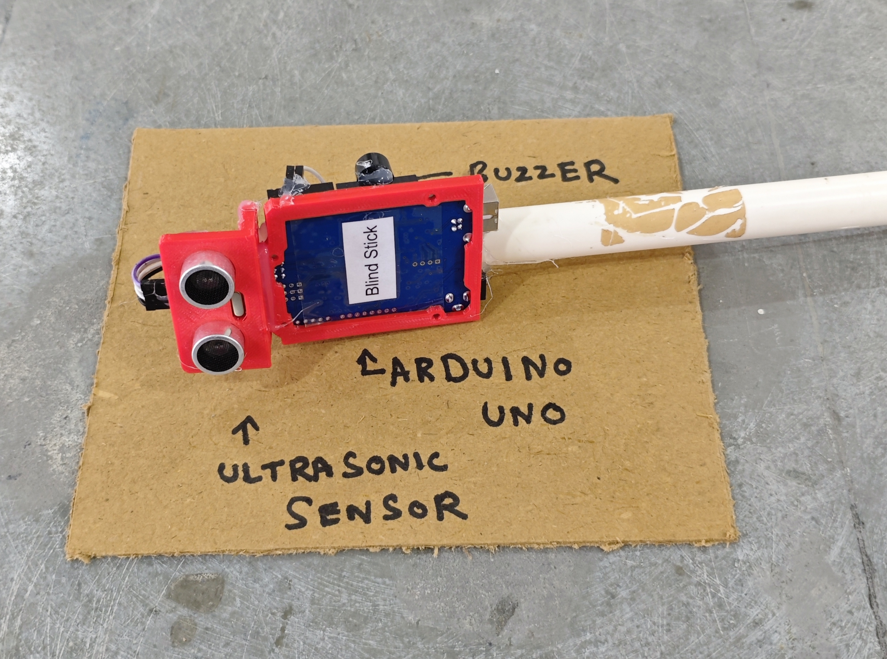

# 🦯 Blind Stick

This project demonstrates a simple **ultrasonic-based obstacle detection system** for visually impaired assistance using **Arduino** and a **buzzer alert**.  
When an obstacle is detected **within a short distance**, the buzzer **beeps to warn the user**.

## 🧩 Required Components
- 1 x Arduino UNO  
- 1 x Ultrasonic Sensor (HC-SR04)  
- 1 x Buzzer  
- Breadboard & Jumper Wires  
- USB Cable / Power Supply  
- 3D Model (Reference): [**Thingiverse**](https://www.thingiverse.com)

## 🔌 Connections

<table>
  <thead>
    <tr>
      <th align="center">Component</th>
      <th align="center">Component Pin</th>
      <th align="center">Arduino Pin</th>
    </tr>
  </thead>
  <tbody>
    <tr>
      <td rowspan="4" align="center"><b>Ultrasonic Sensor (HC-SR04)</b></td>
      <td align="center">VCC</td>
      <td align="center">5V</td>
    </tr>
    <tr>
      <td align="center">GND</td>
      <td align="center">GND</td>
    </tr>
    <tr>
      <td align="center">Trig</td>
      <td align="center">Pin 3</td>
    </tr>
    <tr>
      <td align="center">Echo</td>
      <td align="center">Pin 2</td>
    </tr>
    <tr>
      <td rowspan="2" align="center"><b>Buzzer</b></td>
      <td align="center">+ (Signal)</td>
      <td align="center">Pin 11</td>
    </tr>
    <tr>
      <td align="center">- (GND)</td>
      <td align="center">GND</td>
    </tr>
  </tbody>
</table>

> ⚠️ **Note:**  
> - Keep the ultrasonic sensor facing forward for accurate obstacle detection.  
> - Avoid blocking the sensor with wires or casing.

## 💻 Software Used
- [**Arduino IDE**](https://www.arduino.cc/en/software/)

## 📁 Project Files
- 💻 [**Source Code**](./code/Blind_Stick.ino)  
- 📸 [**Project Photo**](./photos/Blind_Stick.jpg)

## 📸 Demo

  

## ⚙️ Working
- The ultrasonic sensor sends sound waves and measures the reflected echo time.  
- Arduino converts echo time into **distance (cm)**.  
- When an obstacle is detected **within ~30 cm**:  
  - The buzzer **beeps continuously** to alert the user.  
- When no obstacle is nearby:  
  - The buzzer remains **silent**.  
- The beeping pattern helps the user sense proximity to obstacles.

## 🚀 Future Improvements
- Add **vibration motor** for silent alerts.  
- Add **distance-based beep rate** (faster beeps when closer).  
- Add **LED indicator** for visual debugging.  
- Integrate **GPS module** for location tracking.  
- Use **ESP32** for IoT-based emergency alerts.
