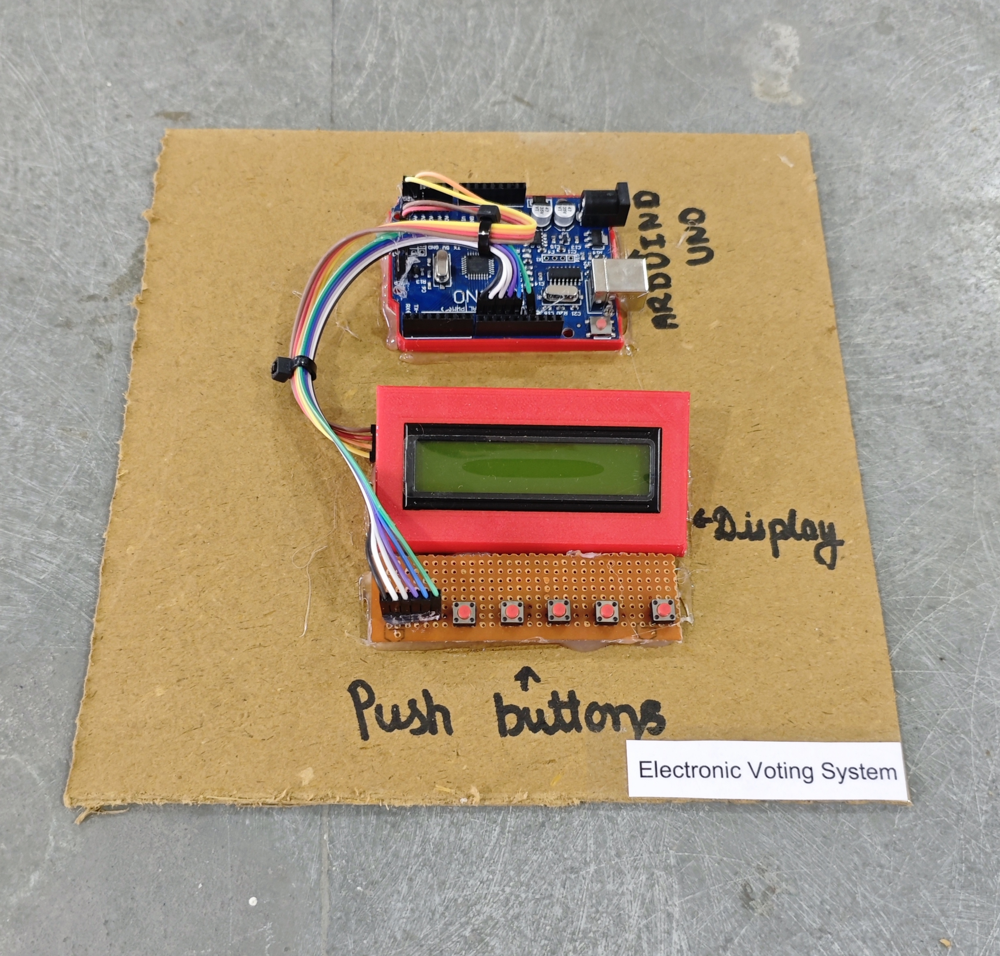

# 🗳️ Electronic Voting System (EVM)

This project demonstrates a simple **Electronic Voting System (EVM)** using **Arduino**, **push buttons**, and an **I2C LCD display**.  
Users can cast votes for **four candidates (A, B, C, D)**, and the system displays **live vote counts** and the **winner** on demand.

> ⚠️ *This is an educational prototype and **not** a real voting machine. Candidate names are generic (A, B, C, D) to avoid any controversy.*

## 🧩 Required Components
- 1 x Arduino UNO  
- 1 x 16x2 I2C LCD Display (PCF8574, Address: 0x27)  
- 5 x Push Buttons (4 for voting + 1 for result)  
- Breadboard & Jumper Wires  
- USB Cable / Power Supply  
- 3D Model (Reference): [**Thingiverse**](https://www.thingiverse.com)

## 🔌 Connections

<table>
  <thead>
    <tr>
      <th align="center">Component</th>
      <th align="center">Button / Pin Name</th>
      <th align="center">Arduino Pin</th>
    </tr>
  </thead>
  <tbody>
    <tr>
      <td rowspan="5" align="center"><b>Push Buttons</b></td>
      <td align="center">Candidate A</td>
      <td align="center">Pin 12</td>
    </tr>
    <tr>
      <td align="center">Candidate B</td>
      <td align="center">Pin 11</td>
    </tr>
    <tr>
      <td align="center">Candidate C</td>
      <td align="center">Pin 10</td>
    </tr>
    <tr>
      <td align="center">Candidate D</td>
      <td align="center">Pin 9</td>
    </tr>
    <tr>
      <td align="center">Result Button</td>
      <td align="center">Pin 8</td>
    </tr>
    <tr>
      <td colspan="3" align="center">
        Other side of <b>all buttons</b> → GND (Active LOW using INPUT_PULLUP)
      </td>
    </tr>
    <tr>
      <td rowspan="4" align="center"><b>I2C LCD</b></td>
      <td align="center">VCC</td>
      <td align="center">5V</td>
    </tr>
    <tr>
      <td align="center">GND</td>
      <td align="center">GND</td>
    </tr>
    <tr>
      <td align="center">SDA</td>
      <td align="center">A4</td>
    </tr>
    <tr>
      <td align="center">SCL</td>
      <td align="center">A5</td>
    </tr>
  </tbody>
</table>

> ℹ️ **Button Logic (Active LOW using INPUT_PULLUP):**  
> - Not Pressed → HIGH  
> - Pressed → LOW  

> ⚠️ **Wiring Tip:**  
> Connect **one terminal of each push button to the assigned Arduino pin**, and connect the **other terminal of all buttons to GND**.  
> No external resistors are required because `INPUT_PULLUP` is used.

## 💻 Software Used
- [**Arduino IDE**](https://www.arduino.cc/en/software/)

## 📚 Dependencies
Install from Arduino Library Manager:
- [**LiquidCrystal I2C**](https://github.com/johnrickman/LiquidCrystal_I2C)  
- [**Wire Library**](https://www.arduino.cc/en/reference/wire) *(Built-in)*

## 📁 Project Files
- 💻 [**Source Code**](./code/Electronic_Voting_System.ino)  
- 📸 [**Project Photo**](./photos/Electronic_Voting_System.jpg)

## 📸 Demo

  

## ⚙️ Working
- The LCD shows candidate labels **A, B, C, D** on the first row.  
- Each vote button increases the count for its candidate.  
- The second row displays **live vote counts**.  
- Press the **Result button** to display the **winner**.  
- If votes are equal, it shows **Tie / No Result**.  
- After displaying results, all vote counts are **reset automatically**.

## 🚀 Future Improvements
- Store votes in **EEPROM** to survive power loss.  
- Add **admin password / reset protection**.  
- Add **buzzer feedback** on each vote.  
- Add **SD card logging** for audit trail.  
- Integrate **ESP8266/ESP32** for remote result monitoring.
