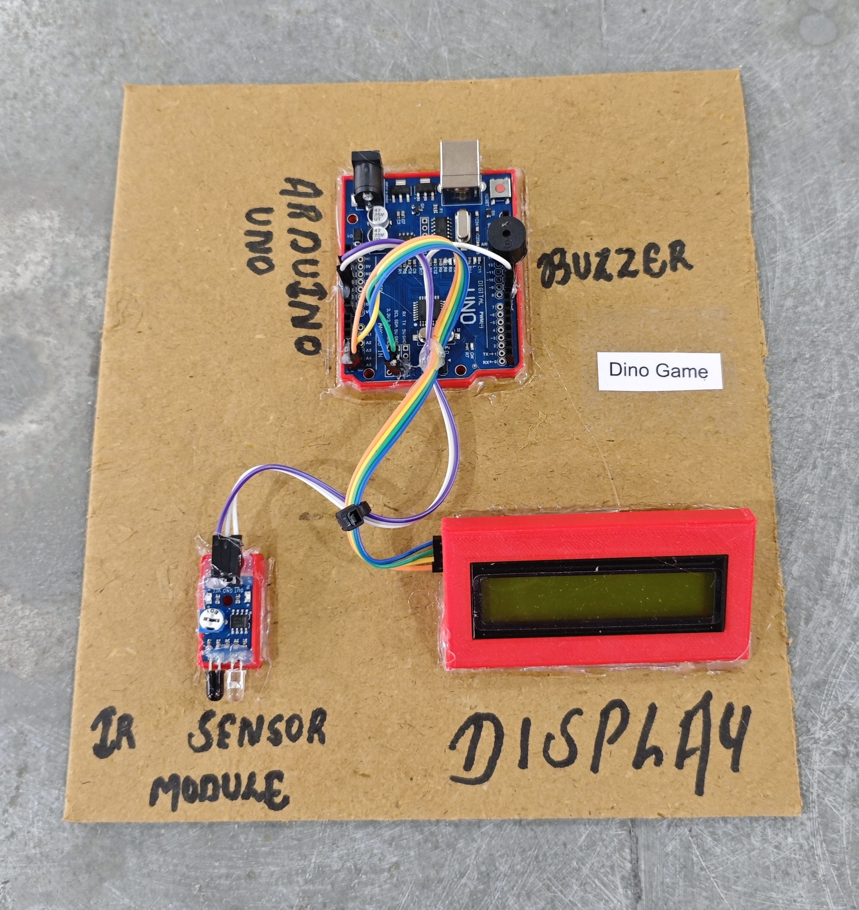

# 🦖 Dino Game

This project implements an interactive Dino game using Arduino, an LCD display, and an IR sensor for motion-based input control.  
The IR sensor detects hand movement to trigger the jump action, while the system manages obstacle generation, collision detection, and score tracking logic.  
It demonstrates real-time input processing, timing control, and state-based game programming in embedded systems.

## 🧩 Required Components
- 1 x Arduino UNO  
- 1 x 16x2 I2C LCD Display (PCF8574, Address: 0x27)  
- 1 x IR Sensor Module (used as jump input)  
- 1 x Buzzer  
- Breadboard & Jumper Wires  
- USB Cable / Power Supply  
- 3D Model (Reference): [**Thingiverse**](https://www.thingiverse.com)

## 🔌 Connections

<table>
  <thead>
    <tr>
      <th align="center">Component</th>
      <th align="center">Component Pin</th>
      <th align="center">Arduino Pin</th>
    </tr>
  </thead>
  <tbody>
    <tr>
      <td rowspan="3" align="center"><b>IR Sensor Module</b></td>
      <td align="center">VCC</td>
      <td align="center">5V</td>
    </tr>
    <tr>
      <td align="center">GND</td>
      <td align="center">GND</td>
    </tr>
    <tr>
      <td align="center">OUT</td>
      <td align="center">Pin 8</td>
    </tr>
    <tr>
      <td rowspan="2" align="center"><b>Buzzer</b></td>
      <td align="center">+ (Signal)</td>
      <td align="center">Pin 11</td>
    </tr>
    <tr>
      <td align="center">- (GND)</td>
      <td align="center">GND</td>
    </tr>
    <tr>
      <td rowspan="4" align="center"><b>I2C LCD</b></td>
      <td align="center">VCC</td>
      <td align="center">5V</td>
    </tr>
    <tr>
      <td align="center">GND</td>
      <td align="center">GND</td>
    </tr>
    <tr>
      <td align="center">SDA</td>
      <td align="center">A4</td>
    </tr>
    <tr>
      <td align="center">SCL</td>
      <td align="center">A5</td>
    </tr>
  </tbody>
</table>

> ℹ️ **Note:**  
> - Adjust the **IR sensor sensitivity** so that hand wave triggers a jump reliably.  
> - Keep the IR sensor facing forward for easy detection.

## 💻 Software Used
- [**Arduino IDE**](https://www.arduino.cc/en/software/)

## 📚 Dependencies
Install from Arduino Library Manager:
- [**LiquidCrystal I2C**](https://github.com/johnrickman/LiquidCrystal_I2C)  
- [**Wire Library**](https://www.arduino.cc/en/reference/wire) *(Built-in)*  

## 📁 Project Files
- 💻 [**Source Code**](./code/Dino_Game.ino)  
- 📸 [**Project Photo**](./photos/Dino_Game.jpg)

## 📸 Demo

  

## ⚙️ Working
- The LCD shows the **dinosaur character** and **moving obstacles**.  
- The player waves their hand in front of the **IR sensor** to make the dinosaur **jump**.  
- Obstacles (cactus or crow) move from **right to left** across the screen.  
- If the dinosaur **hits an obstacle**, the game ends and the **buzzer beeps**.  
- The **score increases** for each obstacle avoided.  
- The game can be **restarted by waving** at the IR sensor after Game Over.

## 🚀 Future Improvements
- Add **physical jump button** as an alternative control.  
- Add **high-score memory** using EEPROM.  
- Add **sound effects** during jump and scoring.  
- Add **difficulty selection** at start.  
- Replace IR with **ultrasonic sensor** for more reliable gesture input.

