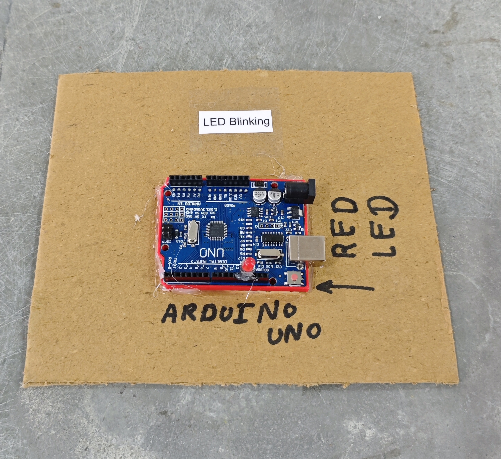

# 💡 LED Blinking

This project demonstrates basic digital output control by blinking an LED using timed delays.  
It introduces fundamental concepts such as pin configuration, digitalWrite operations, and timing using delay functions.  
This serves as an entry-level project for understanding microcontroller output control.

## 🧩 Required Components
- 1 x Arduino UNO  
- 1 x LED *(Onboard LED on Pin 13 can also be used)*  
- 1 x 220Ω Resistor *(if using external LED)*  
- Breadboard & Jumper Wires *(if using external LED)*  
- USB Cable / Power Supply  
- 3D Model (Reference): [**Thingiverse**](https://www.thingiverse.com)

## 🔌 Connections

<table>
  <thead>
    <tr>
      <th align="center">Component</th>
      <th align="center">Wire / Pin</th>
      <th align="center">Arduino Pin</th>
    </tr>
  </thead>
  <tbody>
    <tr>
      <td rowspan="2" align="center"><b>LED</b></td>
      <td align="center">Anode (+) via 220Ω resistor</td>
      <td align="center">Pin 13</td>
    </tr>
    <tr>
      <td align="center">Cathode (–)</td>
      <td align="center">GND</td>
    </tr>
  </tbody>
</table>

> ℹ️ **Note:**  
> - If you use the **onboard LED**, no external wiring is required.  
> - If using an external LED, always connect a **220Ω resistor** in series.

## 💻 Software Used
- [**Arduino IDE**](https://www.arduino.cc/en/software/)

## 📁 Project Files
- 💻 [**Source Code**](./code/LED_Blinking.ino)  
- 📸 [**Project Photo**](./photos/LED_Blinking.jpg)

## 📸 Demo

  

## ⚙️ Working
- The Arduino turns the LED **ON** for 1 second.  
- Then it turns the LED **OFF** for 1 second.  
- This cycle repeats continuously, creating a blinking effect.

## 🚀 Future Improvements
- Add **button control** to start/stop blinking.  
- Change blink speed using a **potentiometer**.  
- Use **multiple LEDs** for patterns.  
- Control LED using **Bluetooth/Wi-Fi**.

