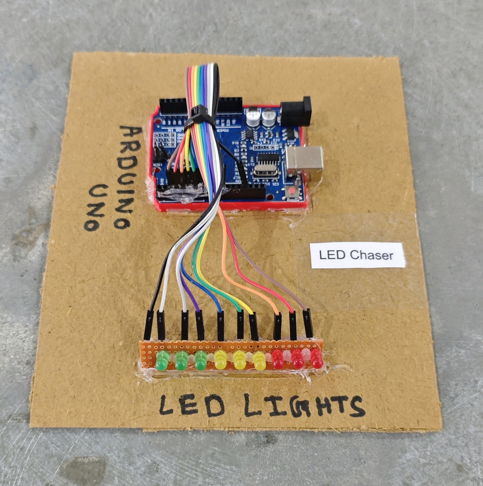

# ✨ LED Chaser

This project implements a multi-pattern LED chaser system using Arduino and nine digital output channels.  
The system generates various dynamic lighting effects such as forward chase, reverse chase, ping-pong, breathing, Knight Rider, sparkle, and meteor tail patterns using structured timing logic.  
It demonstrates sequential output control, pattern generation algorithms, and timing-based visual effects in embedded systems.

## 🧩 Required Components
- 1 x Arduino UNO  
- 9 x LEDs  
- 9 x 220Ω Resistors (for LEDs)  
- Breadboard & Jumper Wires  
- USB Cable / Power Supply  
- 3D Model (Reference): [**Thingiverse**](https://www.thingiverse.com)

## 🔌 Connections

<table>
  <thead>
    <tr>
      <th align="center">Component</th>
      <th align="center">Component Pin</th>
      <th align="center">Arduino Pin</th>
    </tr>
  </thead>
  <tbody>
    <tr>
      <td rowspan="2" align="center"><b>LED 1</b></td>
      <td align="center">Anode (+) via 220Ω resistor</td>
      <td align="center">Pin 2</td>
    </tr>
    <tr>
      <td align="center">Cathode (–)</td>
      <td align="center">GND</td>
    </tr>
    <tr>
      <td rowspan="2" align="center"><b>LED 2</b></td>
      <td align="center">Anode (+) via 220Ω resistor</td>
      <td align="center">Pin 3</td>
    </tr>
    <tr>
      <td align="center">Cathode (–)</td>
      <td align="center">GND</td>
    </tr>
    <tr>
      <td rowspan="2" align="center"><b>LED 3</b></td>
      <td align="center">Anode (+) via 220Ω resistor</td>
      <td align="center">Pin 4</td>
    </tr>
    <tr>
      <td align="center">Cathode (–)</td>
      <td align="center">GND</td>
    </tr>
    <tr>
      <td rowspan="2" align="center"><b>LED 4</b></td>
      <td align="center">Anode (+) via 220Ω resistor</td>
      <td align="center">Pin 5</td>
    </tr>
    <tr>
      <td align="center">Cathode (–)</td>
      <td align="center">GND</td>
    </tr>
    <tr>
      <td rowspan="2" align="center"><b>LED 5</b></td>
      <td align="center">Anode (+) via 220Ω resistor</td>
      <td align="center">Pin 6</td>
    </tr>
    <tr>
      <td align="center">Cathode (–)</td>
      <td align="center">GND</td>
    </tr>
    <tr>
      <td rowspan="2" align="center"><b>LED 6</b></td>
      <td align="center">Anode (+) via 220Ω resistor</td>
      <td align="center">Pin 7</td>
    </tr>
    <tr>
      <td align="center">Cathode (–)</td>
      <td align="center">GND</td>
    </tr>
    <tr>
      <td rowspan="2" align="center"><b>LED 7</b></td>
      <td align="center">Anode (+) via 220Ω resistor</td>
      <td align="center">Pin 8</td>
    </tr>
    <tr>
      <td align="center">Cathode (–)</td>
      <td align="center">GND</td>
    </tr>
    <tr>
      <td rowspan="2" align="center"><b>LED 8</b></td>
      <td align="center">Anode (+) via 220Ω resistor</td>
      <td align="center">Pin 9</td>
    </tr>
    <tr>
      <td align="center">Cathode (–)</td>
      <td align="center">GND</td>
    </tr>
    <tr>
      <td rowspan="2" align="center"><b>LED 9</b></td>
      <td align="center">Anode (+) via 220Ω resistor</td>
      <td align="center">Pin 10</td>
    </tr>
    <tr>
      <td align="center">Cathode (–)</td>
      <td align="center">GND</td>
    </tr>
  </tbody>
</table>

> ⚠️ **Important:**  
> - Always use **220Ω resistors** with each LED to prevent damage.  
> - PWM pins (3, 5, 6, 9, 10) allow smooth fading effects.

## 💻 Software Used
- [**Arduino IDE**](https://www.arduino.cc/en/software/)

## 📁 Project Files
- 💻 [**Source Code**](./code/LED_Chaser.ino)  
- 📸 [**Project Photo**](./photos/LED_Chaser.jpg)

## 📸 Demo

  

## ⚙️ Working
- The system controls **9 LEDs** connected to Arduino digital pins.  
- Multiple lighting patterns run **automatically in sequence**:
  - Forward chase  
  - Reverse chase  
  - Ping-pong  
  - Double-side wave  
  - Breathing (fade in/out)  
  - Knight Rider effect  
  - Random sparkle  
  - Meteor tail  
- PWM pins are used to create **smooth brightness fading**, while non-PWM pins simulate ON/OFF effects.  

## 🚀 Future Improvements
- Add **mode button** to change effects manually.  
- Add **Bluetooth control** to switch patterns from mobile.  
- Add **potentiometer** to control speed in real-time.

