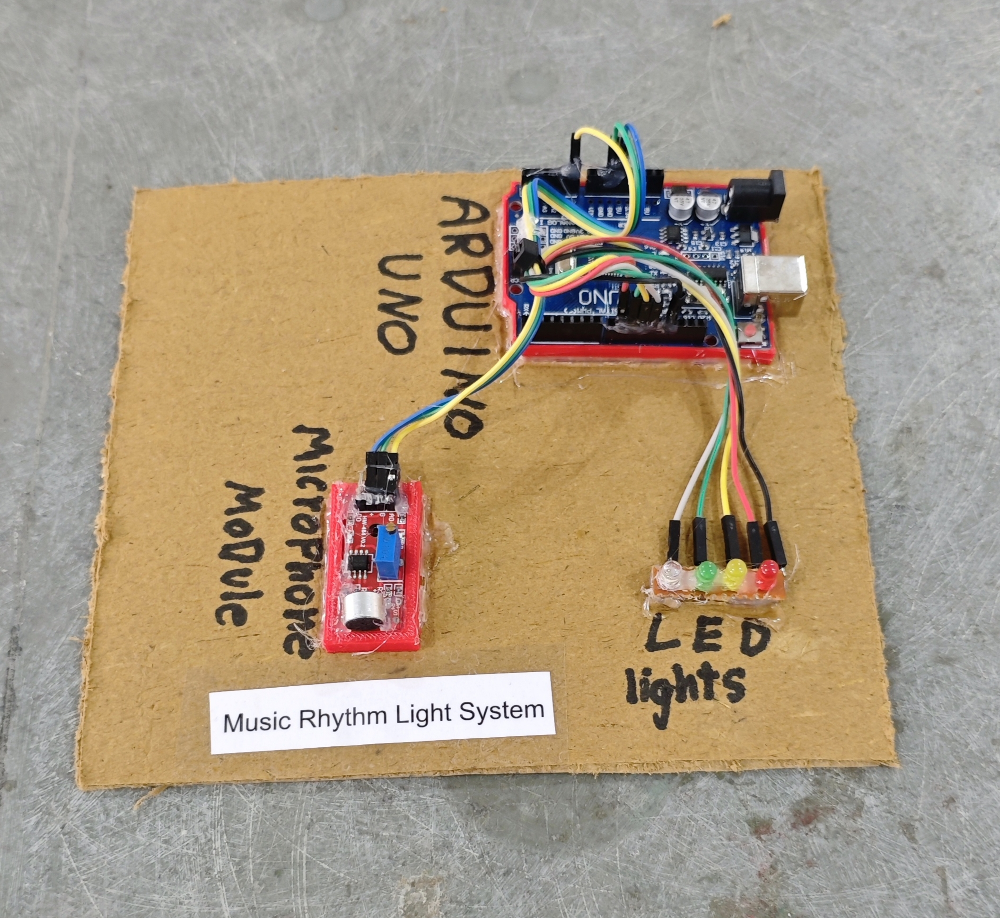

# 🎵 Music Rhythm Light System

This project implements a sound-reactive LED lighting system using Arduino and a microphone-based sound sensor module.  
The system reads analog audio intensity levels and dynamically controls multiple LEDs based on predefined threshold ranges.  
It demonstrates real-time signal processing, analog data acquisition, and intensity-based visual feedback generation in embedded systems.

## 🧩 Required Components
- 1 x Arduino UNO  
- 1 x Sound Sensor / Microphone Module  
- 4 x LEDs  
- 4 x 220Ω Resistors (for LEDs)  
- Breadboard & Jumper Wires  
- USB Cable / Power Supply  
- 3D Model (Reference): [**Thingiverse**](https://www.thingiverse.com)

## 🔌 Connections

<table>
  <thead>
    <tr>
      <th align="center">Component</th>
      <th align="center">Component Pin</th>
      <th align="center">Arduino Pin</th>
    </tr>
  </thead>
  <tbody>
    <!-- Sound Sensor -->
    <tr>
      <td rowspan="3" align="center"><b>Sound Sensor Module</b></td>
      <td align="center">VCC</td>
      <td align="center">5V</td>
    </tr>
    <tr>
      <td align="center">GND</td>
      <td align="center">GND</td>
    </tr>
    <tr>
      <td align="center">AO (Analog Out)</td>
      <td align="center">A0</td>
    </tr>
    <!-- LED 1 -->
    <tr>
      <td rowspan="2" align="center"><b>LED 1</b></td>
      <td align="center">Anode (+) via 220Ω resistor</td>
      <td align="center">Pin 9</td>
    </tr>
    <tr>
      <td align="center">Cathode (–)</td>
      <td align="center">GND</td>
    </tr>
    <!-- LED 2 -->
    <tr>
      <td rowspan="2" align="center"><b>LED 2</b></td>
      <td align="center">Anode (+) via 220Ω resistor</td>
      <td align="center">Pin 10</td>
    </tr>
    <tr>
      <td align="center">Cathode (–)</td>
      <td align="center">GND</td>
    </tr>
    <!-- LED 3 -->
    <tr>
      <td rowspan="2" align="center"><b>LED 3</b></td>
      <td align="center">Anode (+) via 220Ω resistor</td>
      <td align="center">Pin 11</td>
    </tr>
    <tr>
      <td align="center">Cathode (–)</td>
      <td align="center">GND</td>
    </tr>
    <!-- LED 4 -->
    <tr>
      <td rowspan="2" align="center"><b>LED 4</b></td>
      <td align="center">Anode (+) via 220Ω resistor</td>
      <td align="center">Pin 12</td>
    </tr>
    <tr>
      <td align="center">Cathode (–)</td>
      <td align="center">GND</td>
    </tr>

  </tbody>
</table>

> ⚠️ **Important:**  
> - Always use **220Ω resistors** with each LED to prevent damage.  
> - Adjust the sound sensor potentiometer to tune sensitivity.

## 💻 Software Used
- [**Arduino IDE**](https://www.arduino.cc/en/software/)

## 📁 Project Files
- 💻 [**Source Code**](./code/Music_Rhythm_Light_System.ino)  
- 📸 [**Project Photo**](./photos/Music_Rhythm_Light_System.jpg)

## 📸 Demo

  

## ⚙️ Working
- The sound sensor outputs an **analog value (0–1023)** based on sound intensity.  
- Arduino reads this value continuously from **A0**.  
- LEDs turn ON in **levels** based on sound thresholds:
  - Low sound → LED 1  
  - Medium sound → LED 1 & 2  
  - High sound → LED 1, 2 & 3  
  - Very high sound → LED 1, 2, 3 & 4  
- The effect creates a **music rhythm / VU meter style display**.

## 🚀 Future Improvements
- Use **RGB LEDs / LED strip** for better visual effects.  
- Add **PWM brightness control** for smooth fading.  
- Add **sensitivity adjustment knob** using potentiometer.  
- Integrate **Bluetooth control** to change modes.

