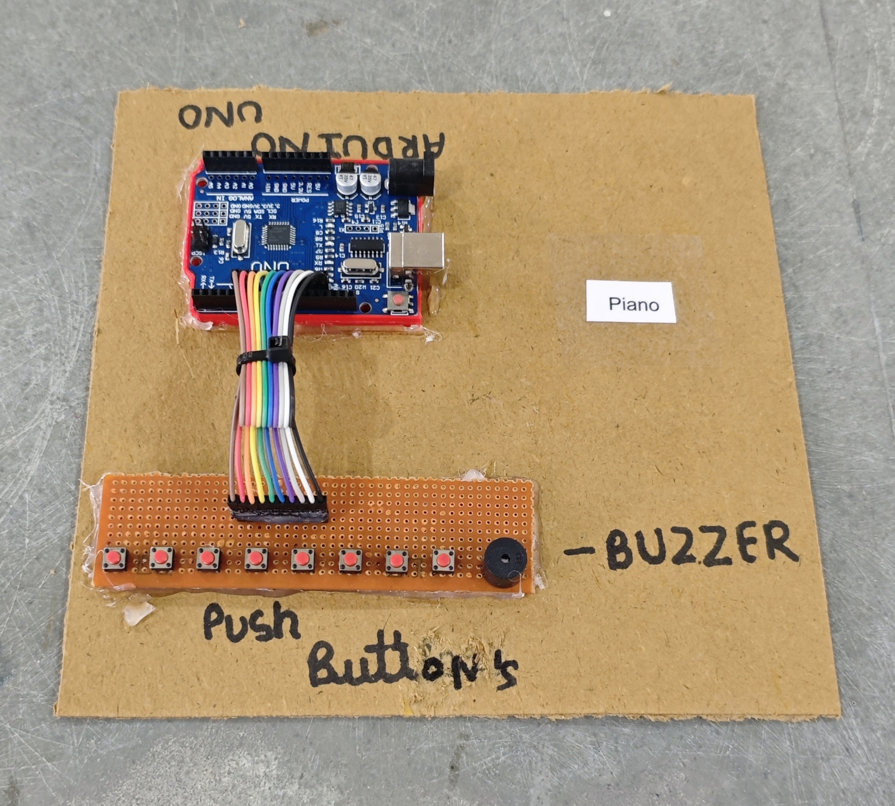

# 🎹 Piano

This project demonstrates a simple **Arduino-based mini piano** using **push buttons** and a **buzzer/speaker**.  
Each button acts as a **piano key**, producing a different musical note when pressed.

## 🧩 Required Components
- 1 x Arduino UNO  
- 1 x Buzzer / Mini Speaker  
- 8 x Push Buttons 
- Breadboard & Jumper Wires  
- USB Cable / Power Supply  
- 3D Model (Reference): [**Thingiverse**](https://www.thingiverse.com)

## 🔌 Connections

<table>
  <thead>
    <tr>
      <th align="center">Component</th>
      <th align="center">Button / Pin Name</th>
      <th align="center">Arduino Pin</th>
    </tr>
  </thead>
  <tbody>
    <tr>
      <td rowspan="8" align="center"><b>Push Buttons (Keys)</b></td>
      <td align="center">Key 1 (C4)</td>
      <td align="center">Pin 5</td>
    </tr>
    <tr>
      <td align="center">Key 2 (D4)</td>
      <td align="center">Pin 6</td>
    </tr>
    <tr>
      <td align="center">Key 3 (E4)</td>
      <td align="center">Pin 7</td>
    </tr>
    <tr>
      <td align="center">Key 4 (F4)</td>
      <td align="center">Pin 8</td>
    </tr>
    <tr>
      <td align="center">Key 5 (G4)</td>
      <td align="center">Pin 9</td>
    </tr>
    <tr>
      <td align="center">Key 6 (A4)</td>
      <td align="center">Pin 10</td>
    </tr>
    <tr>
      <td align="center">Key 7 (B4)</td>
      <td align="center">Pin 11</td>
    </tr>
    <tr>
      <td align="center">Key 8 (C5)</td>
      <td align="center">Pin 12</td>
    </tr>
    <tr>
      <td rowspan="2" align="center"><b>Buzzer / Speaker</b></td>
      <td align="center">+ (Signal)</td>
      <td align="center">Pin 13</td>
    </tr>
    <tr>
      <td align="center">- (GND)</td>
      <td align="center">GND</td>
    </tr>
    <tr>
      <td colspan="3" align="center">
        Other side of <b>all buttons</b> → GND (Active LOW using INPUT_PULLUP)
      </td>
    </tr>
  </tbody>
</table>

> ℹ️ **Button Logic (Active LOW using INPUT_PULLUP):**  
> - Not Pressed → HIGH  
> - Pressed → LOW  

## 💻 Software Used
- [**Arduino IDE**](https://www.arduino.cc/en/software/)

## 📚 Dependencies
- `pitches.h` file (for musical note frequencies)

## 📁 Project Files
- 💻 [**Source Code**](./code/Piano.ino)  
- 📄 [**pitches.h**](./code/pitches.h)  
- 📸 [**Project Photo**](./photos/Piano.jpg)

## 📸 Demo

  

## ⚙️ Working
- Each push button represents a **piano key**.  
- When a button is pressed, the system detects the input and **plays the corresponding musical note** on the speaker.  
- Releasing the button **stops the sound**.  
- Only one note is played at a time (the last pressed key takes priority).

## 🚀 Future Improvements
- Add **polyphony** (play multiple notes together using external sound module).  
- Add **octave switch** to change pitch range.  
- Add **record & playback** feature.  
- Use **capacitive touch pads** instead of buttons.  
- Add **Bluetooth MIDI output** for music apps.
