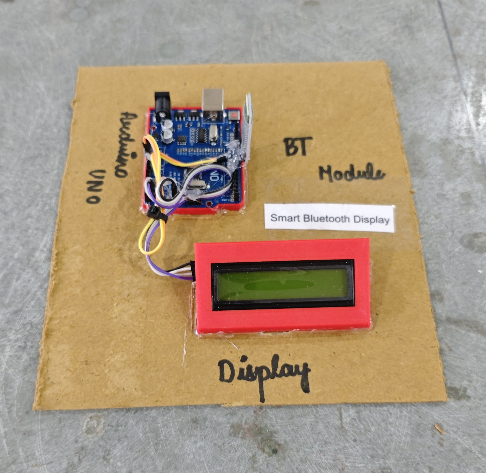

# 📱 Smart Bluetooth Display

This project demonstrates a simple **Bluetooth-based notice display system** using **Arduino**, an **HC-05 Bluetooth module**, and a **16x2 I2C LCD**.  
Users can send a **text notice from a smartphone** (via a Bluetooth Terminal app), and the message is **displayed and auto-scrolled** on the LCD.

## 🧩 Required Components
- 1 x Arduino UNO  
- 1 x HC-05 Bluetooth Module  
- 1 x 16x2 I2C LCD Display (PCF8574, Address: 0x27)  
- Breadboard & Jumper Wires  
- USB Cable / Power Supply  
- 3D Model (Reference): [**Thingiverse**](https://www.thingiverse.com)

## 🔌 Connections

<table>
  <thead>
    <tr>
      <th align="center">Component</th>
      <th align="center">Component Pin</th>
      <th align="center">Arduino Pin</th>
    </tr>
  </thead>
  <tbody>
    <tr>
      <td rowspan="4" align="center"><b>HC-05 Bluetooth Module</b></td>
      <td align="center">VCC</td>
      <td align="center">5V</td>
    </tr>
    <tr>
      <td align="center">GND</td>
      <td align="center">GND</td>
    </tr>
    <tr>
      <td align="center">TXD</td>
      <td align="center">Pin 10 (Arduino RX)</td>
    </tr>
    <tr>
      <td align="center">RXD</td>
      <td align="center">Pin 11 (Arduino TX)</td>
    </tr>
    <tr>
      <td rowspan="4" align="center"><b>I2C LCD</b></td>
      <td align="center">VCC</td>
      <td align="center">5V</td>
    </tr>
    <tr>
      <td align="center">GND</td>
      <td align="center">GND</td>
    </tr>
    <tr>
      <td align="center">SDA</td>
      <td align="center">A4</td>
    </tr>
    <tr>
      <td align="center">SCL</td>
      <td align="center">A5</td>
    </tr>
  </tbody>
</table>

> ⚠️ **HC-05 Wiring Note:**  
> - Use a **voltage divider (1kΩ + 2kΩ)** to step down Arduino TX (5V) to ~3.3V for **HC-05 RX**.  
> - HC-05 RX pin is **not 5V tolerant**.

## 💻 Software Used
- [**Arduino IDE**](https://www.arduino.cc/en/software/)  
- [**Serial Bluetooth Terminal (Android)**](https://play.google.com/store/apps/details?id=de.kai_morich.serial_bluetooth_terminal)

> 📲 **How to Send Notice:**  
> - Pair phone with **HC-05** (PIN: `1234` or `0000`)  
> - Open Bluetooth Terminal app  
> - Type your message and press **Enter**

## 📚 Dependencies
Install from Arduino Library Manager:
- [**LiquidCrystal I2C**](https://github.com/johnrickman/LiquidCrystal_I2C)  
- [**SoftwareSerial**](https://www.arduino.cc/reference/en/language/functions/communication/serial/softwareserial/) *(Built-in)*  
- [**Wire Library**](https://www.arduino.cc/en/reference/wire) *(Built-in)*

## 📁 Project Files
- 💻 [**Source Code**](./code/Smart_Bluetooth_Display.ino)  
- 📸 [**Project Photo**](./photos/Smart_Bluetooth_Display.jpg)

## 📸 Demo

  

## ⚙️ Working
- The HC-05 pairs with the smartphone via Bluetooth.  
- User sends a text message from a Bluetooth Terminal app.  
- Arduino reads the message character-by-character.  
- When **Enter** is pressed:  
  - The message is stored as the current **notice**.  
  - If the notice is **≤ 16 characters**, it is shown statically.  
  - If the notice is **> 16 characters**, it scrolls smoothly on the LCD.  
- The same notice loops continuously until a new message is received.

## 🚀 Future Improvements
- Add **multiple notice storage** with next/previous buttons.  
- Add **priority notices** (urgent message override).  
- Add **auto-clear timer** for temporary messages.  
- Add **Wi-Fi (ESP8266/ESP32)** for internet-based notices.  
- Add **buzzer alert** for new message arrival.
