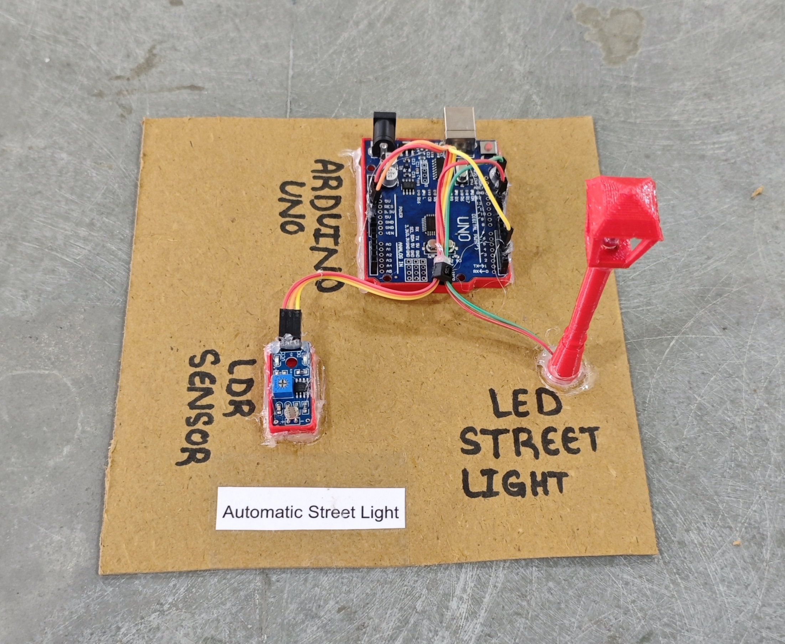

# 💡 Automatic Street Light

This project demonstrates a simple **LDR (Light Dependent Resistor) based automatic light system** using Arduino.  
The LED automatically turns **ON in darkness** and **OFF in bright light**, based on readings from the LDR sensor module.

## 🧩 Required Components
- 1 x Arduino UNO  
- 1 x LDR Sensor Module  
- 1 x White LED  
- 1 x 220Ω Resistor (current limiting for LED)  
- Breadboard & Jumper Wires
- USB Cable / Power Supply 
- 3D Model (Reference): [**Thingiverse**](https://www.thingiverse.com)  

## 🔌 Connections

| Component | Component Pin | Arduino Pin |
| :--- | :--- | :--- |
| **LDR Sensor Module** | VCC | 5V |
| **LDR Sensor Module** | GND | GND |
| **LDR Sensor Module** | DO (Digital Out) | Pin 2 |
| **LED** | Anode (+) via 220Ω Resistor | Pin 10 |
| **LED** | Cathode (-) | GND |

> ⚠️ **Important:**  
> - Always connect a **220Ω resistor in series with the LED** to limit current and prevent LED damage.
> - Adjust the LDR module potentiometer to set sensitivity.

## 💻 Software Used
- [**Arduino IDE**](https://www.arduino.cc/en/software/)
    
## 📁 Project Files
- 💻 [**Source Code**](./code/Automatic_Street_Light.ino)  
- 📸 [**Project Photo**](./photos/Automatic_Street_Light.jpg)

## 📸 Demo

  

## ⚙️ Working
- The LDR module senses ambient light level.  
- In **dark conditions**, the sensor output becomes **HIGH**.  
- Arduino reads the sensor output and turns the **LED ON**.  
- In **bright conditions**, the output becomes **LOW** and the **LED turns OFF**.  
- Live sensor status is displayed on the **Serial Monitor**.

## 🚀 Future Improvements
- Provide user-configurable light sensitivity calibration.  
- Introduce adaptive brightness control based on ambient light levels. 
- Support high-power lighting through isolated relay control. 
- Extend the system with IoT connectivity for remote monitoring and analytics.
