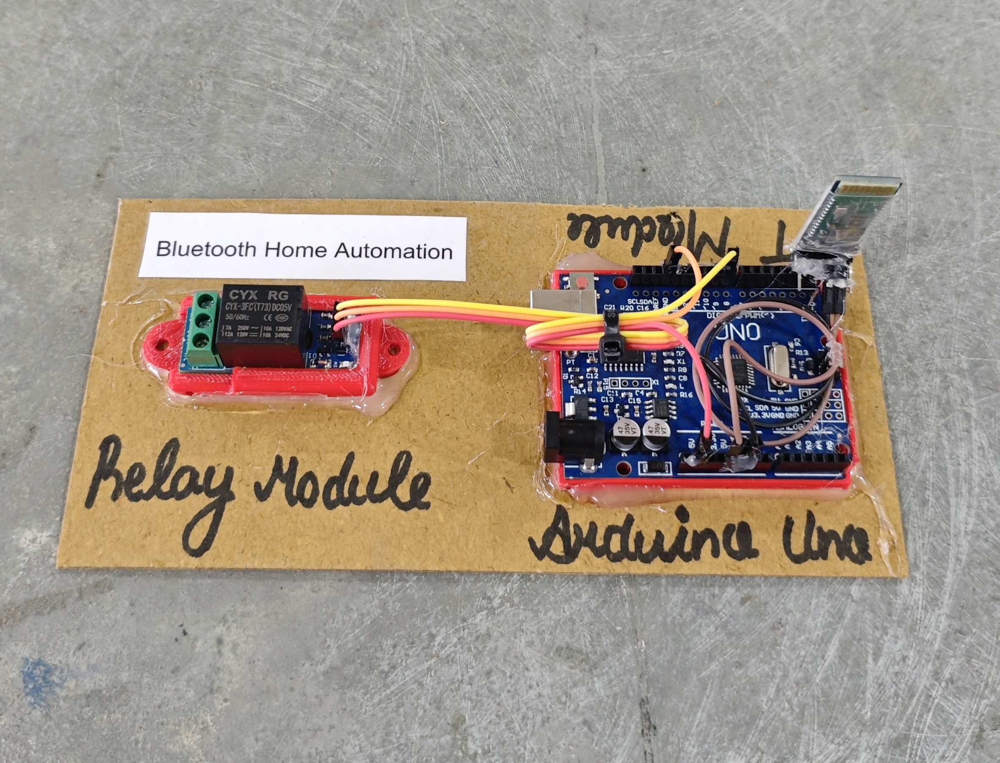

# 📱 Bluetooth Home Automation

This project demonstrates a simple **Bluetooth-based home automation system** using Arduino and an **HC-05 Bluetooth module**.  
A relay-controlled appliance can be turned **ON/OFF wirelessly** from a smartphone using a **Bluetooth Terminal app**.

## 🧩 Required Components
- 1 x Arduino UNO  
- 1 x HC-05 Bluetooth Module  
- 1 x Single Channel Relay Module (Active LOW / HIGH)  
- 1 x Load (DC bulb / AC appliance via relay)  
- Breadboard & Jumper Wires
- USB Cable / Power Supply 
- 3D Model (Reference): [**Thingiverse**](https://www.thingiverse.com)    

## 🔌 Connections

| Component | Component Pin / Wire | Connection (Arduino / Relay) |
| :--- | :--- | :--- |
| **HC-05 BT Module**| VCC | 5V |
| **HC-05 BT Module**| GND | GND |
| **HC-05 BT Module**| TXD | RX (Pin 0) |
| **HC-05 BT Module**| RXD | TX (Pin 1) |
| **Relay Module** | IN | Pin 8 |
| **Relay Module** | VCC | 5V |
| **Relay Module** | GND | GND |
| **Appliance (via Relay)** | Live / + | COM (Relay Terminal) |
| **Appliance (via Relay)** | Load | NO (Relay Terminal) |

> ⚠️ **Important (HC-05 RX Voltage):**
> - Use a voltage divider (1kΩ + 2kΩ) to step down Arduino TX (5V) to ~3.3V for HC-05 RX.

> ⚠️ **Safety:**  
> - Connect the Appliance through a relay module, not directly to Arduino.
> - Be careful while working with AC loads.

> ℹ️ **Note:**
> - Temporarily disconnect TX and RX (Pins 0 and 1) while uploading code to the Arduino, otherwise upload will fail.

## 💻 Software Used
- [**Arduino IDE**](https://www.arduino.cc/en/software/)  
- [**Serial Bluetooth Terminal (Android)**](https://play.google.com/store/apps/details?id=de.kai_morich.serial_bluetooth_terminal&pcampaignid=web_share)

> 📲 **Commands:**
> - Send **`1`** → Relay ON  
> - Send **`0`** → Relay OFF
    
## 📁 Project Files
- 💻 [**Source Code:**](./code/Bluetooth_Home_Automation.ino)  
- 📸 [**Project Photo:**](./photos/Bluetooth_Home_Automation.jpg) 

  

## ⚙️ Working
- The HC-05 module pairs with the smartphone via Bluetooth.  
- User sends commands from a **Bluetooth Terminal app**.  
- Arduino reads incoming characters via Serial:
  - `1` → Relay turns **ON**  
  - `0` → Relay turns **OFF**  
- The relay switches the connected appliance accordingly.  
- Serial Monitor displays received commands and relay status.

> ℹ️ **Relay Logic:**  
> - Active LOW: LOW → ON, HIGH → OFF  
> - Active HIGH: HIGH → ON, LOW → OFF  

## 🚀 Future Improvements
- Control multiple devices (multi-relay board).  
- Create a custom Android app UI.  
- Add password/PIN for security.  
- Add Wi-Fi (ESP8266/ESP32) for internet control.  
