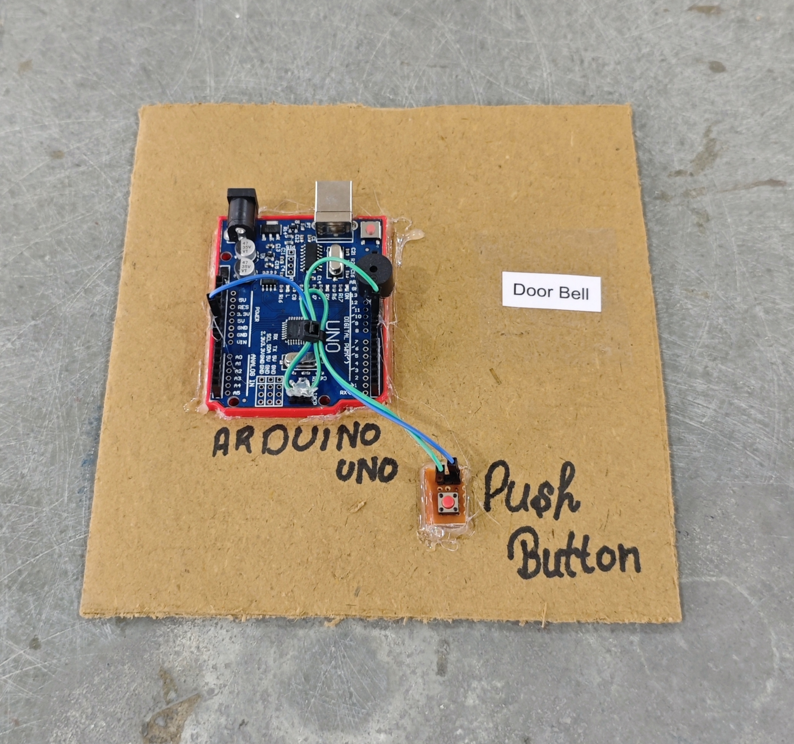

# 🔔 Arduino Door Bell

This project demonstrates a simple **Arduino-based doorbell system** using a **push button and buzzer**.  
When the button is pressed, a short doorbell melody is played.

## 🧩 Required Components
- 1 x Arduino UNO  
- 1 x Push Button  
- 1 x Buzzer  
- Breadboard & Jumper Wires
- USB Cable / Power Supply 
- 3D Model (Reference): [**Thingiverse**](https://www.thingiverse.com) 
  
## 🔌 Connections

| Component | Component Pin | Arduino Pin |
| :--- | :--- | :--- |
| **Push Button** | One side | Pin 9 |
| **Push Button** | Other side | GND |
| **Buzzer** | + (Signal) | Pin 11 |
| **Buzzer** | - (GND) | GND |

> ℹ️ **Note:** Using `INPUT_PULLUP`, so the button is **Active LOW**
> - Not pressed → HIGH  
> - Pressed → LOW

## 💻 Software Used
- [**Arduino IDE**](https://www.arduino.cc/en/software/)

## 📁 Project Files
- 💻 [**Source Code**](./code/Door_Bell.ino) 
- 📸 [**Project Photo**](./photos/Door_Bell.jpg)
 
## ⚙️ Working
- The push button is connected using the **internal pull-up resistor**.  
- Arduino continuously monitors the button state.  
- On a **valid button press (HIGH → LOW transition)**:
  - A doorbell melody is played using the buzzer.  
- This logic prevents repeated triggering when the button is held down.  
- The melody is generated using different sound frequencies.

## 📸 Demo

  

 
## 🚀 Future Improvements
- Add LED/LCD status indicator  
- Support multiple selectable ringtones  
- Wireless trigger using RF/Bluetooth/Wi-Fi  
- Enclosure for safe, permanent installation  

