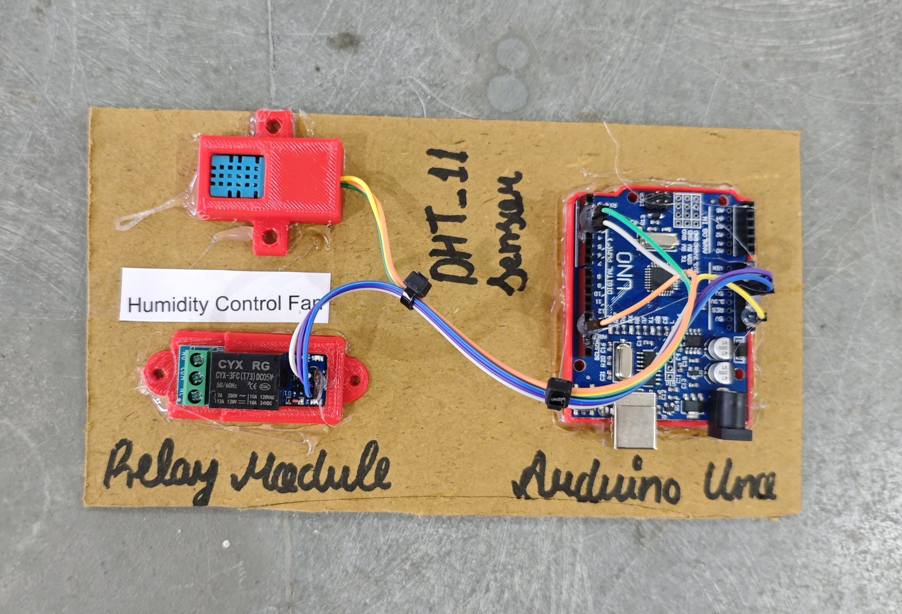

# 💨 Humidity & Temperature Based Fan Control

This project automatically controls a fan using a relay module based on real-time humidity and temperature values measured by a DHT11 sensor. The system helps maintain comfortable environmental conditions by turning the fan ON/OFF based on predefined thresholds.

## 🧩 Required Components
- 1 x Arduino UNO  
- 1 x DHT11 (Module)  
- 1 x Single Channel Relay Module (Active LOW) 
- 1 x DC Fan / AC Fan (via relay)  
- Breadboard & Jumper Wires
- USB Cable / Power Supply 
- 3D Model (Reference): [Thingiverse](https://www.thingiverse.com) 
  
## 🔌 Connections

| Component | Component Pin / Wire | Connection (Arduino / Relay) |
| :--- | :--- | :--- |
| **DHT11 Sensor** | VCC | 5V (Arduino) |
| **DHT11 Sensor** | GND | GND (Arduino) |
| **DHT11 Sensor** | DATA | Pin 2 (Arduino) |
| **Relay Module** | IN | Pin 3 (Arduino) |
| **Relay Module** | VCC | 5V (Arduino) |
| **Relay Module** | GND | GND (Arduino) |
| **Fan (via Relay)** | Live / + | COM (Relay Terminal) |
| **Fan (via Relay)** | Load | NO (Relay Terminal) |

> ⚠️ **Safety Note:**  
> If you are controlling an AC fan, ensure proper insulation and safety precautions.  
> Use an opto-isolated relay module and avoid touching live terminals.

## 💻 Software Used
- Arduino IDE  

## 📚 Dependencies
Install the following libraries from Arduino Library Manager:

- [**Adafruit DHT Sensor Library**](https://github.com/adafruit/DHT-sensor-library) 

- [**Adafruit Unified Sensor**](https://github.com/adafruit/Adafruit_Sensor)  

## 📁 Project Files
- 💻 [**Source Code**](./code/Humidity_Control_Fan.ino)
- 📸 [**Project Photo**](./photos/Humidity_Control_Fan.jpg)

## ⚙️ Working

- The DHT11 sensor measures:
  - **Humidity (%)**
  - **Temperature (°C)**
- Arduino reads sensor values every **2 seconds**.
- The fan turns **ON** when:
  - **Humidity > 60%**
  - **Temperature > 25°C**
- Otherwise, the fan remains **OFF**.
- Live readings and fan status are displayed on the **Serial Monitor**.

> ℹ️ **Relay Logic (Active LOW):**  
> - LOW  → Fan ON  
> - HIGH → Fan OFF  

## 📸 Demo

  

## 🚀 Future Improvements
- Add LCD/OLED display for real-time readings  
- Integrate IoT connectivity (ESP8266/ESP32) for remote monitoring  
- Provide user-configurable thresholds via buttons or potentiometer  
- Implement data logging for historical analysis  
