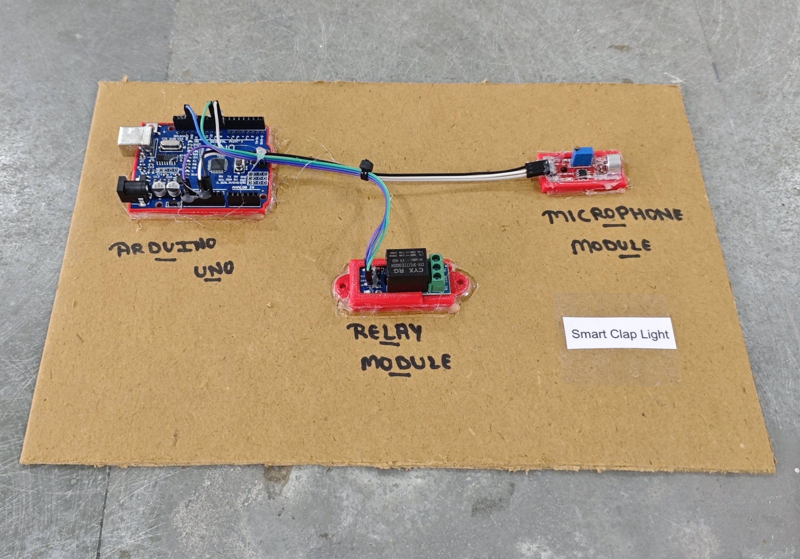

# 👏 Smart Clap Light

This project demonstrates a simple **clap-activated light control system** using Arduino and a **sound sensor module**.  
The light toggles **ON/OFF** whenever a clap sound is detected. 🔊💡

## 🧩 Required Components
- 1 x Arduino UNO  
- 1 x Sound Sensor Module (Digital Output)  
- 1 x Single Channel Relay Module (Active LOW / HIGH)  
- 1 x Load (DC bulb / AC appliance via relay)  
- Breadboard & Jumper Wires  
- USB Cable / Power Supply  
- 3D Model (Reference): [**Thingiverse**](https://www.thingiverse.com)

## 🔌 Connections

*1. Control Circuit (Arduino & Modules)*

<table>
  <thead>
    <tr>
      <th align="center">Component</th>
      <th align="center">Component Pin</th>
      <th align="center">Arduino Pin</th>
    </tr>
  </thead>
  <tbody>
    <tr>
      <td rowspan="3" align="center"><b>Sound Sensor Module</b></td>
      <td align="center">VCC</td>
      <td align="center">5V</td>
    </tr>
    <tr>
      <td align="center">GND</td>
      <td align="center">GND</td>
    </tr>
    <tr>
      <td align="center">DO (Digital Out)</td>
      <td align="center">Pin 8</td>
    </tr>
    <tr>
      <td rowspan="3" align="center"><b>Relay Module</b></td>
      <td align="center">IN</td>
      <td align="center">Pin 9</td>
    </tr>
    <tr>
      <td align="center">VCC</td>
      <td align="center">5V</td>
    </tr>
    <tr>
      <td align="center">GND</td>
      <td align="center">GND</td>
    </tr>
  </tbody>
</table>

*2. Appliance Connection (via Relay)*

| Appliance Wire | Relay Terminal |
| :---: | :---: |
| Live / + | COM |
| Load | NO |

> ⚠️ **Safety Note:**  
> - Connect the appliance through a relay module, not directly to Arduino.  
> - Be careful while working with AC loads.

## 💻 Software Used
- [**Arduino IDE**](https://www.arduino.cc/en/software/)

## 📁 Project Files
- 💻 [**Source Code**](./code/Smart_Clap_Light.ino)  
- 📸 [**Project Photo**](./photos/Smart_Clap_Light.jpg)

## 📸 Demo

  

## ⚙️ Working
- The sound sensor detects a loud sound (clap) and outputs a **LOW signal**.  
- Arduino reads this signal and toggles the **relay state**.  
- On each clap:  
  - If the light is **OFF** → it turns **ON**  
  - If the light is **ON** → it turns **OFF**  
- A small delay is used to avoid multiple triggers from one clap.

## 🚀 Future Improvements
- Add sensitivity calibration for different environments.  
- Support **single-clap / double-clap** actions.  
- Integrate IoT control using **ESP8266 / ESP32**.  
- Add status display using **LED / OLED / LCD**.
