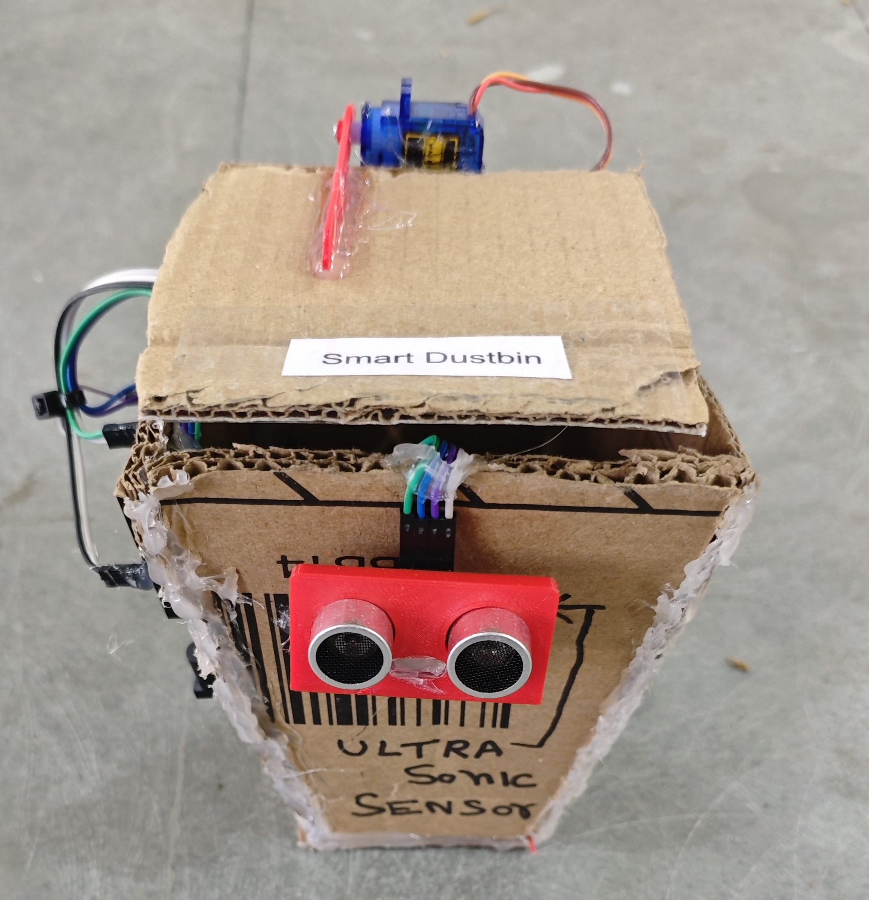

# 🗑️ Smart Dustbin

This project demonstrates a simple **Smart Dustbin system** using an **ultrasonic sensor** and a **servo motor** with Arduino.  
When a **person** comes near the dustbin (within a set distance), the **dustbin (lid) automatically opens** and **closes after a short delay**.

## 🧩 Required Components
- 1 x Arduino UNO  
- 1 x Ultrasonic Sensor (HC-SR04)  
- 1 x Servo Motor (SG90/MG90)  
- Breadboard & Jumper Wires  
- USB Cable / Power Supply  
- 3D Model (Reference): [**Thingiverse**](https://www.thingiverse.com)

## 🔌 Connections

<table>
  <thead>
    <tr>
      <th align="center">Component</th>
      <th align="center">Component Pin</th>
      <th align="center">Arduino Pin</th>
    </tr>
  </thead>
  <tbody>
    <tr>
      <td rowspan="4" align="center"><b>Ultrasonic Sensor (HC-SR04)</b></td>
      <td align="center">VCC</td>
      <td align="center">5V</td>
    </tr>
    <tr>
      <td align="center">GND</td>
      <td align="center">GND</td>
    </tr>
    <tr>
      <td align="center">Trig</td>
      <td align="center">Pin 3</td>
    </tr>
    <tr>
      <td align="center">Echo</td>
      <td align="center">Pin 2</td>
    </tr>
    <tr>
      <td rowspan="3" align="center"><b>Servo Motor (SG90)</b></td>
      <td align="center">Signal</td>
      <td align="center">Pin 4</td>
    </tr>
    <tr>
      <td align="center">VCC</td>
      <td align="center">5V</td>
    </tr>
    <tr>
      <td align="center">GND</td>
      <td align="center">GND</td>
    </tr>
  </tbody>
</table>

> ⚠️ **Note:**  
> - If the servo motor jitters, moves unexpectedly, or causes the Arduino to reset, power the servo using an external 5V supply.  
> - Make sure to connect the **ground (GND)** of the external power supply with the **Arduino GND** (common ground).

## 💻 Software Used
- [**Arduino IDE**](https://www.arduino.cc/en/software/)

## 📚 Dependencies
- [**Servo Library**](https://github.com/arduino-libraries/Servo)  
  *(Pre-installed with Arduino IDE)*

## 📁 Project Files
- 💻 [**Source Code**](./code/Smart_Dustbin.ino)  
- 📸 [**Project Photo**](./photos/Smart_Dustbin.jpg)

## 📸 Demo

  

## ⚙️ Working
- The ultrasonic sensor measures the distance in front of the dustbin.  
- When a **person** is detected within **20 cm**:  
  - The **dustbin (lid) opens automatically**.  
  - After a short delay, the **dustbin (lid) closes automatically**.  
- This provides a **touch-free** and hygienic dustbin system.

## 🚀 Future Improvements
- Add IR/PIR sensor for better human detection.  
- Add LED/Buzzer to indicate lid status.  
- Integrate ESP8266/ESP32 for IoT-based monitoring (fill level alerts).  
- Add battery power with sleep mode for power saving.

