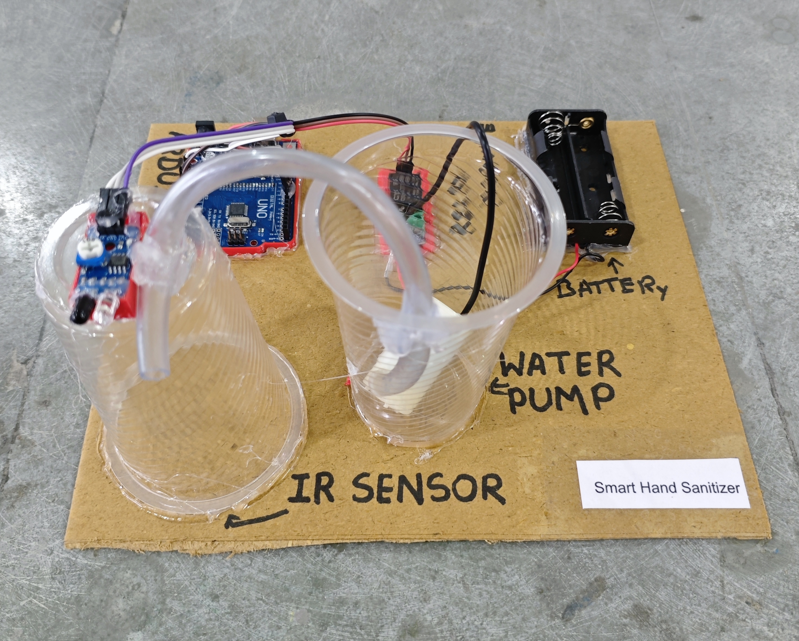

# 🧴 Smart Hand Sanitizer 

This project demonstrates a simple **Smart Hand Sanitizer Dispenser** using an **IR sensor** and a **relay-controlled water pump** with Arduino.  
When a **person places their hand near the sensor**, the pump **dispenses sanitizer automatically** for a short duration.

## 🧩 Required Components
- 1 x Arduino UNO  
- 1 x IR Sensor Module  
- 1 x Single Channel Relay Module (Active LOW)  
- 1 x DC Mini Water Pump  
- 2 x 18650 Li-ion Cells with Holder  
- Pipes / Tubes for liquid flow  
- Breadboard & Jumper Wires  
- USB Cable / Power Supply  
- 3D Model (Reference): [**Thingiverse**](https://www.thingiverse.com)

## 🔌 Connections

*1. Control Circuit (Arduino & Modules)*
<table>
  <thead>
    <tr>
      <th align="center">Component</th>
      <th align="center">Component Pin</th>
      <th align="center">Arduino Pin</th>
    </tr>
  </thead>
  <tbody>
    <tr>
      <td rowspan="3" align="center"><b>IR Sensor Module</b></td>
      <td align="center">VCC</td>
      <td align="center">5V</td>
    </tr>
    <tr>
      <td align="center">GND</td>
      <td align="center">GND</td>
    </tr>
    <tr>
      <td align="center">OUT</td>
      <td align="center">Pin 9</td>
    </tr>
    <tr>
      <td rowspan="3" align="center"><b>Relay Module</b></td>
      <td align="center">IN</td>
      <td align="center">Pin 8</td>
    </tr>
    <tr>
      <td align="center">VCC</td>
      <td align="center">5V</td>
    </tr>
    <tr>
      <td align="center">GND</td>
      <td align="center">GND</td>
    </tr>
  </tbody>
</table>

> ℹ️ **Relay Note:**  
> - This project is configured for an **Active LOW relay module**.  
> - If you are using an **Active HIGH relay**, you may need to invert the relay logic in the code.

*2. Appliance Connection (DC Water Pump via Relay)*
<table>
  <thead>
    <tr>
      <th align="center">Component</th>
      <th align="center">Wire</th>
      <th align="center">Connects To</th>
    </tr>
  </thead>
  <tbody>
    <tr>
      <td align="center"><b>Battery (18650)</b></td>
      <td align="center">Positive (+)</td>
      <td align="center">Relay COM</td>
    </tr>
    <tr>
      <td rowspan="2" align="center"><b>Water Pump</b></td>
      <td align="center">Positive (+)</td>
      <td align="center">Relay NO</td>
    </tr>
    <tr>
      <td align="center">Negative (-)</td>
      <td align="center">Battery Negative (-)</td>
    </tr>
  </tbody>
</table>

> ⚠️ **Power Note:**
> - Power the **DC water pump using 2 × 18650 Li-ion cells**, not from Arduino 5V.  
> - Keep **Arduino GND and battery negative (–) connected together** (common ground) if required by your relay module.

## 💻 Software Used
- [**Arduino IDE**](https://www.arduino.cc/en/software/)

## 📁 Project Files
- 💻 [**Source Code**](./code/Smart_Hand_Sanitizer.ino)  
- 📸 [**Project Photo**](./photos/Smart_Hand_Sanitizer.jpg)

## 📸 Demo

  

## ⚙️ Working
- The IR sensor detects a hand placed near the dispenser.  
- When the sensor output goes **LOW**, Arduino activates the **relay**.  
- The relay turns the **water pump ON** for a fixed time to dispense sanitizer.  
- After the delay, the pump turns **OFF automatically**.  
- A short delay is added to avoid continuous triggering.

## 🚀 Future Improvements
- Add adjustable dispensing time using a potentiometer.  
- Add refill level indicator using a float sensor.
- Integrate ESP8266/ESP32 for usage tracking or alerts.

