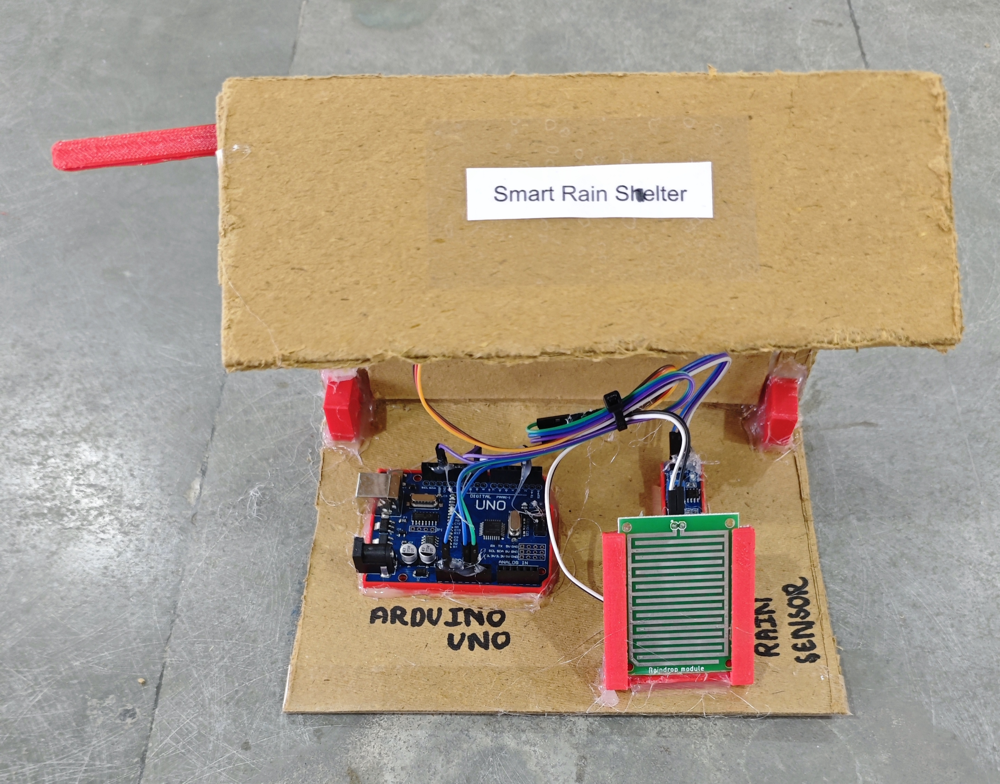

# ☔ Smart Rain Shelter (Clothes Protection System)

This project demonstrates a **Smart Rain Shelter system for protecting clothes** using a **rain sensor module** and a **servo motor** with Arduino.  
When **rain is detected**, the system **automatically moves the clothes hanger rod into the shelter** to protect clothes from rain, and when there is **no rain**, the clothes hanger rod **moves back outside** for drying.

## 🧩 Required Components
- 1 x Arduino UNO  
- 1 x Rain Sensor Module (Digital Output)  
- 1 x Servo Motor (SG90/MG90)  
- Breadboard & Jumper Wires  
- USB Cable / Power Supply  
- 3D Model (Reference): [**Thingiverse**](https://www.thingiverse.com)

## 🔌 Connections

<table>
  <thead>
    <tr>
      <th align="center">Component</th>
      <th align="center">Component Pin</th>
      <th align="center">Arduino Pin</th>
    </tr>
  </thead>
  <tbody>
    <tr>
      <td rowspan="3" align="center"><b>Rain Sensor</b></td>
      <td align="center">VCC</td>
      <td align="center">5V</td>
    </tr>
    <tr>
      <td align="center">GND</td>
      <td align="center">GND</td>
    </tr>
    <tr>
      <td align="center">DO (Digital Out)</td>
      <td align="center">Pin 2</td>
    </tr>
    <tr>
      <td rowspan="3" align="center"><b>Servo Motor (SG90)</b></td>
      <td align="center">Signal</td>
      <td align="center">Pin 9</td>
    </tr>
    <tr>
      <td align="center">VCC</td>
      <td align="center">5V</td>
    </tr>
    <tr>
      <td align="center">GND</td>
      <td align="center">GND</td>
    </tr>
  </tbody>
</table>

> ⚠️ **Note:**  
> - If the servo motor jitters or causes Arduino resets, power the servo using an external 5V supply.  
> - Make sure to connect the **ground (GND)** of the external power supply with the **Arduino GND** (common ground).

## 💻 Software Used
- [**Arduino IDE**](https://www.arduino.cc/en/software/)

## 📚 Dependencies
- [**Servo Library**](https://github.com/arduino-libraries/Servo)  
  *(Pre-installed with Arduino IDE)*

## 📁 Project Files
- 💻 [**Source Code**](./code/Smart_Rain_Shelter.ino)  
- 📸 [**Project Photo**](./photos/Smart_Rain_Shelter.jpg)

## 📸 Demo

  

## ⚙️ Working
- The rain sensor outputs **LOW** when water droplets are detected on the sensor plate.  
- Arduino reads the sensor state and controls the servo motor connected to the **clothes hanger rod mechanism**.  
- When **rain is detected**:  
  - The motor **moves the clothes hanger rod inside the shelter**, bringing the clothes under cover.  
- When **no rain is detected**:  
  - The motor **moves the clothes hanger rod back outside** for drying. 

## 🚀 Future Improvements
- Add adjustable rain sensitivity using potentiometer.  
- Add weather API integration using ESP8266/ESP32.  
- Add LCD/OLED display for rain status.  
- Add manual override button for open/close control.
