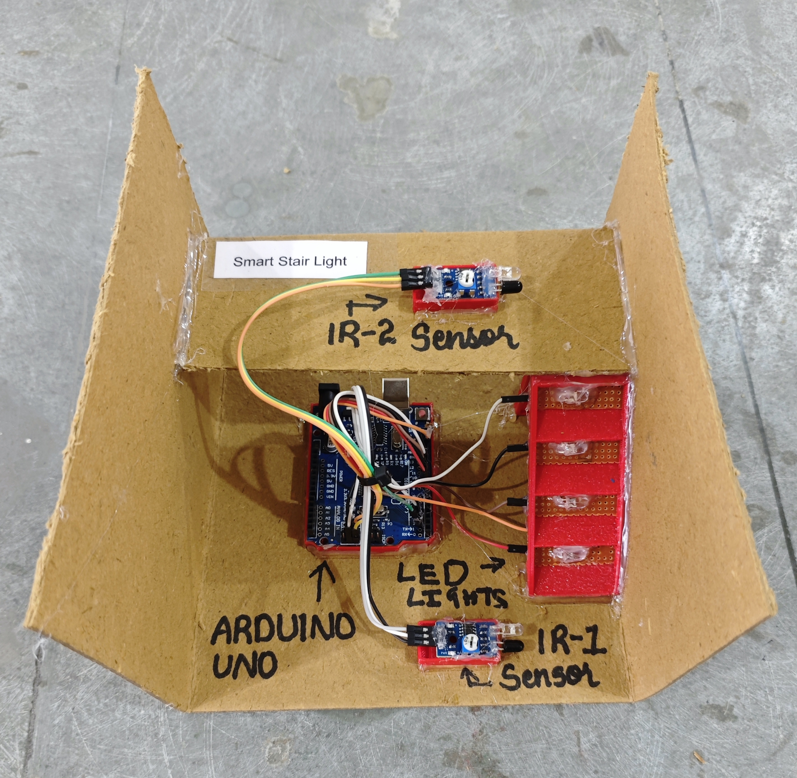

# 🪜 Smart Stair Light

This project demonstrates a simple **Smart Stair Light system** using **two IR sensors** and **four white LEDs** with Arduino.  
When a **person is detected** at the top or bottom of the stairs, the lights **toggle ON/OFF automatically**.

## 🧩 Required Components
- 1 x Arduino UNO  
- 2 x IR Sensor Modules  
- 4 x White LEDs  
- 4 x 220Ω Resistors (for LEDs)  
- Breadboard & Jumper Wires  
- USB Cable / Power Supply  
- 3D Model (Reference): [**Thingiverse**](https://www.thingiverse.com)

## 🔌 Connections

<table>
  <thead>
    <tr>
      <th align="center">Component</th>
      <th align="center">Component Pin</th>
      <th align="center">Arduino Pin</th>
    </tr>
  </thead>
  <tbody>
    <tr>
      <td rowspan="3" align="center"><b>IR Sensor Module (Top)</b></td>
      <td align="center">VCC</td>
      <td align="center">5V</td>
    </tr>
    <tr>
      <td align="center">GND</td>
      <td align="center">GND</td>
    </tr>
    <tr>
      <td align="center">OUT</td>
      <td align="center">Pin 3</td>
    </tr>
    <tr>
      <td rowspan="3" align="center"><b>IR Sensor Module (Bottom)</b></td>
      <td align="center">VCC</td>
      <td align="center">5V</td>
    </tr>
    <tr>
      <td align="center">GND</td>
      <td align="center">GND</td>
    </tr>
    <tr>
      <td align="center">OUT</td>
      <td align="center">Pin 2</td>
    </tr>
    <tr>
      <td rowspan="2" align="center"><b>White LEDs (x4)</b></td>
      <td align="center">Anode (+) via 220Ω resistor</td>
      <td align="center">Pins 8, 9, 10, 11</td>
    </tr>
    <tr>
      <td align="center">Cathode (-)</td>
      <td align="center">GND</td>
    </tr>
  </tbody>
</table>

> ⚠️ **Note:**  
> - Use **220Ω resistors** with individual LEDs to limit current.

## 💻 Software Used
- [**Arduino IDE**](https://www.arduino.cc/en/software/)

## 📁 Project Files
- 💻 [**Source Code**](./code/Smart_Stair_Light.ino)  
- 📸 [**Project Photo**](./photos/Smart_Stair_Light.jpg)

## 📸 Demo

  

## ⚙️ Working
- Both IR sensors output **LOW** when a person is detected.  
- Arduino monitors both sensors.  
- When either sensor is triggered:  
  - The stair lights **toggle ON/OFF**.  
- A short delay is used to avoid multiple triggers from the same detection.

## 🚀 Future Improvements
- Implement sequential lighting (step-by-step LED animation).  
- Add LDR for automatic night-only operation.  
- Add a timer to turn lights OFF after inactivity.  
- Integrate ESP8266/ESP32 for remote control or automation.
