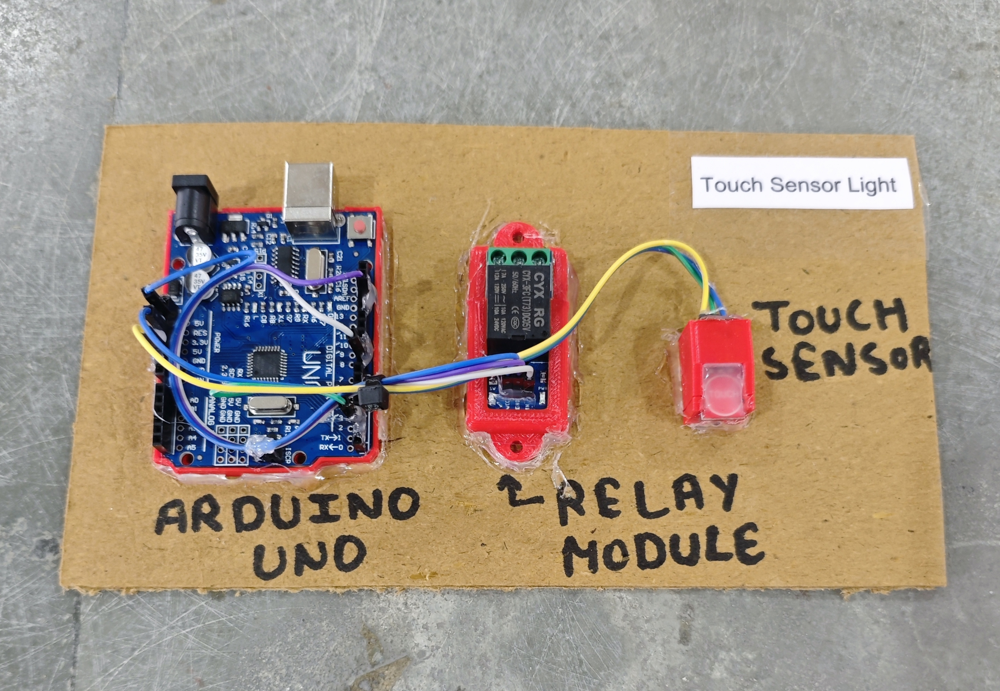

# ✋ Touch Sensor Light

This project demonstrates a simple **Touch Sensor based Light Control system** using an **Arduino**, a **touch sensor module**, and a **relay**.  
When a **person touches the sensor**, the light **toggles ON/OFF**.

## 🧩 Required Components
- 1 x Arduino UNO  
- 1 x Touch Sensor Module (TTP223 or similar)  
- 1 x Single Channel Relay Module (Active LOW)  
- 1 x Load (DC bulb / AC appliance via relay)  
- Breadboard & Jumper Wires  
- USB Cable / Power Supply  
- 3D Model (Reference): [**Thingiverse**](https://www.thingiverse.com)

## 🔌 Connections

*1. Control Circuit (Arduino & Modules)*
<table>
  <thead>
    <tr>
      <th align="center">Component</th>
      <th align="center">Component Pin</th>
      <th align="center">Arduino Pin</th>
    </tr>
  </thead>
  <tbody>
    <tr>
      <td rowspan="3" align="center"><b>Touch Sensor</b></td>
      <td align="center">VCC</td>
      <td align="center">5V</td>
    </tr>
    <tr>
      <td align="center">GND</td>
      <td align="center">GND</td>
    </tr>
    <tr>
      <td align="center">OUT</td>
      <td align="center">Pin 2</td>
    </tr>
    <tr>
      <td rowspan="3" align="center"><b>Relay Module</b></td>
      <td align="center">IN</td>
      <td align="center">Pin 8</td>
    </tr>
    <tr>
      <td align="center">VCC</td>
      <td align="center">5V</td>
    </tr>
    <tr>
      <td align="center">GND</td>
      <td align="center">GND</td>
    </tr>
  </tbody>
</table>

> ℹ️ **Relay Note:**  
> - This project is configured for an **Active LOW relay module**.  
> - If you are using an **Active HIGH relay**, you may need to invert the relay logic in the code.

*2. Appliance Connection (via Relay)*
<table>
  <thead>
    <tr>
      <th align="center">Appliance Wire</th>
      <th align="center">Relay Terminal</th>
    </tr>
  </thead>
  <tbody>
    <tr>
      <td align="center">Live / +</td>
      <td align="center">COM</td>
    </tr>
    <tr>
      <td align="center">Load</td>
      <td align="center">NO</td>
    </tr>
  </tbody>
</table>

> ⚠️ **Safety Note:**  
> - Connect the appliance through the relay module, not directly to Arduino.  
> - Be careful while working with AC loads.

## 💻 Software Used
- [**Arduino IDE**](https://www.arduino.cc/en/software/)

## 📁 Project Files
- 💻 [**Source Code**](./code/Touch_Sensor_Light.ino)  
- 📸 [**Project Photo**](./photos/Touch_Sensor_Light.jpg)

## 📸 Demo

  

## ⚙️ Working
- The touch sensor outputs **HIGH** when touched.  
- Arduino detects a **new touch event** and toggles the relay state.  
- The relay switches the connected light **ON/OFF**.  
- A small delay is used to avoid multiple toggles from a single touch.

## 🚀 Future Improvements
- Add capacitive touch pad for better sensitivity.  
- Add LED indicator for light status.  
- Add mobile app control using Bluetooth/Wi-Fi.  
- Use a multi-relay module to control multiple lights.

