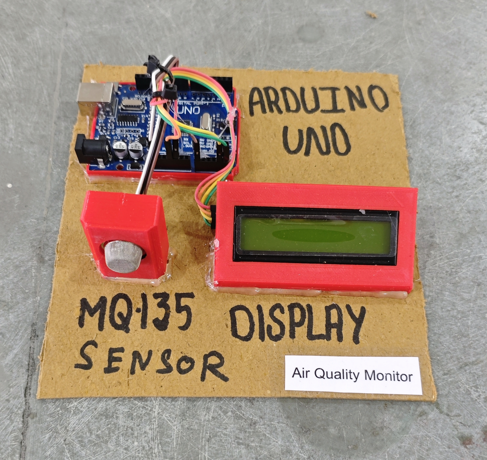

# 🌫️ Air Quality Monitor

This project demonstrates a simple **Air Quality Monitoring system** using **Arduino**, an **MQ-135 air quality sensor**, and a **16x2 I2C LCD**.  
The system displays an **approximate AQI (Air Quality Index)** value and its category on the LCD.

> ⚠️ *This is an educational demo. MQ-135 readings are mapped to AQI approximately and are **not medically accurate** without proper calibration.*

## 🧩 Required Components
- 1 x Arduino UNO  
- 1 x MQ-135 Air Quality Sensor Module  
- 1 x 16x2 I2C LCD Display (PCF8574, Address: 0x27)  
- Breadboard & Jumper Wires  
- USB Cable / Power Supply  
- 3D Model (Reference): [**Thingiverse**](https://www.thingiverse.com)

## 🔌 Connections

<table>
  <thead>
    <tr>
      <th align="center">Component</th>
      <th align="center">Component Pin</th>
      <th align="center">Arduino Pin</th>
    </tr>
  </thead>
  <tbody>
    <tr>
      <td rowspan="3" align="center"><b>MQ-135 Sensor Module</b></td>
      <td align="center">VCC</td>
      <td align="center">5V</td>
    </tr>
    <tr>
      <td align="center">GND</td>
      <td align="center">GND</td>
    </tr>
    <tr>
      <td align="center">AO (Analog Out)</td>
      <td align="center">A0</td>
    </tr>
    <tr>
      <td rowspan="4" align="center"><b>I2C LCD</b></td>
      <td align="center">VCC</td>
      <td align="center">5V</td>
    </tr>
    <tr>
      <td align="center">GND</td>
      <td align="center">GND</td>
    </tr>
    <tr>
      <td align="center">SDA</td>
      <td align="center">A4</td>
    </tr>
    <tr>
      <td align="center">SCL</td>
      <td align="center">A5</td>
    </tr>
  </tbody>
</table>

> ℹ️ **Note:**  
> - MQ-135 requires **warm-up time** (24–48 hours for best accuracy).  
> - Keep the sensor in open air for calibration.

## 💻 Software Used
- [**Arduino IDE**](https://www.arduino.cc/en/software/)

## 📚 Dependencies
Install from Arduino Library Manager:
- [**LiquidCrystal I2C**](https://github.com/johnrickman/LiquidCrystal_I2C)  
- [**Wire Library**](https://www.arduino.cc/en/reference/wire) *(Built-in)*

## 📁 Project Files
- 💻 [**Source Code**](./code/Air_Quality_Monitor.ino)  
- 📸 [**Project Photo**](./photos/Air_Quality_Monitor.jpg)

## 📸 Demo

  

## ⚙️ Working
- The MQ-135 sensor outputs an **analog value (0–1023)** based on air quality.  
- Arduino maps this value to an **approximate AQI range (0–500)**.  
- The LCD displays:
  - **AQI value**
  - **Air quality category** (Good, Satisfactory, Moderate, Poor, Very Poor, Severe)  
- The display refreshes every **1.5 seconds**.

## 🚀 Future Improvements
- Implement **proper MQ-135 calibration** and real AQI conversion formulas.  
- Add **buzzer alert** for poor/severe air quality.  
- Add **data logging** to SD card.  
- Integrate **ESP8266/ESP32** for cloud monitoring and alerts.  
- Add **mobile app / web dashboard** for AQI history.
