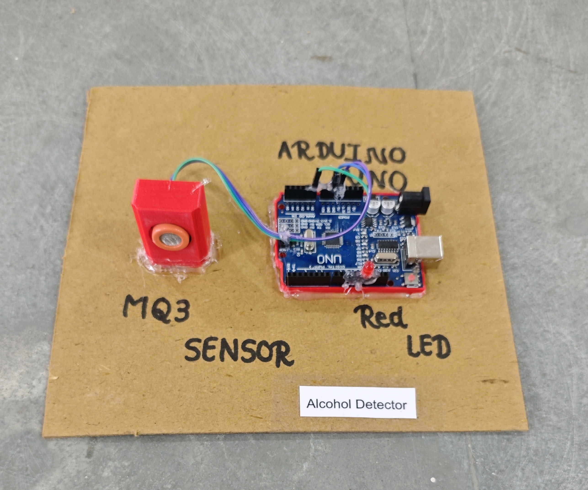

# 🍺 Alcohol Detector

This project demonstrates a simple **Alcohol Detection System** using **Arduino** and an **MQ-3 alcohol sensor**.  
When alcohol is detected above a set threshold, an **LED turns ON** as an alert.

> ⚠️ *This is an educational prototype and **not** a medical or legal breathalyzer device.*

## 🧩 Required Components
- 1 x Arduino UNO  
- 1 x MQ-3 Alcohol Sensor Module  
- 1 x LED  
- 1 x 220Ω Resistor (for LED)  
- Breadboard & Jumper Wires  
- USB Cable / Power Supply  
- 3D Model (Reference): [**Thingiverse**](https://www.thingiverse.com)

## 🔌 Connections

<table>
  <thead>
    <tr>
      <th align="center">Component</th>
      <th align="center">Component Pin</th>
      <th align="center">Arduino Pin</th>
    </tr>
  </thead>
  <tbody>
    <tr>
      <td rowspan="3" align="center"><b>MQ-3 Sensor Module</b></td>
      <td align="center">VCC</td>
      <td align="center">5V</td>
    </tr>
    <tr>
      <td align="center">GND</td>
      <td align="center">GND</td>
    </tr>
    <tr>
      <td align="center">AO (Analog Out)</td>
      <td align="center">A0</td>
    </tr>
    <tr>
      <td rowspan="2" align="center"><b>LED</b></td>
      <td align="center">Anode (+) via 220Ω resistor</td>
      <td align="center">Pin 13</td>
    </tr>
    <tr>
      <td align="center">Cathode (–)</td>
      <td align="center">GND</td>
    </tr>
  </tbody>
</table>

> ℹ️ **Note:**  
> - MQ-3 sensor requires **warm-up time** (15–30 minutes minimum; longer for stable readings).  
> - Threshold value should be **calibrated** based on your environment.

## 💻 Software Used
- [**Arduino IDE**](https://www.arduino.cc/en/software/)

## 📁 Project Files
- 💻 [**Source Code**](./code/Alcohol_Detector.ino)  
- 📸 [**Project Photo**](./photos/Alcohol_Detector.jpg)

## 📸 Demo

  

## ⚙️ Working
- The MQ-3 sensor outputs an **analog value (0–1023)** based on alcohol concentration in the air.  
- Arduino continuously reads the sensor value from **A0**.  
- When the value crosses the **set threshold**:  
  - The LED **turns ON** (alcohol detected).  
- When the value is below the threshold:  
  - The LED **remains OFF**.  
- Sensor values can be viewed on the **Serial Monitor** for easy calibration.

## 🚀 Future Improvements
- Add **buzzer alert** for stronger indication.  
- Add **LCD/OLED display** to show alcohol level.  
- Add **relay to cut off vehicle ignition** (demo model).  
- Integrate **ESP8266/ESP32** for remote alerts/logging.
