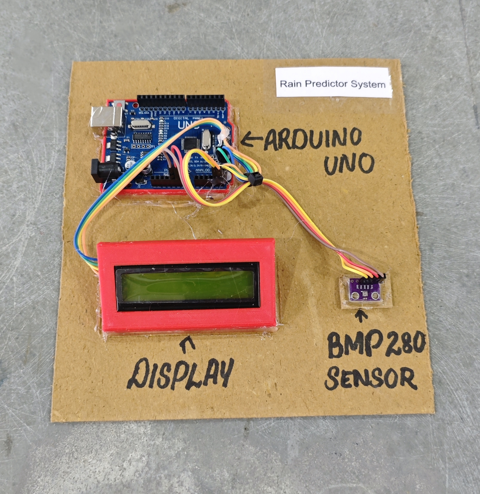

# 🌦️ Rain Predictor System

This project demonstrates a simple **weather forecasting system** using an **Arduino**, a **BMP280 barometric pressure sensor**, and a **16x2 I2C LCD display**.  
The system predicts basic weather conditions such as **Rain Likely, Cloudy, Sunny, or Clear** based on atmospheric pressure changes.

## 🧩 Required Components
- 1 x Arduino UNO  
- 1 x BMP280 Barometric Pressure Sensor (I2C)  
- 1 x 16x2 I2C LCD Display (Address: 0x27)  
- Breadboard & Jumper Wires  
- USB Cable / Power Supply  
- 3D Model (Reference): [**Thingiverse**](https://www.thingiverse.com)

## 🔌 Connections

<table>
  <thead>
    <tr>
      <th align="center">Component</th>
      <th align="center">Component Pin</th>
      <th align="center">Arduino Pin</th>
    </tr>
  </thead>
  <tbody>
    <tr>
      <td rowspan="4" align="center"><b>BMP280 Sensor</b></td>
      <td align="center">VCC</td>
      <td align="center">5V / 3.3V</td>
    </tr>
    <tr>
      <td align="center">GND</td>
      <td align="center">GND</td>
    </tr>
    <tr>
      <td align="center">SDA</td>
      <td align="center">A4</td>
    </tr>
    <tr>
      <td align="center">SCL</td>
      <td align="center">A5</td>
    </tr>
    <tr>
      <td rowspan="4" align="center"><b>I2C LCD</b></td>
      <td align="center">VCC</td>
      <td align="center">5V</td>
    </tr>
    <tr>
      <td align="center">GND</td>
      <td align="center">GND</td>
    </tr>
    <tr>
      <td align="center">SDA</td>
      <td align="center">A4</td>
    </tr>
    <tr>
      <td align="center">SCL</td>
      <td align="center">A5</td>
    </tr>
  </tbody>
</table>

> ℹ️ **Note:**  
> - BMP280 I2C address is usually **0x76** or **0x77**.  
> - Both BMP280 and LCD share the same I2C bus (SDA & SCL).

## 💻 Software Used
- [**Arduino IDE**](https://www.arduino.cc/en/software/)

## 📚 Dependencies
Install from Arduino Library Manager:

- [**Adafruit BMP280 Library**](https://github.com/adafruit/Adafruit_BMP280_Library)  
- [**Adafruit Unified Sensor**](https://github.com/adafruit/Adafruit_Sensor)  
- [**LiquidCrystal I2C**](https://github.com/johnrickman/LiquidCrystal_I2C)  
- [**Wire Library**](https://www.arduino.cc/en/reference/wire) *(Built-in)*  

## 📁 Project Files
- 💻 [**Source Code**](./code/Rain_Predictor_System.ino)  
- 📸 [**Project Photo**](./photos/Rain_Predictor_System.jpg)

## 📸 Demo

  

## ⚙️ Working
- The BMP280 reads atmospheric **pressure in hPa**.  
- Pressure is measured every **30 seconds**.  
- The current pressure is compared with the previous value.  
- Based on pressure difference:
  - Pressure drop > 2 hPa → **RAIN LIKELY**
  - Pressure drop > 1 hPa → **CLOUDY**
  - Pressure rise > 1 hPa → **SUNNY**
  - Stable pressure → **CLEAR**
- The LCD cycles through:
  - Pressure Level  
  - Weather Status  
  - Forecast Alert Message  

## 🚀 Future Improvements
- Add **DHT22** for temperature & humidity monitoring.  
- Add **ESP8266/ESP32** for IoT weather dashboard.  
- Add **SD Card module** for pressure data logging.  
- Add **RTC module** for time-based tracking.  
- Add **Buzzer alert** for rain notification.
