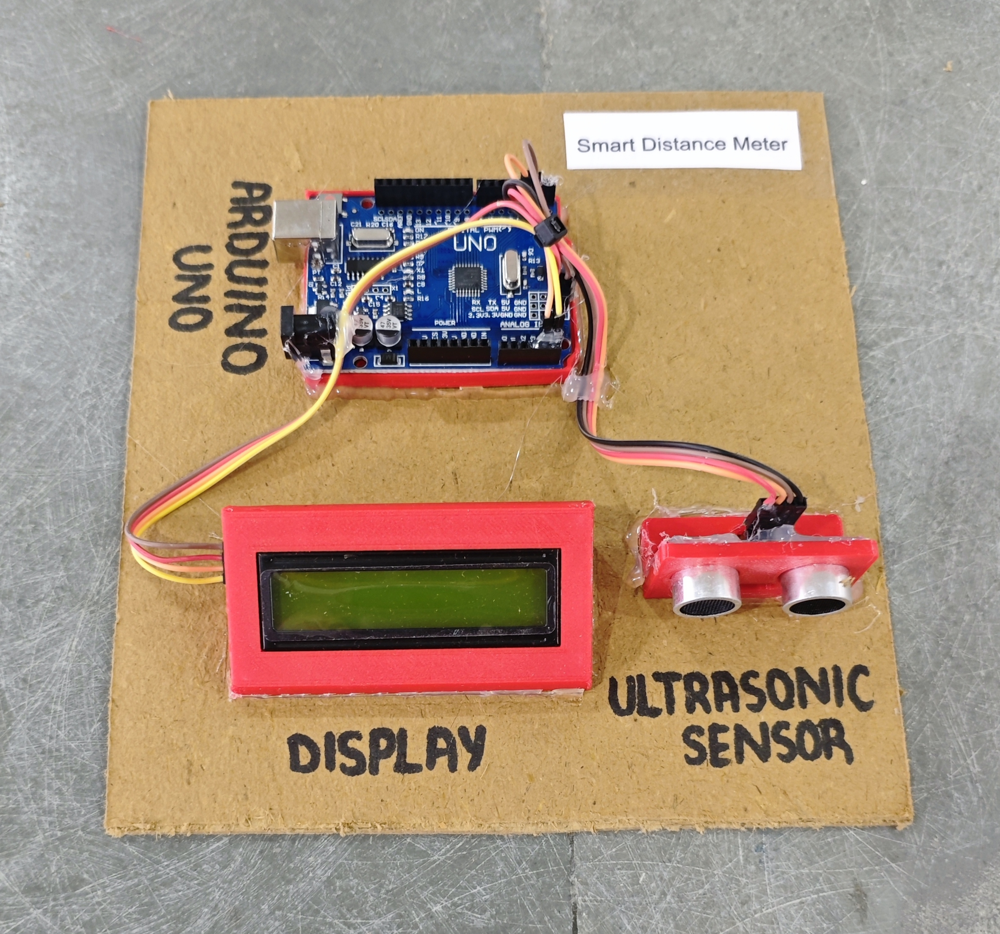

# 📏 Smart Distance Meter

This project demonstrates a simple **distance measurement system** using an **Arduino**, an **HC-SR04 ultrasonic sensor**, and a **16x2 I2C LCD display**.  
The system measures the distance of an object in front of the sensor and displays the result in **centimeters (cm)** on both the **LCD screen** and the **Serial Monitor**.

## 🧩 Required Components
- 1 x Arduino UNO  
- 1 x Ultrasonic Sensor (HC-SR04)  
- 1 x 16x2 I2C LCD Display (Address: 0x27)  
- Breadboard & Jumper Wires  
- USB Cable / Power Supply  
- 3D Model (Reference): [**Thingiverse**](https://www.thingiverse.com)

## 🔌 Connections

<table>
  <thead>
    <tr>
      <th align="center">Component</th>
      <th align="center">Component Pin</th>
      <th align="center">Arduino Pin</th>
    </tr>
  </thead>
  <tbody>
    <tr>
      <td rowspan="4" align="center"><b>Ultrasonic Sensor (HC-SR04)</b></td>
      <td align="center">VCC</td>
      <td align="center">5V</td>
    </tr>
    <tr>
      <td align="center">GND</td>
      <td align="center">GND</td>
    </tr>
    <tr>
      <td align="center">Trig</td>
      <td align="center">Pin 2</td>
    </tr>
    <tr>
      <td align="center">Echo</td>
      <td align="center">Pin 3</td>
    </tr>
    <tr>
      <td rowspan="4" align="center"><b>I2C LCD</b></td>
      <td align="center">VCC</td>
      <td align="center">5V</td>
    </tr>
    <tr>
      <td align="center">GND</td>
      <td align="center">GND</td>
    </tr>
    <tr>
      <td align="center">SDA</td>
      <td align="center">A4</td>
    </tr>
    <tr>
      <td align="center">SCL</td>
      <td align="center">A5</td>
    </tr>
  </tbody>
</table>

> ℹ️ **Note:**  
> - Ensure the ultrasonic sensor faces the object directly for accurate measurement.  
> - Both LCD and sensor must share a common GND connection.

## 💻 Software Used
- [**Arduino IDE**](https://www.arduino.cc/en/software/)

## 📚 Dependencies
Install from Arduino Library Manager:

- [**LiquidCrystal I2C**](https://github.com/johnrickman/LiquidCrystal_I2C)  
- [**Wire Library**](https://www.arduino.cc/en/reference/wire) *(Built-in)*  

## 📁 Project Files
- 💻 [**Source Code**](./code/Smart_Distance_Meter.ino)  
- 📸 [**Project Photo**](./photos/Smart_Distance_Meter.jpg)

## 📸 Demo
<p align="left">
  
</p>

## ⚙️ Working
- The ultrasonic sensor sends a short **10µs trigger pulse**.  
- It measures the time taken for the echo to return.  
- Distance is calculated using the formula:  

  ```
  Distance = (Duration × 0.034) / 2
  ```

- The measured distance (in cm) is displayed:
  - On the **Serial Monitor**
  - On the **16x2 LCD display**
- The system updates readings every **500 milliseconds**.

## 🚀 Future Improvements
- Add **buzzer alert** when object is too close.  
- Add **distance threshold warning system**.  
- Add **OLED display** for compact design.  
- Add **ESP8266/ESP32** for IoT-based distance monitoring.
