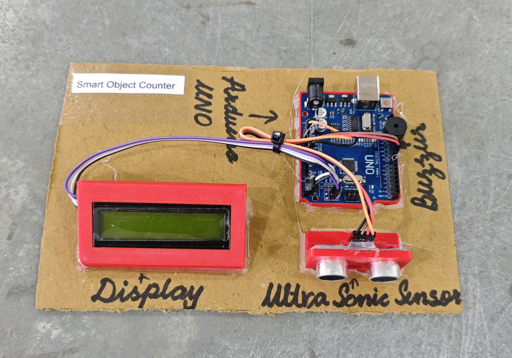

# 🔢 Smart Object Counter

This project demonstrates a simple **object counting system** using an **Arduino**, an **HC-SR04 ultrasonic sensor**, a **buzzer**, and a **16x2 I2C LCD display**.  
The system detects objects placed very close to the sensor and automatically **increments the count**, while providing **buzzer feedback** and displaying the total count on the LCD.

## 🧩 Required Components
- 1 x Arduino UNO  
- 1 x Ultrasonic Sensor (HC-SR04)  
- 1 x 16x2 I2C LCD Display (Address: 0x27)  
- 1 x Buzzer  
- Breadboard & Jumper Wires  
- USB Cable / Power Supply  
- 3D Model (Reference): [**Thingiverse**](https://www.thingiverse.com)

## 🔌 Connections

<table>
  <thead>
    <tr>
      <th align="center">Component</th>
      <th align="center">Component Pin</th>
      <th align="center">Arduino Pin</th>
    </tr>
  </thead>
  <tbody>
    <tr>
      <td rowspan="4" align="center"><b>Ultrasonic Sensor (HC-SR04)</b></td>
      <td align="center">VCC</td>
      <td align="center">5V</td>
    </tr>
    <tr>
      <td align="center">GND</td>
      <td align="center">GND</td>
    </tr>
    <tr>
      <td align="center">Trig</td>
      <td align="center">Pin 8</td>
    </tr>
    <tr>
      <td align="center">Echo</td>
      <td align="center">Pin 9</td>
    </tr>
    <tr>
      <td rowspan="2" align="center"><b>Buzzer</b></td>
      <td align="center">+ (Signal)</td>
      <td align="center">Pin 11</td>
    </tr>
    <tr>
      <td align="center">- (GND)</td>
      <td align="center">GND</td>
    </tr>
    <tr>
      <td rowspan="4" align="center"><b>I2C LCD</b></td>
      <td align="center">VCC</td>
      <td align="center">5V</td>
    </tr>
    <tr>
      <td align="center">GND</td>
      <td align="center">GND</td>
    </tr>
    <tr>
      <td align="center">SDA</td>
      <td align="center">A4</td>
    </tr>
    <tr>
      <td align="center">SCL</td>
      <td align="center">A5</td>
    </tr>
  </tbody>
</table>

> ℹ️ **Note:**  
> - Objects must pass within approximately **3 cm** of the sensor to be counted.  
> - The counter resets detection only when the object moves away beyond **6 cm** to prevent double counting.  
> - Ensure all components share a common GND connection.

## 💻 Software Used
- [**Arduino IDE**](https://www.arduino.cc/en/software/)

## 📚 Dependencies
Install from Arduino Library Manager:

- [**LiquidCrystal I2C**](https://github.com/johnrickman/LiquidCrystal_I2C)  
- [**Wire Library**](https://www.arduino.cc/en/reference/wire) *(Built-in)*  

## 📁 Project Files
- 💻 [**Source Code**](./code/Smart_Object_Counter.ino)  
- 📸 [**Project Photo**](./photos/Smart_Object_Counter.jpg)

## 📸 Demo

  

## ⚙️ Working
- The ultrasonic sensor sends a short **10µs trigger pulse**.  
- The echo time is measured and converted into **distance (cm)**.  
- If an object is detected closer than **3 cm**:
  - The counter value increases by **1**.
  - The buzzer beeps once.
  - The LCD displays **"Object Detected"** and updated count.
- When the object moves away beyond **6 cm**, the system resets detection to allow counting the next object.
- The total object count is continuously displayed on the LCD.

## 🚀 Future Improvements
- Add **EEPROM storage** to save count after power loss.  
- Add **IR sensor** for more accurate object detection.  
- Add **WiFi (ESP8266/ESP32)** for cloud-based counting system.  
- Add **reset button** to manually reset the counter.  
- Use for **conveyor belt automation systems**.
