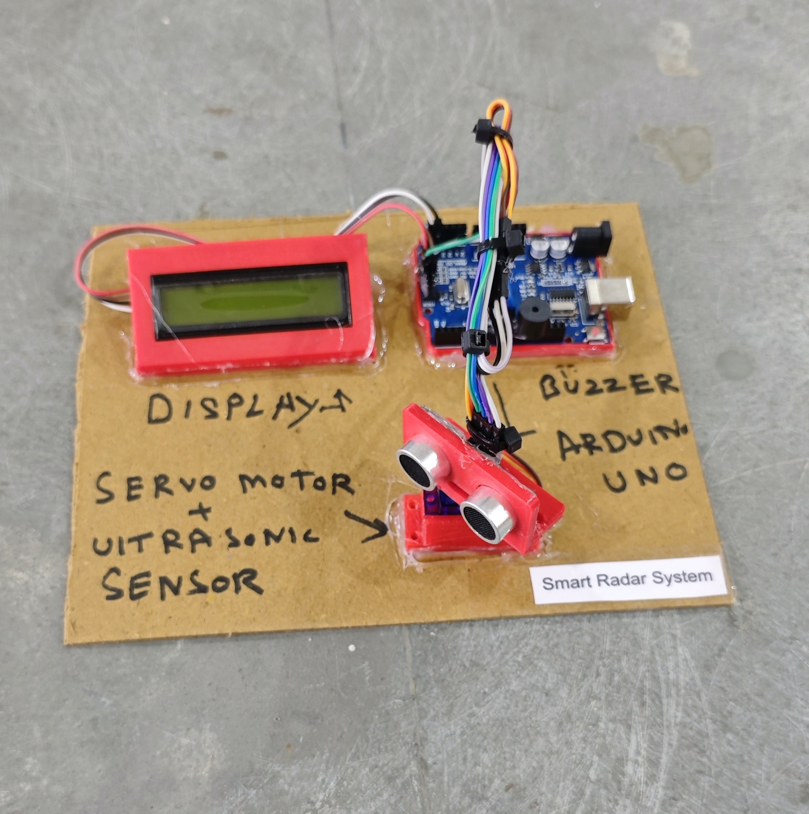

# 📡 Smart Radar System

This project demonstrates a simple **ultrasonic radar system** using an **Arduino**, an **HC-SR04 ultrasonic sensor**, a **servo motor**, a **buzzer**, and a **16x2 I2C LCD display**.  
The system continuously scans from **0° to 180°** and detects objects within a defined range. If an object is detected within the alert distance, a **buzzer warning** is triggered.

## 🧩 Required Components
- 1 x Arduino UNO  
- 1 x Ultrasonic Sensor (HC-SR04)  
- 1 x Servo Motor (SG90 or similar)  
- 1 x 16x2 I2C LCD Display (Address: 0x27)  
- 1 x Buzzer  
- Breadboard & Jumper Wires  
- USB Cable / Power Supply  
- 3D Model (Reference): [**Thingiverse**](https://www.thingiverse.com)

## 🔌 Connections

<table>
  <thead>
    <tr>
      <th align="center">Component</th>
      <th align="center">Component Pin</th>
      <th align="center">Arduino Pin</th>
    </tr>
  </thead>
  <tbody>
    <tr>
      <td rowspan="4" align="center"><b>Ultrasonic Sensor (HC-SR04)</b></td>
      <td align="center">VCC</td>
      <td align="center">5V</td>
    </tr>
    <tr>
      <td align="center">GND</td>
      <td align="center">GND</td>
    </tr>
    <tr>
      <td align="center">Trig</td>
      <td align="center">Pin 9</td>
    </tr>
    <tr>
      <td align="center">Echo</td>
      <td align="center">Pin 10</td>
    </tr>
    <tr>
      <td rowspan="3" align="center"><b>Servo Motor</b></td>
      <td align="center">VCC (Red)</td>
      <td align="center">5V</td>
    </tr>
    <tr>
      <td align="center">GND (Brown/Black)</td>
      <td align="center">GND</td>
    </tr>
    <tr>
      <td align="center">Signal (Orange)</td>
      <td align="center">Pin 8</td>
    </tr>
    <tr>
      <td rowspan="2" align="center"><b>Buzzer</b></td>
      <td align="center">+ (Signal)</td>
      <td align="center">Pin 11</td>
    </tr>
    <tr>
      <td align="center">- (GND)</td>
      <td align="center">GND</td>
    </tr>
    <tr>
      <td rowspan="4" align="center"><b>I2C LCD</b></td>
      <td align="center">VCC</td>
      <td align="center">5V</td>
    </tr>
    <tr>
      <td align="center">GND</td>
      <td align="center">GND</td>
    </tr>
    <tr>
      <td align="center">SDA</td>
      <td align="center">A4</td>
    </tr>
    <tr>
      <td align="center">SCL</td>
      <td align="center">A5</td>
    </tr>
  </tbody>
</table>

> ℹ️ **Note:**  
> - Servo may require an external 5V supply if unstable.  
> - Keep all components connected to a common GND.  
> - Default alert distance is set to **20 cm** (modifiable in code).

## 💻 Software Used
- [**Arduino IDE**](https://www.arduino.cc/en/software/)

## 📚 Dependencies
Install from Arduino Library Manager:

- [**LiquidCrystal I2C**](https://github.com/johnrickman/LiquidCrystal_I2C)  
- [**Servo Library**](https://www.arduino.cc/en/reference/servo)  
- [**Wire Library**](https://www.arduino.cc/en/reference/wire) *(Built-in)*  

## 📁 Project Files
- 💻 [**Source Code**](./code/Smart_Radar_System.ino)  
- 📸 [**Project Photo**](./photos/Smart_Radar_System.jpg)

## 📸 Demo
<p align="left">
  
</p>

## ⚙️ Working
- The servo motor rotates from **0° to 180°** and back continuously.  
- At each angle:
  - The ultrasonic sensor measures distance.  
  - Distance is calculated using:  

    ```
    Distance = (Duration × 0.034) / 2
    ```

- The LCD displays:
  - Current servo angle  
  - Measured distance in cm  

- If an object is detected within **20 cm**:
  - The buzzer generates an alert tone.  
- If no object is within range:
  - The buzzer remains OFF.  

This creates a basic **radar-style object detection system**.

## 🚀 Future Improvements
- Add **OLED display with radar animation**.  
- Add **real-time graph visualization on PC** using Processing.  
- Add **ESP32** for web-based radar monitoring.  
- Add **distance-based variable beep frequency**.
