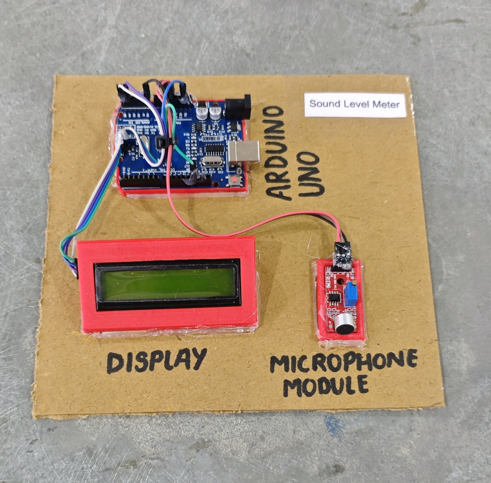

# 🔊 Sound Level Meter

This project demonstrates a simple **sound level measurement system** using an **Arduino**, a **microphone sound sensor module**, and a **16x2 I2C LCD display**.  
The system reads ambient sound levels and displays an approximate **decibel (dB)** value on the LCD screen.

> ⚠️ Note: The dB value shown is an approximate mapping and not a calibrated professional measurement.

## 🧩 Required Components
- 1 x Arduino UNO  
- 1 x Microphone Sound Sensor Module (Analog Output)  
- 1 x 16x2 I2C LCD Display (Address: 0x27)  
- Breadboard & Jumper Wires  
- USB Cable / Power Supply  
- 3D Model (Reference): [**Thingiverse**](https://www.thingiverse.com)

## 🔌 Connections

<table>
  <thead>
    <tr>
      <th align="center">Component</th>
      <th align="center">Component Pin</th>
      <th align="center">Arduino Pin</th>
    </tr>
  </thead>
  <tbody>
    <tr>
      <td rowspan="3" align="center"><b>Sound Sensor Module</b></td>
      <td align="center">VCC</td>
      <td align="center">5V</td>
    </tr>
    <tr>
      <td align="center">GND</td>
      <td align="center">GND</td>
    </tr>
    <tr>
      <td align="center">AO (Analog Out)</td>
      <td align="center">A0</td>
    </tr>
    <tr>
      <td rowspan="4" align="center"><b>I2C LCD</b></td>
      <td align="center">VCC</td>
      <td align="center">5V</td>
    </tr>
    <tr>
      <td align="center">GND</td>
      <td align="center">GND</td>
    </tr>
    <tr>
      <td align="center">SDA</td>
      <td align="center">A4</td>
    </tr>
    <tr>
      <td align="center">SCL</td>
      <td align="center">A5</td>
    </tr>
  </tbody>
</table>

> ℹ️ **Note:**  
> - I2C LCD address is usually **0x27** or **0x3F**.  
> - Ensure all components share a common GND connection.

## 💻 Software Used
- [**Arduino IDE**](https://www.arduino.cc/en/software/)

## 📚 Dependencies
Install from Arduino Library Manager:

- [**LiquidCrystal I2C**](https://github.com/johnrickman/LiquidCrystal_I2C)  
- [**Wire Library**](https://www.arduino.cc/en/reference/wire) *(Built-in)*  

## 📁 Project Files
- 💻 [**Source Code**](./code/Sound_Level_Meter.ino)  
- 📸 [**Project Photo**](./photos/Sound_Level_Meter.jpg)

## 📸 Demo

  

## ⚙️ Working
- The microphone sensor reads ambient sound as an **analog value (0–1023)**.  
- The raw analog value is mapped to an approximate **30–120 dB range**.  
- The calculated dB value is displayed on the **16x2 LCD display**.  
- The system updates the reading every **300 milliseconds**.

## 🚀 Future Improvements
- Add **OLED display with sound graph visualization**.  
- Add **LED bar graph** for visual sound intensity indication.  
- Add **buzzer alert** for high noise levels.  
- Add **ESP8266/ESP32** for IoT-based sound monitoring.  
- Calibrate with a professional dB meter for improved accuracy.
