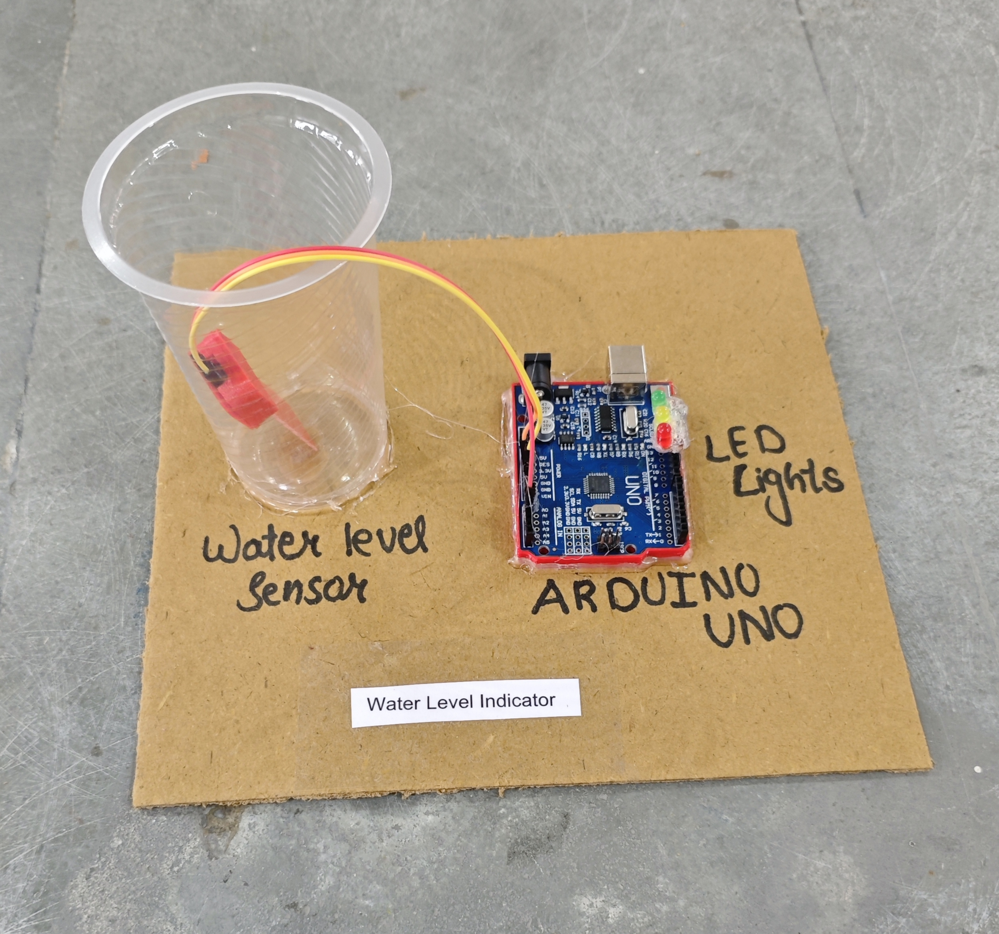

# 💧 Water Level Indicator

This project demonstrates a simple **water level monitoring system** using an **Arduino**, a **water level sensor**, and three **LED indicators**.  
The system reads the water level from an analog sensor and indicates whether the tank is **Low, Medium, High, or Full** using LEDs.

## 🧩 Required Components
- 1 x Arduino UNO  
- 1 x Water Level Sensor (Analog Output)  
- 3 x LEDs (Red, Yellow, Green recommended)  
- 3 x 220Ω Resistors  
- Breadboard & Jumper Wires  
- USB Cable / Power Supply  
- 3D Model (Reference): [**Thingiverse**](https://www.thingiverse.com)

## 🔌 Connections

<table>
  <thead>
    <tr>
      <th align="center">Component</th>
      <th align="center">Component Pin</th>
      <th align="center">Arduino Pin</th>
    </tr>
  </thead>
  <tbody>
    <!-- Water Level Sensor -->
    <tr>
      <td rowspan="3" align="center"><b>Water Level Sensor</b></td>
      <td align="center">VCC</td>
      <td align="center">5V</td>
    </tr>
    <tr>
      <td align="center">GND</td>
      <td align="center">GND</td>
    </tr>
    <tr>
      <td align="center">AO (Analog Out)</td>
      <td align="center">A2</td>
    </tr>
    <!-- LED 1 -->
    <tr>
      <td rowspan="2" align="center"><b>LED 1 (Low)</b></td>
      <td align="center">Anode (+) via 220Ω resistor</td>
      <td align="center">Pin 11</td>
    </tr>
    <tr>
      <td align="center">Cathode (–)</td>
      <td align="center">GND</td>
    </tr>
    <!-- LED 2 -->
    <tr>
      <td rowspan="2" align="center"><b>LED 2 (Medium)</b></td>
      <td align="center">Anode (+) via 220Ω resistor</td>
      <td align="center">Pin 12</td>
    </tr>
    <tr>
      <td align="center">Cathode (–)</td>
      <td align="center">GND</td>
    </tr>
    <!-- LED 3 -->
    <tr>
      <td rowspan="2" align="center"><b>LED 3 (High / Full)</b></td>
      <td align="center">Anode (+) via 220Ω resistor</td>
      <td align="center">Pin 13</td>
    </tr>
    <tr>
      <td align="center">Cathode (–)</td>
      <td align="center">GND</td>
    </tr>
  </tbody>
</table>

> ⚠️ **Important:**  
> - Always use a **220Ω resistor** with each LED to prevent damage.  
> - Adjust threshold values in code according to your sensor calibration.

## 💻 Software Used
- [**Arduino IDE**](https://www.arduino.cc/en/software/)

## 📁 Project Files
- 💻 [**Source Code**](./code/Water_Level_Indicator.ino)  
- 📸 [**Project Photo**](./photos/Water_Level_Indicator.jpg)

## 📸 Demo

  

## ⚙️ Working
- The water level sensor outputs an **analog value (0–1023)** based on the water level.  
- Arduino reads the value from **A2**.  
- Based on predefined thresholds:
  - **< 200** → Very Low (No LED ON)  
  - **200–400** → Medium (LED1 ON)  
  - **400–600** → High (LED1 + LED2 ON)  
  - **> 600** → Full Tank (All LEDs ON)  
- Sensor values can be monitored via the **Serial Monitor** for calibration.

## 🚀 Future Improvements
- Add **buzzer alert** for low water level.  
- Add **LCD display** for percentage-based indication.  
- Add **automatic motor control** using relay module.  
- Add **ESP8266/ESP32** for IoT-based tank monitoring.  
- Add **SMS alert system** using GSM module.

