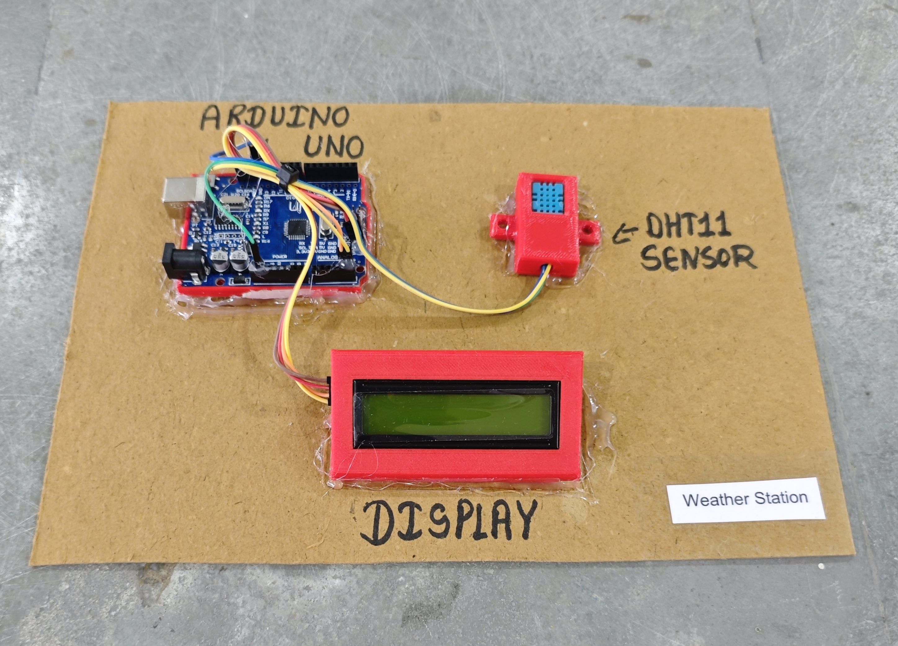

# 🌤️ Weather Station

This project demonstrates a simple **weather monitoring system** using an **Arduino**, a **DHT11 module (temperature & humidity sensor)**, and a **16x2 I2C LCD display**.  
The system reads real-time temperature and humidity values and displays them on both the **LCD screen** and the **Serial Monitor**.

## 🧩 Required Components
- 1 x Arduino UNO  
- 1 x DHT11 Module  
- 1 x 16x2 I2C LCD Display (Address: 0x27)  
- Breadboard & Jumper Wires  
- USB Cable / Power Supply  
- 3D Model (Reference): [**Thingiverse**](https://www.thingiverse.com)

## 🔌 Connections

<table>
  <thead>
    <tr>
      <th align="center">Component</th>
      <th align="center">Component Pin</th>
      <th align="center">Arduino Pin</th>
    </tr>
  </thead>
  <tbody>
    <tr>
      <td rowspan="3" align="center"><b>DHT11 Module</b></td>
      <td align="center">VCC</td>
      <td align="center">5V</td>
    </tr>
    <tr>
      <td align="center">GND</td>
      <td align="center">GND</td>
    </tr>
    <tr>
      <td align="center">DATA</td>
      <td align="center">Pin 13</td>
    </tr>
    <tr>
      <td rowspan="4" align="center"><b>I2C LCD</b></td>
      <td align="center">VCC</td>
      <td align="center">5V</td>
    </tr>
    <tr>
      <td align="center">GND</td>
      <td align="center">GND</td>
    </tr>
    <tr>
      <td align="center">SDA</td>
      <td align="center">A4</td>
    </tr>
    <tr>
      <td align="center">SCL</td>
      <td align="center">A5</td>
    </tr>
  </tbody>
</table>

> ℹ️ **Note:**  
> - This project uses the **DHT11 module**, which already has a built-in pull-up resistor.  
> - No external resistor is required.  
> - I2C LCD address is usually **0x27** or **0x3F**.

## 💻 Software Used
- [**Arduino IDE**](https://www.arduino.cc/en/software/)

## 📚 Dependencies
Install from Arduino Library Manager:

- [**DHT Sensor Library (Adafruit)**](https://github.com/adafruit/DHT-sensor-library)  
- [**Adafruit Unified Sensor**](https://github.com/adafruit/Adafruit_Sensor)  
- [**LiquidCrystal I2C**](https://github.com/johnrickman/LiquidCrystal_I2C)  
- [**Wire Library**](https://www.arduino.cc/en/reference/wire) *(Built-in)*  

## 📁 Project Files
- 💻 [**Source Code**](./code/Weather_Station.ino)  
- 📸 [**Project Photo**](./photos/Weather_Station.jpg)

## 📸 Demo

  

## ⚙️ Working
- The DHT11 module measures:
  - **Temperature (°C)**
  - **Humidity (%)**
- Arduino reads data every **2 seconds**.
- Values are displayed on:
  - The **16x2 LCD display**
  - The **Serial Monitor**
- This creates a simple indoor **weather monitoring system**.

## 🚀 Future Improvements
- Upgrade to **DHT22** for higher accuracy.  
- Add **BMP280** for pressure monitoring.  
- Add **ESP8266/ESP32** for IoT weather dashboard.  
- Add **SD card module** for data logging.
