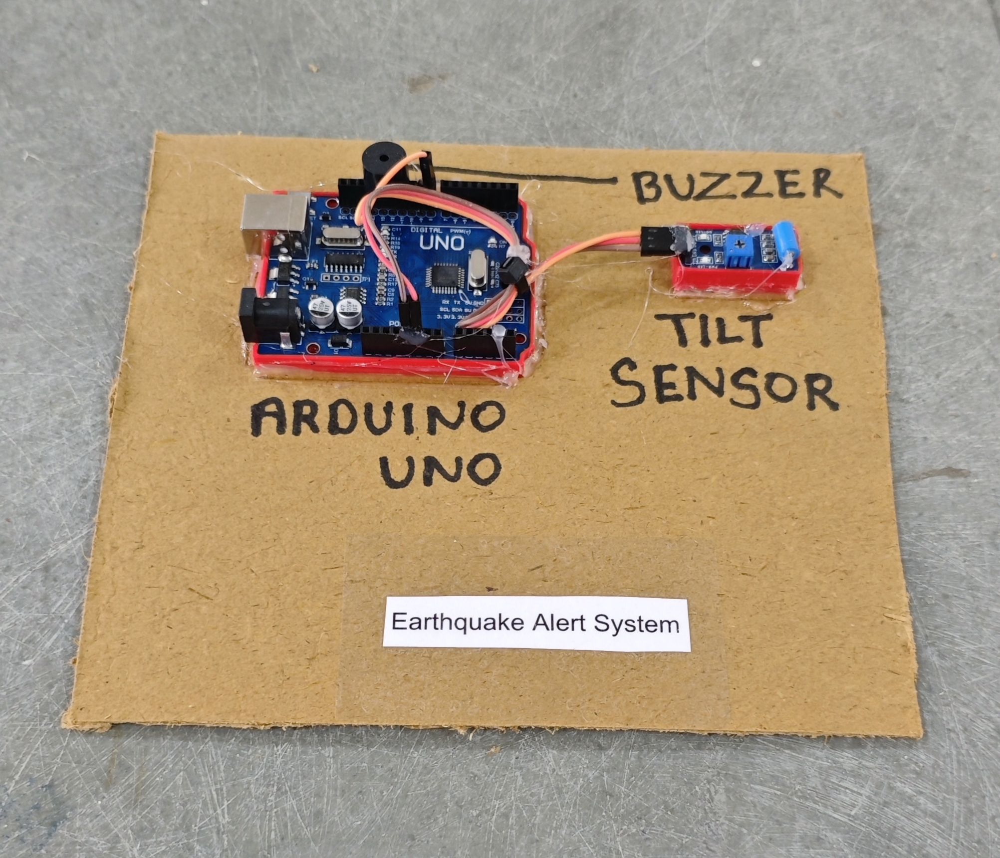

# 🌍 Earthquake Alert System

This project demonstrates a simple **earthquake detection and alert system** using an **Arduino**, a **tilt/vibration sensor**, a **buzzer**, and an **LED indicator**.  
When vibration or movement is detected, the system triggers a **buzzer alarm** and turns ON the LED to alert users.

## 🧩 Required Components
- 1 x Arduino UNO  
- 1 x Tilt / Vibration Sensor Module  
- 1 x Buzzer  
- 1 x LED  
- 1 x 220Ω Resistor (for LED)  
- Breadboard & Jumper Wires  
- USB Cable / Power Supply  
- 3D Model (Reference): [**Thingiverse**](https://www.thingiverse.com)

## 🔌 Connections

<table>
  <thead>
    <tr>
      <th align="center">Component</th>
      <th align="center">Component Pin</th>
      <th align="center">Arduino Pin</th>
    </tr>
  </thead>
  <tbody>
    <tr>
      <td rowspan="3" align="center"><b>Tilt / Vibration Sensor</b></td>
      <td align="center">VCC</td>
      <td align="center">5V</td>
    </tr>
    <tr>
      <td align="center">GND</td>
      <td align="center">GND</td>
    </tr>
    <tr>
      <td align="center">OUT</td>
      <td align="center">Pin 8</td>
    </tr>
    <tr>
      <td align="center"><b>Buzzer</b></td>
      <td align="center">+ (Signal)</td>
      <td align="center">Pin 11</td>
    </tr>
    <tr>
      <td align="center"><b>LED</b></td>
      <td align="center">Anode (+) via 220Ω</td>
      <td align="center">Pin 12</td>
    </tr>
    <tr>
      <td colspan="3" align="center">
        All GND connections → Arduino GND
      </td>
    </tr>
  </tbody>
</table>

> ⚠️ **Important:**  
> - This system detects vibration or tilt changes, not real seismic intensity.  
> - Sensitivity depends on sensor quality and mounting stability.

## 💻 Software Used
- [**Arduino IDE**](https://www.arduino.cc/en/software/)

## 📁 Project Files
- 💻 [**Source Code**](./code/Earthquake_Alert_System.ino)  
- 📸 [**Project Photo**](./photos/Earthquake_Alert_System.jpg)

## 📸 Demo

  

## ⚙️ Working
- The tilt/vibration sensor detects movement or sudden changes.  
- When vibration is detected:
  - The **buzzer turns ON**
  - The **LED lights up**
- The alert remains active for **2 seconds**.
- If no movement is detected, the system remains silent.

## 🚀 Future Improvements
- Add **LCD display** for alert messages.  
- Add **ESP8266/ESP32** for IoT emergency notification.  
- Add **GSM module** for SMS alerts.  
- Add **adjustable sensitivity control**.
