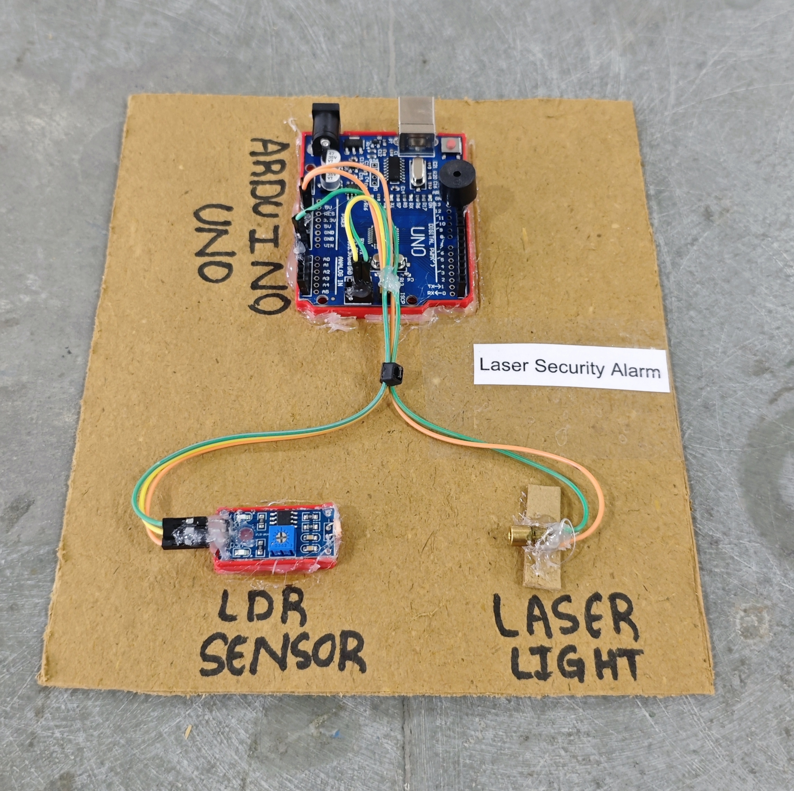

# 🔐 Laser Security Alarm

This project demonstrates a simple **laser-based security alarm system** using an **Arduino**, an **LDR module**, and a **buzzer**.  
When the laser beam is interrupted, the system activates a **buzzer alarm** to indicate possible intrusion.

## 🧩 Required Components
- 1 x Arduino UNO  
- 1 x LDR Module
- 1 x Laser Module  
- 1 x Buzzer  
- Breadboard & Jumper Wires  
- USB Cable / Power Supply  
- 3D Model (Reference): [**Thingiverse**](https://www.thingiverse.com)

## 🔌 Connections

<table>
  <thead>
    <tr>
      <th align="center">Component</th>
      <th align="center">Component Pin</th>
      <th align="center">Arduino Pin</th>
    </tr>
  </thead>
  <tbody>
    <!-- LDR Module -->
    <tr>
      <td rowspan="3" align="center"><b>LDR Module</b></td>
      <td align="center">VCC</td>
      <td align="center">5V</td>
    </tr>
    <tr>
      <td align="center">GND</td>
      <td align="center">GND</td>
    </tr>
    <tr>
      <td align="center">DO (Digital Out)</td>
      <td align="center">Pin 2</td>
    </tr>
    <!-- Laser Module -->
    <tr>
      <td rowspan="2" align="center"><b>Laser Module</b></td>
      <td align="center">VCC (+)</td>
      <td align="center">5V</td>
    </tr>
    <tr>
      <td align="center">GND (–)</td>
      <td align="center">GND</td>
    </tr>
    <!-- Buzzer -->
    <tr>
      <td rowspan="2" align="center"><b>Buzzer</b></td>
      <td align="center">+ (Signal)</td>
      <td align="center">Pin 11</td>
    </tr>
    <tr>
      <td align="center">– (GND)</td>
      <td align="center">GND</td>
    </tr>
  </tbody>
</table>

> ⚠️ **Important:**  
> - Most LDR modules are **Active LOW**.  
> - Use the onboard potentiometer to adjust sensitivity.  
> - Proper alignment between laser and LDR module is required.  

## 💻 Software Used
- [**Arduino IDE**](https://www.arduino.cc/en/software/)

## 📁 Project Files
- 💻 [**Source Code**](./code/Laser_Security_Alarm.ino)  
- 📸 [**Project Photo**](./photos/Laser_Security_Alarm.jpg)

## 📸 Demo

  

## ⚙️ Working
- The laser continuously falls on the LDR module.  
- When the beam is intact:
  - Output remains stable.
  - Buzzer stays OFF.
- When the beam is interrupted:
  - Digital output changes.
  - Buzzer turns ON.
- Sensitivity can be adjusted using the onboard potentiometer.

## 🚀 Future Improvements
- Add **LCD display** for intrusion message.  
- Add **GSM module** for SMS alert.  
- Add **ESP8266/ESP32** for IoT-based monitoring.

