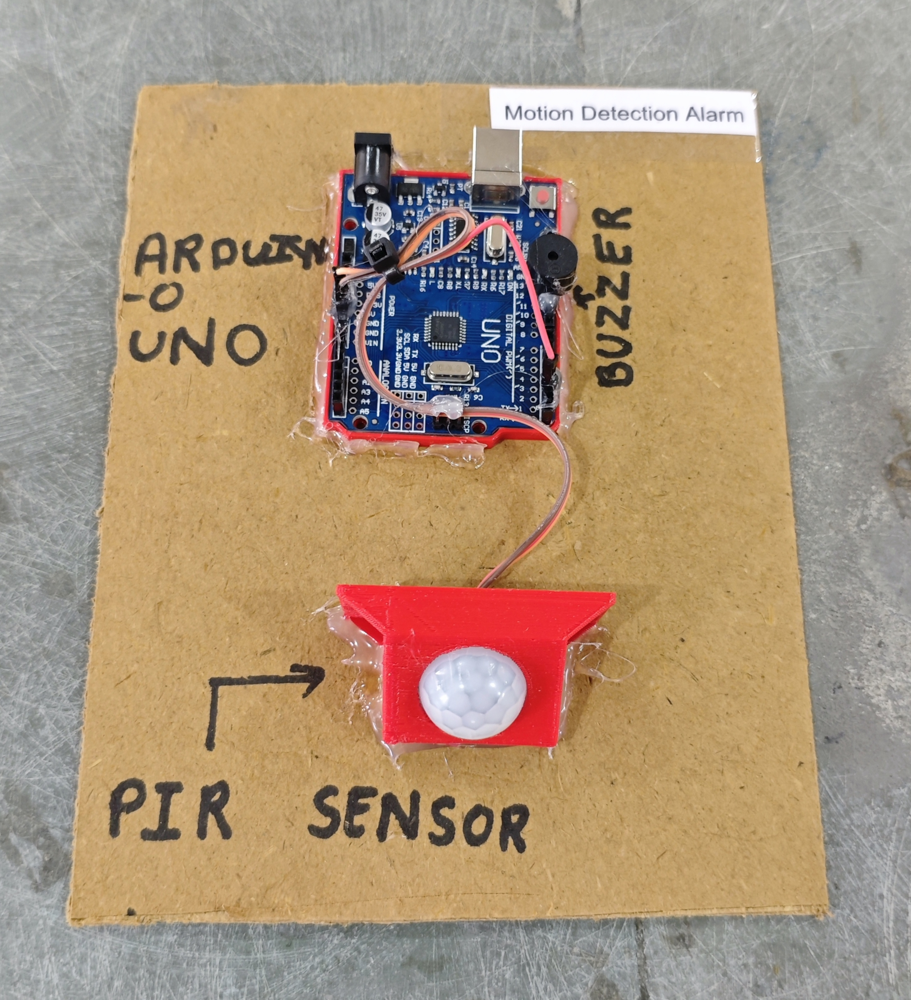

# 🚨 Motion Detection Alarm

This project demonstrates a robust **motion detection alarm system** using an **Arduino**, a **PIR motion sensor**, a **buzzer**, and an **LED indicator**.  
When motion is detected, the system activates an alarm for a fixed duration and requires a reset period before accepting a new trigger.

## 🧩 Required Components
- 1 x Arduino UNO  
- 1 x PIR Motion Sensor (HC-SR501)  
- 1 x Buzzer  
- 1 x LED  
- 1 x 220Ω Resistor (for LED)  
- Breadboard & Jumper Wires  
- USB Cable / Power Supply  
- 3D Model (Reference): [**Thingiverse**](https://www.thingiverse.com)

## 🔌 Connections

<table>
  <thead>
    <tr>
      <th align="center">Component</th>
      <th align="center">Component Pin</th>
      <th align="center">Arduino Pin</th>
    </tr>
  </thead>
  <tbody>
    <tr>
      <td rowspan="3" align="center"><b>PIR Sensor</b></td>
      <td align="center">VCC</td>
      <td align="center">5V</td>
    </tr>
    <tr>
      <td align="center">GND</td>
      <td align="center">GND</td>
    </tr>
    <tr>
      <td align="center">OUT</td>
      <td align="center">Pin 2</td>
    </tr>
    <tr>
      <td align="center"><b>Buzzer</b></td>
      <td align="center">+ (Signal)</td>
      <td align="center">Pin 11</td>
    </tr>
    <tr>
      <td align="center"><b>LED</b></td>
      <td align="center">Anode (+) via 220Ω</td>
      <td align="center">Pin 13</td>
    </tr>
    <tr>
      <td colspan="3" align="center">
        All GND connections → Arduino GND
      </td>
    </tr>
  </tbody>
</table>

> ℹ️ **Note:**  
> - PIR sensors require a warm-up time (~30–60 seconds).  
> - Alarm duration is set to **5 seconds**.  
> - Reset requires PIR to stay LOW for **2 seconds** before re-triggering.

## 💻 Software Used
- [**Arduino IDE**](https://www.arduino.cc/en/software/)

## 📁 Project Files
- 💻 [**Source Code**](./code/Motion_Detection_Alarm.ino)  
- 📸 [**Project Photo**](./photos/Motion_Detection_Alarm.jpg)

## 📸 Demo

  

## ⚙️ Working
- PIR detects infrared motion from human movement.
- When motion is detected:
  - Buzzer turns ON
  - LED turns ON
  - Alarm remains active for 5 seconds
- After alarm:
  - System waits for PIR to stay LOW for 2 seconds
  - Then resets and becomes ready for next detection

## 🚀 Future Improvements
- Add **LCD display** for status messages.  
- Add **GSM module** for SMS alerts.  
- Add **ESP8266/ESP32** for IoT monitoring.  
- Add **Camera module** for intrusion capture.  
