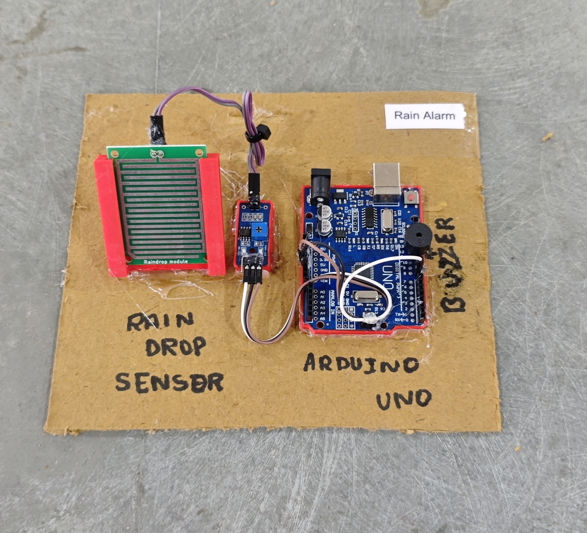

# 🌧️ Rain Alarm

This project demonstrates a simple **rain detection alarm system** using an **Arduino**, a **rain sensor module**, and a **buzzer**.  
When rain is detected, the system activates a **buzzer alert** to notify the user.

## 🧩 Required Components
- 1 x Arduino UNO  
- 1 x Rain Sensor Module  
- 1 x Buzzer  
- Breadboard & Jumper Wires  
- USB Cable / Power Supply  
- 3D Model (Reference): [**Thingiverse**](https://www.thingiverse.com)

## 🔌 Connections

<table>
  <thead>
    <tr>
      <th align="center">Component</th>
      <th align="center">Component Pin</th>
      <th align="center">Arduino Pin</th>
    </tr>
  </thead>
  <tbody>
    <tr>
      <td rowspan="3" align="center"><b>Rain Sensor Module</b></td>
      <td align="center">VCC</td>
      <td align="center">5V</td>
    </tr>
    <tr>
      <td align="center">GND</td>
      <td align="center">GND</td>
    </tr>
    <tr>
      <td align="center">DO (Digital Out)</td>
      <td align="center">Pin 8</td>
    </tr>
    <tr>
      <td align="center"><b>Buzzer</b></td>
      <td align="center">+ (Signal)</td>
      <td align="center">Pin 11</td>
    </tr>
    <tr>
      <td colspan="3" align="center">
        All GND connections → Arduino GND
      </td>
    </tr>
  </tbody>
</table>

> ⚠️ **Important:**  
> - Most rain sensor modules are **Active LOW** (LOW = rain detected).  
> - Adjust sensitivity using the onboard potentiometer.  
> - This is a basic prototype and not a certified weather device.

## 💻 Software Used
- [**Arduino IDE**](https://www.arduino.cc/en/software/)

## 📁 Project Files
- 💻 [**Source Code**](./code/Rain_Alarm.ino)  
- 📸 [**Project Photo**](./photos/Rain_Alarm.jpg)

## 📸 Demo

  

## ⚙️ Working
- The rain sensor detects water droplets on its surface.  
- When rain is detected:
  - The sensor output becomes **LOW**.
  - The buzzer turns **ON**.
- When no rain is detected:
  - The buzzer remains **OFF**.

## 🚀 Future Improvements
- Add **LCD display** for rain status.  
- Add **ESP8266/ESP32** for IoT weather alerts.  
- Add **SMS notification system** using GSM module.  
- Integrate with **automatic roof or window control system**.  
- Add **water intensity level detection** using analog output.
