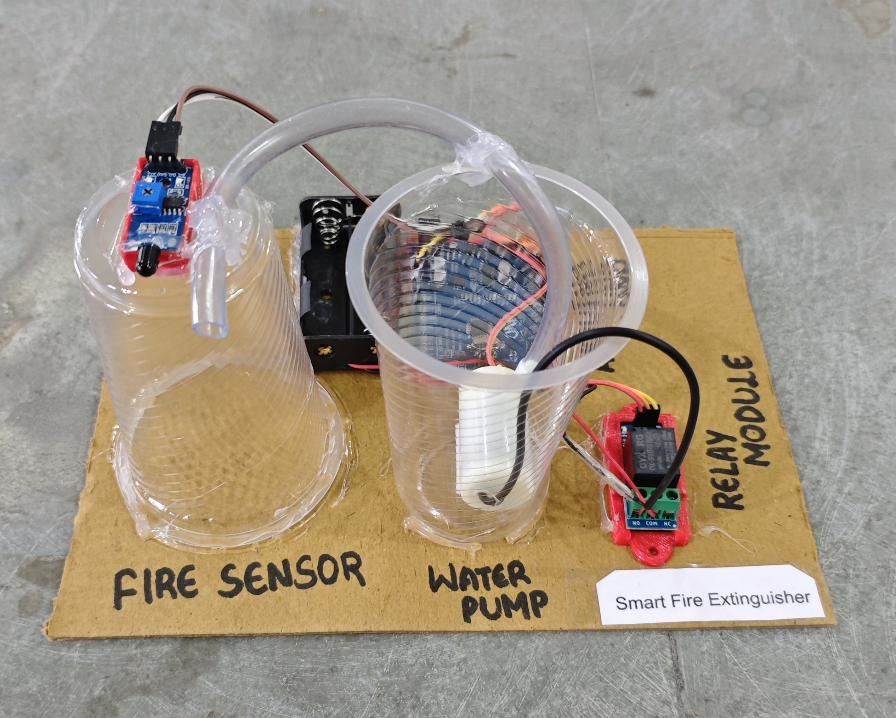

# 🧯 Smart Fire Extinguisher

This project demonstrates a simple **automatic fire extinguishing system** using an **Arduino**, a **flame sensor module**, and a **relay-controlled DC water pump**.  
When fire is detected, the pump **automatically turns ON** to spray water, and turns **OFF** when no fire is detected.

## 🧩 Required Components
- 1 x Arduino UNO  
- 1 x Flame Sensor Module  
- 1 x Single Channel Relay Module (Active LOW)  
- 1 x DC Mini Water Pump  
- 2 x 18650 Li-ion Cells with Holder  
- Pipes / Tubes for water flow  
- Breadboard & Jumper Wires  
- USB Cable / Power Supply  
- 3D Model (Reference): [**Thingiverse**](https://www.thingiverse.com)

## 🔌 Connections

*1. Control Circuit (Arduino & Modules)*  
<table>
  <thead>
    <tr>
      <th align="center">Component</th>
      <th align="center">Component Pin</th>
      <th align="center">Arduino Pin</th>
    </tr>
  </thead>
  <tbody>
    <tr>
      <td rowspan="3" align="center"><b>Flame Sensor Module</b></td>
      <td align="center">VCC</td>
      <td align="center">5V</td>
    </tr>
    <tr>
      <td align="center">GND</td>
      <td align="center">GND</td>
    </tr>
    <tr>
      <td align="center">DO (Digital Out)</td>
      <td align="center">Pin 9</td>
    </tr>
    <tr>
      <td rowspan="3" align="center"><b>Relay Module</b></td>
      <td align="center">IN</td>
      <td align="center">Pin 8</td>
    </tr>
    <tr>
      <td align="center">VCC</td>
      <td align="center">5V</td>
    </tr>
    <tr>
      <td align="center">GND</td>
      <td align="center">GND</td>
    </tr>
  </tbody>
</table>

> ℹ️ **Relay Note:**  
> - This project is configured for an **Active LOW relay module**.  
> - If you are using an **Active HIGH relay**, you may need to invert the relay logic in the code.

*2. Pump Connection (DC Water Pump via Relay)*  
<table>
  <thead>
    <tr>
      <th align="center">Component</th>
      <th align="center">Wire</th>
      <th align="center">Connects To</th>
    </tr>
  </thead>
  <tbody>
    <tr>
      <td align="center"><b>Battery Pack (2 × 18650)</b></td>
      <td align="center">Positive (+)</td>
      <td align="center">Relay COM</td>
    </tr>
    <tr>
      <td rowspan="2" align="center"><b>DC Water Pump</b></td>
      <td align="center">Positive (+)</td>
      <td align="center">Relay NO</td>
    </tr>
    <tr>
      <td align="center">Negative (-)</td>
      <td align="center">Battery Pack Negative (-)</td>
    </tr>
  </tbody>
</table>

> ⚠️ **Safety & Power Notes:**  
> - Do **not** power the DC water pump from Arduino 5V.  
> - Use **2 × 18650 Li-ion cells** with a proper holder.  
> - If required by your relay module, connect **Arduino GND and battery negative (–)** together (common ground).  
> - Keep water away from electronic components while testing.  

## 💻 Software Used
- [**Arduino IDE**](https://www.arduino.cc/en/software/)

## 📁 Project Files
- 💻 [**Source Code**](./code/Smart_Fire_Extinguisher.ino)  
- 📸 [**Project Photo**](./photos/Smart_Fire_Extinguisher.jpg)

## 📸 Demo

  

## ⚙️ Working
- The flame sensor detects infrared radiation emitted by fire.  
- Arduino continuously reads the digital output from the sensor.  
- When fire is detected (sensor output LOW):  
  - Relay goes **LOW** → Pump **ON** (Active LOW).  
- When no fire is detected:  
  - Relay goes **HIGH** → Pump **OFF**.  
- The system automatically sprays water to extinguish the fire.

## 🚀 Future Improvements
- Add **buzzer alert system**.  
- Add **temperature sensor** for double confirmation.  
- Add **ESP8266/ESP32** for IoT fire alerts.  
- Add **automatic sprinkler distribution system**.  
- Add **GSM module** for emergency SMS notification.

