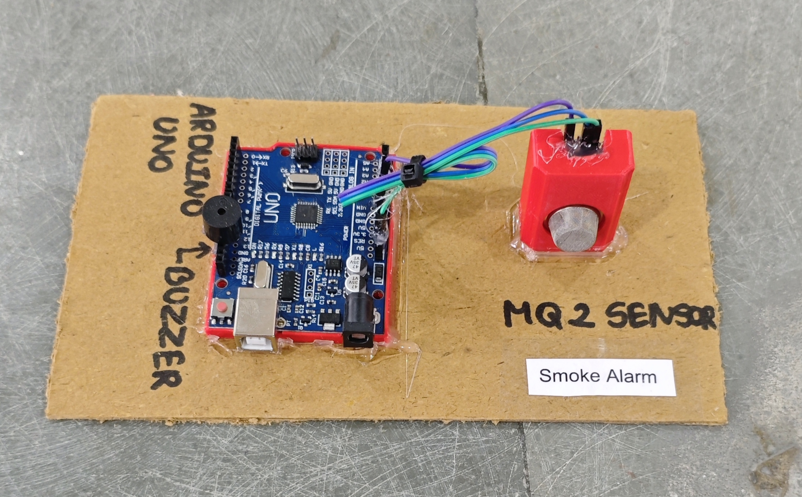

# 🚨 Smoke Alarm

This project demonstrates a simple **smoke and gas detection system** using an **Arduino**, an **MQ-2 gas sensor**, and a **buzzer**.  
When smoke or gas concentration exceeds a defined threshold, the system activates a **buzzer alarm** to alert users.

## 🧩 Required Components
- 1 x Arduino UNO  
- 1 x MQ-2 Gas/Smoke Sensor Module  
- 1 x Buzzer  
- Breadboard & Jumper Wires  
- USB Cable / Power Supply  
- 3D Model (Reference): [**Thingiverse**](https://www.thingiverse.com)

## 🔌 Connections

<table>
  <thead>
    <tr>
      <th align="center">Component</th>
      <th align="center">Component Pin</th>
      <th align="center">Arduino Pin</th>
    </tr>
  </thead>
  <tbody>
    <tr>
      <td rowspan="4" align="center"><b>MQ-2 Sensor Module</b></td>
      <td align="center">VCC</td>
      <td align="center">5V</td>
    </tr>
    <tr>
      <td align="center">GND</td>
      <td align="center">GND</td>
    </tr>
    <tr>
      <td align="center">AO (Analog Out)</td>
      <td align="center">A0</td>
    </tr>
    <tr>
      <td align="center">DO (Optional)</td>
      <td align="center">Not Used</td>
    </tr>
    <tr>
      <td align="center"><b>Buzzer</b></td>
      <td align="center">+ (Signal)</td>
      <td align="center">Pin 11</td>
    </tr>
    <tr>
      <td colspan="3" align="center">
        All GND connections → Arduino GND
      </td>
    </tr>
  </tbody>
</table>

> ⚠️ **Sensor Notes:**  
> - MQ-2 sensor requires a warm-up time (30–60 seconds).  
> - Adjust the `threshold` value in the code according to your environment.  
> - Sensor detects smoke, LPG, methane, hydrogen, and other gases.

## 💻 Software Used
- [**Arduino IDE**](https://www.arduino.cc/en/software/)

## 📁 Project Files
- 💻 [**Source Code**](./code/Smoke_Alarm.ino)  
- 📸 [**Project Photo**](./photos/Smoke_Alarm.jpg)

## 📸 Demo

  

## ⚙️ Working
- MQ-2 sensor continuously measures gas/smoke concentration.
- Arduino reads the analog output value.
- If sensor value exceeds the defined threshold:
  - Buzzer turns ON.
- If value is below threshold:
  - Buzzer remains OFF.
- Serial Monitor can be used for calibration.

## 🚀 Future Improvements
- Add **LCD display** for gas level monitoring.  
- Add **ESP8266/ESP32** for IoT alerts.  
- Add **GSM module** for SMS notification.  
- Add **automatic ventilation system using relay**.  
- Add **temperature sensor** for fire confirmation.
