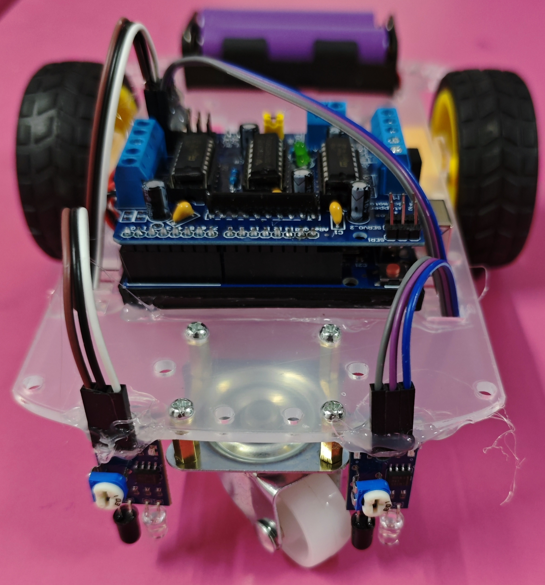

# 🚗 Line Follower Car

This project demonstrates an intelligent **Line follower Car** using **Arduino UNO**, an **L293D motor driver**, and **two analog IR sensors**.  
The car follows a black line on a white surface using sensor-based decision logic and differential motor control.
This version uses a **2-wheel drive chassis**.

## 🧩 Required Components
- 1 x Arduino UNO  
- 1 x L293D Motor Shield
- 1 x 2-Wheel Drive Chassis Kit (Wheels, Motors) 
- 2 x IR Sensors Modules   
- 2 x 18650 Li-ion Cells with Holder  
- Breadboard & Jumper Wires
- USB Cable / Power Supply 
- Black Electrical Tape (4.5 – 5 cm width)
- 3D Model (Reference): [**Thingiverse**](https://www.thingiverse.com)

## 📐 Mechanical Setup Requirements
For proper working:
- Distance between IR sensors: **8 – 9 cm**
- Black line width: **4.5 – 5 cm**
- Sensor height from ground: **~2 cm**

## 🔌 Connections

*1. L293D Motor Shield (Mounted on Arduino UNO)*

<table>
  <thead>
    <tr>
      <th align="center">Component</th>
      <th align="center">Shield Motor Terminal</th>
    </tr>
  </thead>
  <tbody>
    <tr>
      <td align="center"><b>Left Motor</b></td>
      <td align="center">M3 Terminal</td>
    </tr>
    <tr>
      <td align="center"><b>Right Motor</b></td>
      <td align="center">M4 Terminal</td>
    </tr>
  </tbody>
</table>

> - The L293D motor shield is directly mounted on the Arduino UNO.  
> - Motor control pins are internally mapped by the shield.

*2. IR Sensors Modules (Connected via Shield Headers)*

<table>
  <thead>
    <tr>
      <th align="center">Sensor</th>
      <th align="center">Shield Header Pin</th>
    </tr>
  </thead>
  <tbody>
    <tr>
      <td align="center"><b>Left IR Sensor</b></td>
      <td align="center">A4</td>
    </tr>
    <tr>
      <td align="center"><b>Right IR Sensor</b></td>
      <td align="center">A5</td>
    </tr>
    <tr>
      <td align="center"><b>VCC</b></td>
      <td align="center">5V</td>
    </tr>
    <tr>
      <td align="center"><b>GND</b></td>
      <td align="center">GND</td>
    </tr>
  </tbody>
</table>

> - The IR sensors are connected to the shield header pins, which are internally connected to the corresponding Arduino pins.

*3. Power Connections*

<table>
  <thead>
    <tr>
      <th align="center">Component</th>
      <th align="center">Shield Power Terminal</th>
    </tr>
  </thead>
  <tbody>
    <tr>
      <td align="center"><b>2 × 18650 Battery Pack (+)</b></td>
      <td align="center">EXT_PWR (M+)</td>
    </tr>
    <tr>
      <td align="center"><b>Battery Pack (-)</b></td>
      <td align="center">GND</td>
    </tr>
  </tbody>
</table>

> - ⚠️ Ensure all grounds are connected together (Common Ground).  

## 💻 Software Used
- [**Arduino IDE**](https://www.arduino.cc/en/software/)

## 📚 Dependencies

Install from Arduino Library Manager or official sources:

- [**Adafruit Motor Shield Library V1 (AFMotor)**](https://github.com/adafruit/Adafruit-Motor-Shield-library) 

## 📁 Project Files
- 💻 [**Source Code**](./code/Line_Follower_Car.ino)  
- 📸 [**Project Photo**](./photos/Line_Follower_Car.jpg)

## 📸 Demo

  

## ⚙️ Working
- Robot reads analog values from both IR sensors.
- If right sensor detects black → Turn right.
- If left sensor detects black → Turn left.
- If both detect white → Move forward.
- If both detect black → Stop.
- The robot adjusts turning speed automatically for smoother tracking.

## 🚀 Future Improvements  
- Add speed tuning via potentiometer  
- Add Bluetooth monitoring  
- Upgrade to ESP32  
- Add OLED display for sensor values
