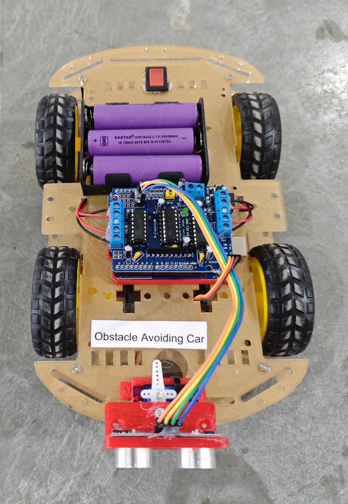

# 🚗 Obstacle Avoiding Car

This project demonstrates an autonomous **Obstacle Avoiding Robot Car** using **Arduino UNO**, an **HC-SR04 Ultrasonic Sensor**, a **Servo Motor**, and an **L293D Motor Shield**.  
The car automatically detects obstacles and intelligently chooses the clearer direction to navigate.  
This version uses a **4-wheel drive chassis (4 DC motors)** for better traction and stability.

## 🧩 Required Components
- 1 x Arduino UNO  
- 1 x L293D Motor Shield  
- 1 x HC-SR04 Ultrasonic Sensor  
- 1 x SG90 Servo Motor  
- 1 x 4-Wheel Drive Chassis Kit (Wheels, Motors)  
- 3 x 18650 Li-ion Cells with Holder  
- Breadboard & Jumper Wires  
- USB Cable / Power Supply
- 3D Model (Reference): [**Thingiverse**](https://www.thingiverse.com)  

## 🔌 Connections

*1. L293D Motor Shield (Mounted on Arduino UNO)*

<table>
  <thead>
    <tr>
      <th align="center">Component</th>
      <th align="center">Shield Motor Terminal</th>
    </tr>
  </thead>
  <tbody>
    <tr>
      <td align="center"><b>Motor 1 (Front Left)</b></td>
      <td align="center">M1</td>
    </tr>
    <tr>
      <td align="center"><b>Motor 2 (Front Right)</b></td>
      <td align="center">M2</td>
    </tr>
    <tr>
      <td align="center"><b>Motor 3 (Rear Left)</b></td>
      <td align="center">M3</td>
    </tr>
    <tr>
      <td align="center"><b>Motor 4 (Rear Right)</b></td>
      <td align="center">M4</td>
    </tr>
  </tbody>
</table>

> - The L293D motor shield is directly mounted on the Arduino UNO.  
> - Motor control pins are internally mapped by the shield.

*2. Ultrasonic Sensor & Servo (Connected via Shield Header Pins)*

<table>
  <thead>
    <tr>
      <th align="center">Component</th>
      <th align="center">Pin / Wire</th>
      <th align="center">Shield Header Pin</th>
    </tr>
  </thead>
  <tbody>
    <tr>
      <td rowspan="4" align="center"><b>HC-SR04 Ultrasonic</b></td>
      <td align="center">TRIG</td>
      <td align="center">A0</td>
    </tr>
    <tr>
      <td align="center">ECHO</td>
      <td align="center">A1</td>
    </tr>
    <tr>
      <td align="center">VCC</td>
      <td align="center">5V</td>
    </tr>
    <tr>
      <td align="center">GND</td>
      <td align="center">GND</td>
    </tr>
    <tr>
      <td rowspan="3" align="center"><b>Servo Motor</b></td>
      <td align="center">Signal</td>
      <td align="center">D9</td>
    </tr>
    <tr>
      <td align="center">VCC</td>
      <td align="center">5V</td>
    </tr>
    <tr>
      <td align="center">GND</td>
      <td align="center">GND</td>
    </tr>
  </tbody>
</table>

> - Servo is connected to **SERVO 1 terminal (Digital Pin 9)** of Motor Shield
> - Ultrasonic and servo are connected using shield header pins.  
> - These headers are internally mapped to the Arduino pins.

*3. Power Connections*

<table>
  <thead>
    <tr>
      <th align="center">Component</th>
      <th align="center">Shield Power Terminal</th>
    </tr>
  </thead>
  <tbody>
    <tr>
      <td align="center"><b>3 × 18650 Battery Pack (+)</b></td>
      <td align="center">EXT_PWR (M+) </td>
    </tr>
    <tr>
      <td align="center"><b>Battery Pack (-)</b></td>
      <td align="center">GND</td>
    </tr>
  </tbody>
</table>

> ⚠️ Important Power Notes:  
> - Ensure all grounds are connected together (Common Ground). 

## 💻 Software Used
- [**Arduino IDE**](https://www.arduino.cc/en/software/)

## 📚 Dependencies

Install from Arduino Library Manager or official sources:

- [**Adafruit Motor Shield Library V1 (AFMotor)**](https://github.com/adafruit/Adafruit-Motor-Shield-library)  
- [**NewPing Library**](https://bitbucket.org/teckel12/arduino-new-ping/wiki/Home)  
- [**Servo Library**](https://www.arduino.cc/reference/en/libraries/servo/) *(Built-in with Arduino IDE)*  

## 📁 Project Files
- 💻 [**Source Code**](./code/Obstacle_Avoiding_Car.ino)  
- 📸 [**Project Photo**](./photos/Obstacle_Avoiding_Car.jpg)

## 📸 Demo

  

## ⚙️ Working
- Robot continuously moves forward.
- Ultrasonic sensor measures distance.
- If obstacle ≤ 30 cm:
  - Stop
  - Move backward
  - Scan right
  - Scan left
  - Turn toward clearer direction
- Resume forward movement.
- Smooth PWM acceleration is used for stable motion.

## 🚀 Future Improvements
- Add Bluetooth manual override  
- Add WiFi control using ESP32  
- Implement smarter path decision algorithm  
- Add obstacle mapping  
- Add rechargeable charging module (TP4056)
