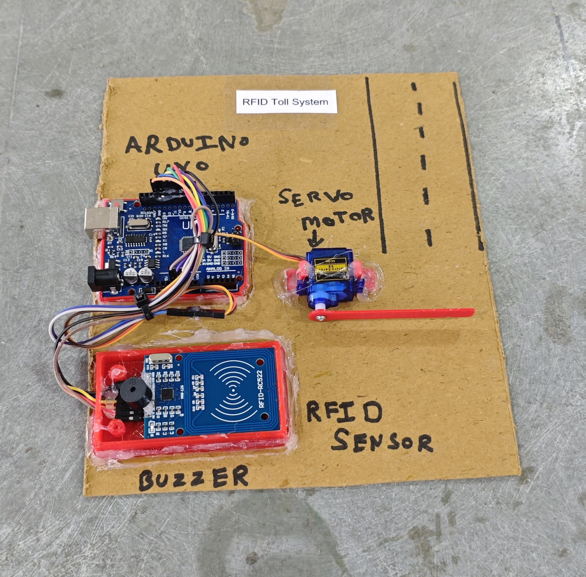

# 🛣️🚗 RFID Toll System

This project demonstrates an **RFID-based Toll Gate System** using **Arduino UNO** and the **MFRC522 RFID module**.  
When an authorized RFID card is scanned, the servo motor opens the gate and a confirmation buzzer tone is played.  
Unauthorized cards trigger an access denied alert, simulating a basic automatic toll plaza barrier system.

## 🧩 Required Components
- 1 x Arduino UNO  
- 1 x MFRC522 RFID Module (with Card & Tag)
- 1 x SG90 Servo Motor  
- 1 x Buzzer  
- Jumper Wires  
- USB Cable / Power Supply  
- 3D Model (Reference): [**Thingiverse**](https://www.thingiverse.com)

## 🔌 Connections
<table>
  <thead>
    <tr>
      <th align="center">Component</th>
      <th align="center">Component Pin</th>
      <th align="center">Arduino Pin</th>
    </tr>
  </thead>
  <tbody>
    <tr>
      <td rowspan="7" align="center"><b>MFRC522 RFID</b></td>
      <td align="center">SDA (SS)</td>
      <td align="center">Pin 10</td>
    </tr>
    <tr><td align="center">RST</td><td align="center">Pin 9</td></tr>
    <tr><td align="center">MOSI</td><td align="center">Pin 11</td></tr>
    <tr><td align="center">MISO</td><td align="center">Pin 12</td></tr>
    <tr><td align="center">SCK</td><td align="center">Pin 13</td></tr>
    <tr><td align="center">VCC</td><td align="center">3.3V</td></tr>
    <tr><td align="center">GND</td><td align="center">GND</td></tr>
    <tr>
      <td rowspan="3" align="center"><b>Servo Motor</b></td>
      <td align="center">Signal</td>
      <td align="center">Pin 7</td>
    </tr>
    <tr><td align="center">VCC</td><td align="center">5V</td></tr>
    <tr><td align="center">GND</td><td align="center">GND</td></tr>
    <tr>
      <td rowspan="2" align="center"><b>Buzzer</b></td>
      <td align="center">Signal (+)</td>
      <td align="center">Pin 8</td>
    </tr>
    <tr>
      <td align="center">GND (-)</td>
      <td align="center">GND</td>
    </tr>
  </tbody>
</table>

> ⚠️ **Power Notes**
> - MFRC522 operates at **3.3V (Do NOT connect to 5V)**.
> - If the servo motor jitters or resets the Arduino, use an external 5V supply.
> - Always connect external power GND with Arduino GND (common ground).

## 💻 Software Used

- [Arduino IDE](https://www.arduino.cc/en/software/)

## 📚 Dependencies

Install from Arduino Library Manager or official sources:

- [MFRC522 Library by Miguel Balboa](https://github.com/miguelbalboa/rfid)  
- [Servo Library](https://www.arduino.cc/reference/en/libraries/servo/) *(Built-in)*  
- [SPI Library](https://www.arduino.cc/en/reference/SPI) *(Built-in)*

## 📁 Project Files
- 💻 [**Source Code**](./code/RFID_Toll_System.ino)  
- 📸 [**Project Photo**](./photos/RFID_Toll_System.jpg)

## 📸 Demo
<p align="left">
  
</p>

## 🔎 Card Validation (Using Serial Monitor)
1. Upload the RFID Toll System code to Arduino.
2. Open **Serial Monitor** (Baud Rate: 9600).
3. Scan your RFID card and you will see:
```
UID: 626d053a
```
4. Copy the UID.
5. Replace it in your code:
```cpp
String masterTag = "626d053a";
```
6. Upload the code again and from now that RFID card will be authorized.

## ⚙️ Working
- The system continuously scans for an RFID card.
- When a card is detected, its UID is read via the MFRC522 module.
- The scanned UID is converted into a HEX string.
- The system compares the scanned UID with the stored `masterTag`.
- If the UID matches:
  - Access is granted.
  - Servo rotates to open the toll gate.
  - A success buzzer tone is played.
  - After a short delay, the gate closes automatically.
- If the UID does not match:
  - Access is denied.
  - An error buzzer tone is played.
- A small delay prevents rapid repeated scanning of the same card.

## 🚀 Future Enhancements
- Support multiple authorized RFID cards.
- Add LCD display for toll status messages.
- Implement balance deduction system.
- Store data using EEPROM or SD card.
- Connect to cloud server for real-time monitoring.
- Add vehicle detection sensor for automatic triggering.
- Add GSM module for SMS notification system.
