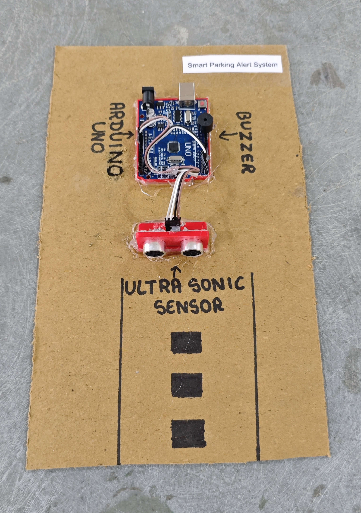

# 🚗📡 Smart Parking Alert System

This project demonstrates a **Smart Parking Alert System** using **Arduino UNO** and an **HC-SR04 Ultrasonic Sensor**.  
The system measures the distance of a vehicle while parking and activates a **buzzer alert** when the vehicle comes too close to an obstacle.
This simulates a basic **reverse parking assistance system**.

## 🧩 Required Components
- 1 x Arduino UNO  
- 1 x HC-SR04 Ultrasonic Sensor  
- 1 x Buzzer  
- Jumper Wires  
- USB Cable / Power Supply  
- 3D Model (Reference): [**Thingiverse**](https://www.thingiverse.com)

## 🔌 Connections
<table>
  <thead>
    <tr>
      <th align="center">Component</th>
      <th align="center">Pin</th>
      <th align="center">Arduino Pin</th>
    </tr>
  </thead>
  <tbody>
    <tr>
      <td rowspan="4" align="center"><b>HC-SR04 Ultrasonic</b></td>
      <td align="center">VCC</td>
      <td align="center">5V</td>
    </tr>
    <tr><td align="center">GND</td><td align="center">GND</td></tr>
    <tr><td align="center">TRIG</td><td align="center">Pin 3</td></tr>
    <tr><td align="center">ECHO</td><td align="center">Pin 2</td></tr>
    <tr>
      <td rowspan="2" align="center"><b>Buzzer</b></td>
      <td align="center">Signal (+)</td>
      <td align="center">Pin 11</td>
    </tr>
    <tr>
      <td align="center">GND (-)</td>
      <td align="center">GND</td>
    </tr>
  </tbody>
</table>

> ⚠️ Ensure all grounds are connected together (Common Ground).

## 💻 Software Used

- [Arduino IDE](https://www.arduino.cc/en/software/)

## 📁 Project Files

- 💻 [**Source Code**](./code/Smart_Parking_Alert_System.ino)  
- 📸 [**Project Photo**](./photos/Smart_Parking_Alert_System.jpg)

## 📸 Demo

  

## ⚙️ Working
- Ultrasonic sensor sends a sound pulse.
- The echo pin receives the reflected signal.
- The system calculates distance using the time-of-flight method.
- Distance is displayed on Serial Monitor.
- If the distance is less than **10 cm**:
  - Buzzer turns ON.
- If the distance is greater than 10 cm:
  - Buzzer turns OFF.

## 🚀 Future Enhancements
- Add LCD display for distance indication.  
- Add multi-level buzzer frequency based on distance.  
- Add LED distance indicators (Green, Yellow, Red).  
- Add automatic braking relay system. 
- Upgrade to ESP32 for IoT parking monitoring.
