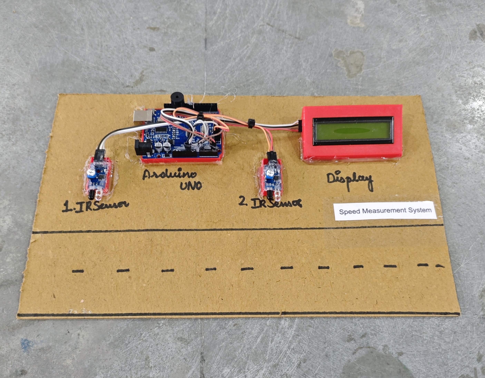

# 🚗📏 Speed Measurement System

This project demonstrates a **Vehicle Speed Measurement System** using **Arduino UNO**, two **IR sensors**, and a **16x2 I2C LCD display**.  
The system calculates the speed of a moving vehicle by measuring the time taken to travel between two IR sensors placed at a fixed distance.
If the vehicle exceeds the defined speed limit, a **buzzer alert** is triggered.

## 🧩 Required Components

- 1 x Arduino UNO  
- 1 x 16x2 I2C LCD (0x27)  
- 2 x IR Sensor Modules 
- 1 x Buzzer  
- Jumper Wires  
- USB Cable / Power Supply  
- 3D Model (Reference): [**Thingiverse**](https://www.thingiverse.com)

## 🔌 Connections

<table>
  <thead>
    <tr>
      <th align="center">Component</th>
      <th align="center">Pin</th>
      <th align="center">Arduino Pin</th>
    </tr>
  </thead>
  <tbody>
    <tr>
      <td rowspan="4" align="center"><b>I2C LCD</b></td>
      <td align="center">VCC</td>
      <td align="center">5V</td>
    </tr>
    <tr><td align="center">GND</td><td align="center">GND</td></tr>
    <tr><td align="center">SDA</td><td align="center">A4</td></tr>
    <tr><td align="center">SCL</td><td align="center">A5</td></tr>
    <tr>
      <td rowspan="2" align="center"><b>IR Sensor 1</b></td>
      <td align="center">OUT</td>
      <td align="center">A0</td>
    </tr>
    <tr>
      <td align="center">VCC / GND</td>
      <td align="center">5V / GND</td>
    </tr>
    <tr>
      <td rowspan="2" align="center"><b>IR Sensor 2</b></td>
      <td align="center">OUT</td>
      <td align="center">A1</td>
    </tr>
    <tr>
      <td align="center">VCC / GND</td>
      <td align="center">5V / GND</td>
    </tr>
    <tr>
      <td rowspan="2" align="center"><b>Buzzer</b></td>
      <td align="center">Signal (+)</td>
      <td align="center">Pin 11</td>
    </tr>
    <tr>
      <td align="center">GND (-)</td>
      <td align="center">GND</td>
    </tr>
  </tbody>
</table>

> ⚠️ Ensure all grounds are connected together (Common Ground).

## 💻 Software Used
- [Arduino IDE](https://www.arduino.cc/en/software/)

## 📚 Dependencies
Install from Arduino Library Manager or official sources:
- [LiquidCrystal I2C Library](https://github.com/johnrickman/LiquidCrystal_I2C)  
- [Wire Library](https://www.arduino.cc/en/reference/wire) *(Built-in)*  

## 📁 Project Files
- 💻 [**Source Code**](./code/Speed_Measurement_System.ino)  
- 📸 [**Project Photo**](./photos/Speed_Measurement_System.jpg)

## 📸 Demo

  

## ⚙️ Working

- Two IR sensors are placed **5 meters apart**.
- When a vehicle crosses the first sensor, time is recorded using `millis()`.
- When it crosses the second sensor, time is recorded again.
- The time difference between the two sensors is calculated.

📐 **Speed Formula**

Speed (m/s) = Distance (meters) / Time (seconds)

To convert speed into km/h:

Speed (km/h) = (Distance / Time) × 3.6

- If speed exceeds **60 km/h**:
  - LCD displays **Over Speeding!**
  - Buzzer is activated.
- Otherwise:
  - LCD displays **Normal Speed**.

## 🚀 Future Enhancements
- Add SD card data logging.  
- Add GSM module for speed violation alert.  
- Add camera module for vehicle capture.  
- Cloud-based monitoring dashboard.  
- Adjustable speed limit via keypad.
