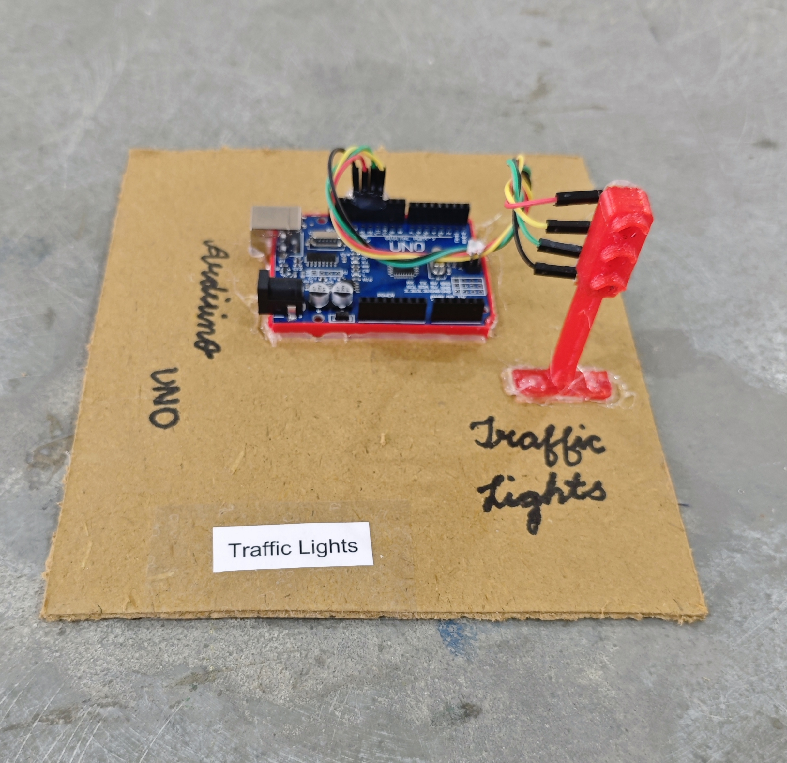

# 🚦 Traffic Lights

This project demonstrates a basic **Traffic Light Control System** using **Arduino UNO** and three LEDs (Red, Yellow, Green).  
The system simulates real-world traffic signal behavior with timed transitions between STOP, READY, and GO states.

## 🧩 Required Components
- 1 x Arduino UNO  
- 1 x Red LED  
- 1 x Yellow LED  
- 1 x Green LED  
- 3 x 220Ω Resistors  
- Breadboard & Jumper Wires  
- USB Cable / Power Supply  
- 3D Model (Reference): [**Thingiverse**](https://www.thingiverse.com)

## 🔌 Connections
<table>
  <thead>
    <tr>
      <th align="center">Component</th>
      <th align="center">Component Pin</th>
      <th align="center">Arduino Pin</th>
    </tr>
  </thead>
  <tbody>
    <tr>
      <td rowspan="2" align="center"><b>Red LED</b></td>
      <td align="center">Anode (+) via 220Ω resistor</td>
      <td align="center">Pin 12</td>
    </tr>
    <tr>
      <td align="center">Cathode (–)</td>
      <td align="center">GND</td>
    </tr>
    <tr>
      <td rowspan="2" align="center"><b>Yellow LED</b></td>
      <td align="center">Anode (+) via 220Ω resistor</td>
      <td align="center">Pin 11</td>
    </tr>
    <tr>
      <td align="center">Cathode (–)</td>
      <td align="center">GND</td>
    </tr>
    <tr>
      <td rowspan="2" align="center"><b>Green LED</b></td>
      <td align="center">Anode (+) via 220Ω resistor</td>
      <td align="center">Pin 13</td>
    </tr>
    <tr>
      <td align="center">Cathode (–)</td>
      <td align="center">GND</td>
    </tr>
  </tbody>
</table>

> ⚠️ Use 220Ω current-limiting resistors to protect LEDs.

## 💻 Software Used
- [Arduino IDE](https://www.arduino.cc/en/software/)

## 📁 Project Files
- 💻 [**Source Code**](./code/Traffic_Lights.ino)  
- 📸 [**Project Photo**](./photos/Traffic_Lights.jpg)

## 📸 Demo

  

## ⚙️ Working
- 🔴 Red LED turns ON for **8 seconds** (STOP).
- 🟡 Yellow LED blinks 5 times as transition warning.
- 🟢 Green LED turns ON for **10 seconds** (GO).
- 🟡 Yellow LED blinks again before returning to Red.
- The cycle repeats continuously.

## 🚀 Future Enhancements
- Add pedestrian crossing button.  
- Add countdown timer display (7-segment or LCD).  
- Add IR vehicle detection.  
- Add smart traffic density control.  
- Upgrade to IoT-based traffic monitoring.

