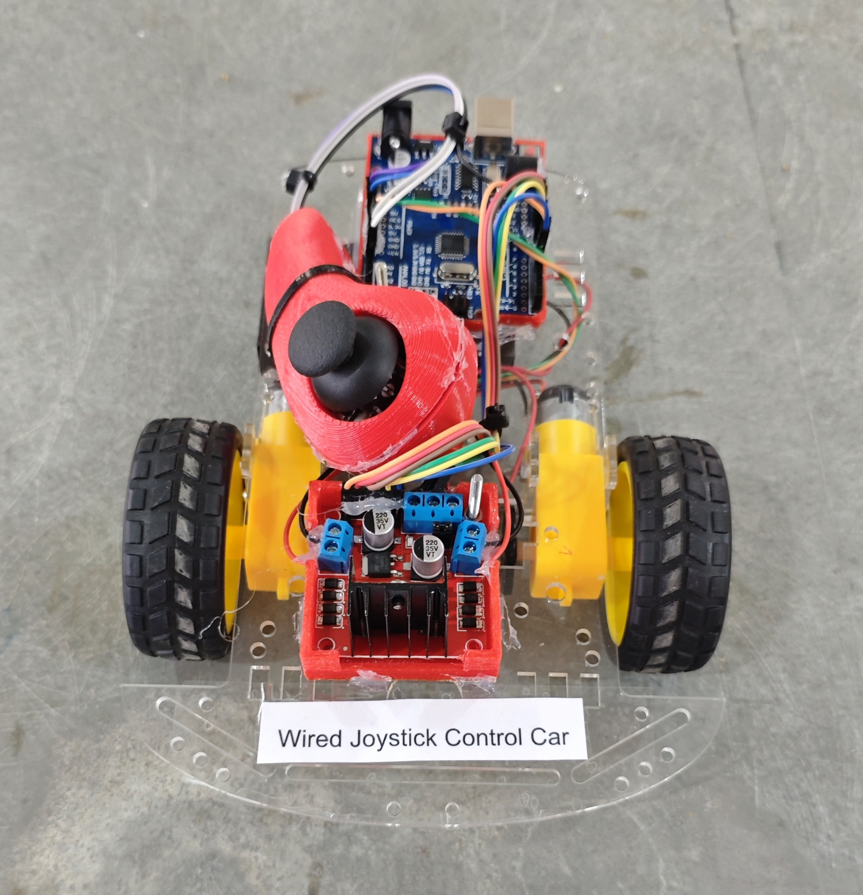

# 🎮🚗 Wired Joystick Car

This project demonstrates a **wired joystick-controlled robot car** using **Arduino UNO** and an **L298N motor driver**.  
The car moves **forward, backward, left, and right** based on joystick position.  
The built-in joystick push button activates a **buzzer (horn)**.
This version uses a **2-wheel drive chassis**.

## 🧩 Required Components
- 1 x Arduino UNO  
- 1 x L298N Motor Driver Module  
- 1 x Dual Axis Joystick Module  
- 1 x Buzzer  
- 1 x 2-Wheel Drive Chassis Kit (Motors & Wheels)  
- 2 x 18650 Li-ion Cells with Holder  
- Jumper Wires  
- USB Cable / Power Supply  
- 3D Model (Reference): [**Thingiverse**](https://www.thingiverse.com)  

## 🔌 Connections

*1. Control Circuit (Arduino & Modules)* 
<table>
  <thead>
    <tr>
      <th align="center">Component</th>
      <th align="center">Component Pin</th>
      <th align="center">Arduino Pin</th>
    </tr>
  </thead>
  <tbody>
    <tr>
      <td rowspan="6" align="center"><b>L298N Motor Driver</b></td>
      <td align="center">IN1</td>
      <td align="center">Pin 8</td>
    </tr>
    <tr><td align="center">IN2</td><td align="center">Pin 9</td></tr>
    <tr><td align="center">IN3</td><td align="center">Pin 10</td></tr>
    <tr><td align="center">IN4</td><td align="center">Pin 11</td></tr>
    <tr><td align="center">ENA</td><td align="center">Pin 5 (PWM)</td></tr>
    <tr><td align="center">ENB</td><td align="center">Pin 6 (PWM)</td></tr>
    <tr>
      <td rowspan="5" align="center"><b>Joystick Module</b></td>
      <td align="center">VRx</td>
      <td align="center">A0</td>
    </tr>
    <tr><td align="center">VRy</td><td align="center">A1</td></tr>
    <tr><td align="center">SW</td><td align="center">Pin 7</td></tr>
    <tr><td align="center">VCC</td><td align="center">5V</td></tr>
    <tr><td align="center">GND</td><td align="center">GND</td></tr>
    <tr>
      <td rowspan="2" align="center"><b>Buzzer</b></td>
      <td align="center">Signal (+)</td>
      <td align="center">Pin 12</td>
    </tr>
    <tr>
      <td align="center">GND (-)</td>
      <td align="center">GND</td>
    </tr>
  </tbody>
</table>

*2. Motor Connections to L298N*

<table>
  <thead>
    <tr>
      <th align="center">Motor</th>
      <th align="center">L298N Motor Terminals</th>
    </tr>
  </thead>
  <tbody>
    <tr>
      <td align="center"><b>Left Motor</b></td>
      <td align="center">OUT1 & OUT2</td>
    </tr>
    <tr>
      <td align="center"><b>Right Motor</b></td>
      <td align="center">OUT3 & OUT4</td>
    </tr>
  </tbody>
</table>

*3. Power Connections*

<table>
  <thead>
    <tr>
      <th align="center">Component</th>
      <th align="center">L298N Power Terminal</th>
    </tr>
  </thead>
  <tbody>
    <tr>
      <td align="center"><b>2 × 18650 Battery Pack (+)</b></td>
      <td align="center">12V</td>
    </tr>
    <tr>
      <td align="center"><b>Battery Pack (-)</b></td>
      <td align="center">GND</td>
    </tr>
    <tr>
      <td align="center"><b>Arduino GND</b></td>
      <td align="center">GND</td>
    </tr>
    <tr>
      <td align="center"><b>Arduino Vin</b></td>
      <td align="center">5V</td>
    </tr>
  </tbody>
</table>

> ⚠️ **Power Note:**
> - Arduino is powered using the L298N 5V output (5V-EN jumper ON).
> - Arduino GND and L298N GND must be connected (common ground).

## 💻 Software Used
- [**Arduino IDE**](https://www.arduino.cc/en/software/)

## 📁 Project Files
- 💻 [**Source Code**](./code/Wired_Joystick_Control_Car.ino)  
- 📸 [**Project Photo**](./photos/Wired_Joystick_Control_Car.jpg)

## 📸 Demo

  

## ⚙️ Working
- Joystick Y-axis controls **forward & backward**
- Joystick X-axis controls **left & right**
- Joystick button activates **buzzer (horn)**
- PWM control (D5 & D6) adjusts motor speed
- Neutral joystick position → Car stops
  
## 🚀 Future Improvements
- Add speed control using joystick intensity.  
- Add wireless (Bluetooth) version. 
- Add LED headlights  
- Upgrade to ESP32.
- Add battery level monitoring.

