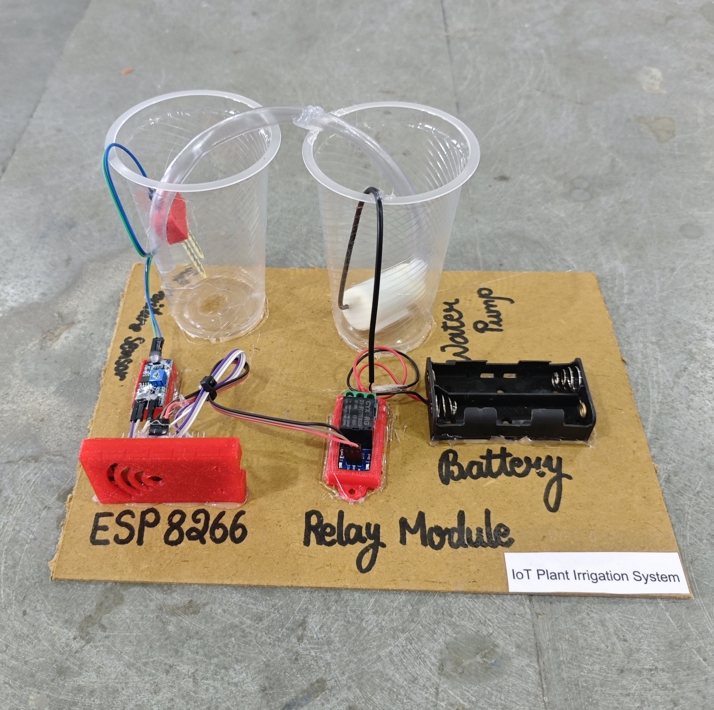

# 🌱 IoT Plant Irrigation System

This project implements an automated **IoT-based plant irrigation system** using an ESP8266 (NodeMCU), soil moisture sensing, and Blynk cloud integration.  
The system continuously monitors soil moisture levels and activates a water pump when the soil becomes dry. It helps optimize water usage, reduce manual effort, and enables **remote monitoring & control** through the Blynk mobile application.

## 🧩 Required Components
- 1 x ESP8266 (NodeMCU)  
- 1 x Soil Moisture Sensor Module  
- 1 x Single Channel Relay Module (Active LOW)  
- 1 x DC Mini Water Pump  
- 2 x 18650 Li-ion Cells with Holder  
- Pipes / Tubes for liquid flow  
- Breadboard & Jumper Wires  
- USB Cable / Power Supply  

## 🔌 Connections

*1. Control Circuit (ESP8266 & Modules)*

<table>
  <thead>
    <tr>
      <th align="center">Component</th>
      <th align="center">Component Pin</th>
      <th align="center">ESP8266 Pin</th>
    </tr>
  </thead>
  <tbody>
    <tr>
      <td rowspan="3" align="center"><b>Soil Moisture Sensor Module</b></td>
      <td align="center">VCC</td>
      <td align="center">3.3V</td>
    </tr>
    <tr>
      <td align="center">GND</td>
      <td align="center">GND</td>
    </tr>
    <tr>
      <td align="center">AO (Analog Out)</td>
      <td align="center">A0</td>
    </tr>
    <tr>
      <td rowspan="3" align="center"><b>Relay Module</b></td>
      <td align="center">IN</td>
      <td align="center">D5</td>
    </tr>
    <tr>
      <td align="center">VCC</td>
      <td align="center">VIN (5V)</td>
    </tr>
    <tr>
      <td align="center">GND</td>
      <td align="center">GND</td>
    </tr>
  </tbody>
</table>

> ℹ️ **Relay Note:**  
> - This project is configured for an **Active LOW relay module**.  
> - If using an **Active HIGH relay**, invert relay logic in the code.

*2️. Pump Connection (DC Mini Pump via Relay)*

<table>
  <thead>
    <tr>
      <th align="center">Component</th>
      <th align="center">Wire</th>
      <th align="center">Connects To</th>
    </tr>
  </thead>
  <tbody>
    <tr>
      <td align="center"><b>Battery Pack (2 × 18650)</b></td>
      <td align="center">Positive (+)</td>
      <td align="center">Relay COM</td>
    </tr>
    <tr>
      <td rowspan="2" align="center"><b>DC Mini Water Pump</b></td>
      <td align="center">Positive (+)</td>
      <td align="center">Relay NO</td>
    </tr>
    <tr>
      <td align="center">Negative (-)</td>
      <td align="center">Battery Pack Negative (-)</td>
    </tr>
  </tbody>
</table>

> ⚠️ **Safety & Power Notes:**  
> - Do **not** power the water pump from ESP8266.  
> - Use separate battery supply for pump.  
> - Ensure common ground if required.  
> - Keep electronics protected from water.

## 💻 Software Used
- Arduino IDE  
- Blynk IoT Platform  

## 📁 Project Files
- 💻 Source Code: `./code/IoT_Plant_Irrigation_System.ino`  
- 📸 Project Photo: `./photos/IoT_Plant_Irrigation_System.jpg`  

## 📸 Demo

  

## ⚙️ Working
- Soil sensor gives analog value (0–1023).  
- ESP8266 converts it to moisture percentage (0–100%).  
- If moisture < threshold → Pump ON.  
- If moisture ≥ threshold → Pump OFF.  
- Data updates every 5 seconds on Blynk App.  
- Manual control available from mobile.  

## 🚀 Future Improvements
- Add DHT11/DHT22.  
- Add water level sensor.  
- Add Auto / Manual toggle.  
- Add OLED display.  
- Add cloud data logging.  
- Add solar power support.
