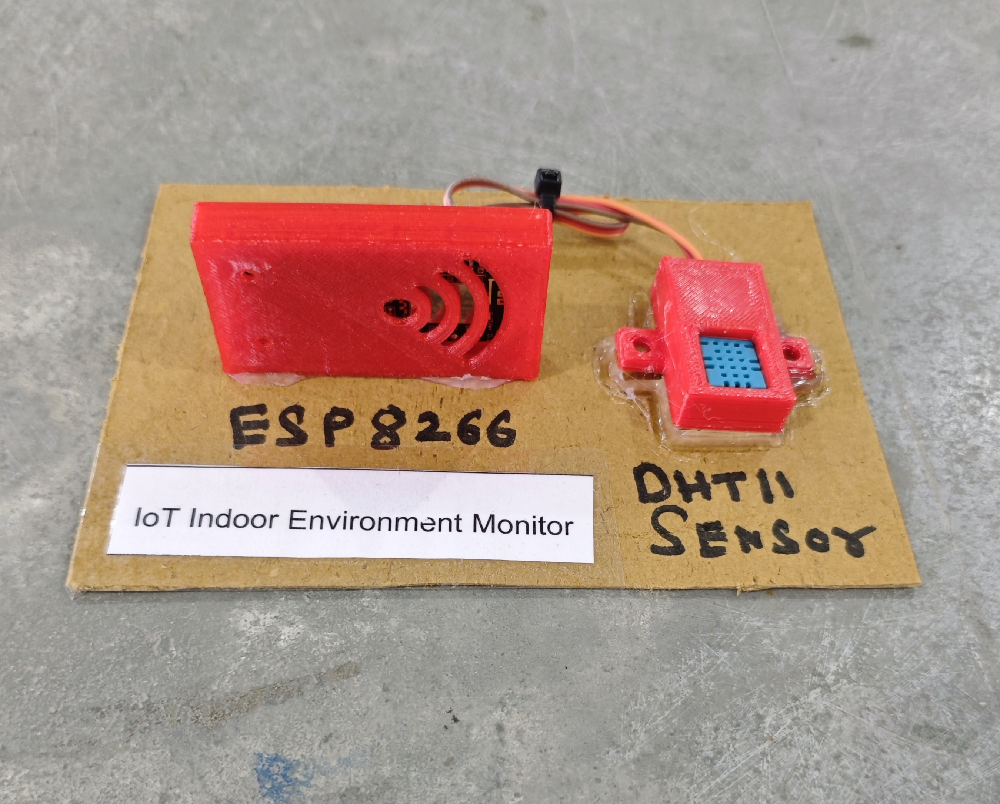

# 🌡️ IoT Indoor Environment Monitor

This project implements an IoT-based indoor environment monitoring system using an ESP8266 (NodeMCU) and a DHT11 sensor. The system measures real-time **temperature and humidity** and sends the data to the **Blynk mobile application** for remote monitoring. It is useful for indoor air monitoring, smart homes, greenhouses, and server room environment tracking.


## 🧩 Required Components
- 1 x ESP8266 (NodeMCU)  
- 1 x DHT11 Temperature & Humidity Sensor Module  
- Breadboard & Jumper Wires  
- USB Cable / Power Supply  
- 3D Model (Reference): [**Thingiverse**](https://www.thingiverse.com)

## 🔌 Connections
<table>
  <thead>
    <tr>
      <th align="center">Component</th>
      <th align="center">Pin</th>
      <th align="center">ESP8266 Pin</th>
    </tr>
  </thead>
  <tbody>
    <tr>
      <td rowspan="3" align="center"><b>DHT11</b></td>
      <td align="center">VCC</td>
      <td align="center">3.3V</td>
    </tr>
    <tr>
      <td align="center">GND</td>
      <td align="center">GND</td>
    </tr>
    <tr>
      <td align="center">DATA</td>
      <td align="center">D4</td>
    </tr>
  </tbody>
</table>

## 💻 Software Used
- [Arduino IDE](https://www.arduino.cc/en/software)  
- [Blynk IoT Platform](https://blynk.io/)

## 📚 Dependencies
Install the following libraries from **Arduino Library Manager**:

- [ESP8266WiFi](https://github.com/esp8266/Arduino)  
- [Blynk Library](https://github.com/blynkkk/blynk-library)  
- [DHT Sensor Library](https://github.com/adafruit/DHT-sensor-library)  

> ℹ️ **Make sure you have installed the ESP8266 Board Package from:**
>
> Arduino IDE → Preferences → Additional Boards Manager URLs  
>
> ```
> http://arduino.esp8266.com/stable/package_esp8266com_index.json
> ```

## 📱 Blynk Configuration

- 🔗 **Setup Guide:**  
  - [Blynk Setup Guide](./ESP_IoT_Projects/BLYNK_SETUP.md)

- **Required Virtual Pins**  
  - V2 → Temperature (°C)  
  - V3 → Humidity (%)  

- **Datastream Type**  
  - V2 → Double  
  - V3 → Double  

- **Widget Configuration**  
  - Gauge / Display Widget → V2 (Unit: °C)  
  - Gauge / Display Widget → V3 (Unit: %)  

- **Update Interval**  
  - 5 seconds (`timer.setInterval(5000L, sendDHTData);`)

## 📁 Project Files
- 💻 [Source Code](./code/IoT_Indoor_Environment_Monitor.ino)  
- 📸 [Project Image](./photos/IoT_Indoor_Environment_Monitor.jpg)

## 📸 Demo
<p align="left">
  
</p>

## ⚙️ Working
- The DHT11 sensor measures **temperature (°C)** and **humidity (%)**.  
- ESP8266 reads sensor data every 5 seconds.  
- The values are sent to:
  - **Virtual Pin V2** → Temperature  
  - **Virtual Pin V3** → Humidity  
- Data is displayed in real time on the **Blynk mobile application**.  
- Live values can also be monitored using the **Serial Monitor**.

## 🚀 Future Improvements
- Add data logging to cloud database.  
- Add temperature alerts & notifications. 
- Add OLED display for local monitoring.  
- Add fan/AC automatic control based on temperature. 
- Upgrade to DHT22 for better accuracy.
