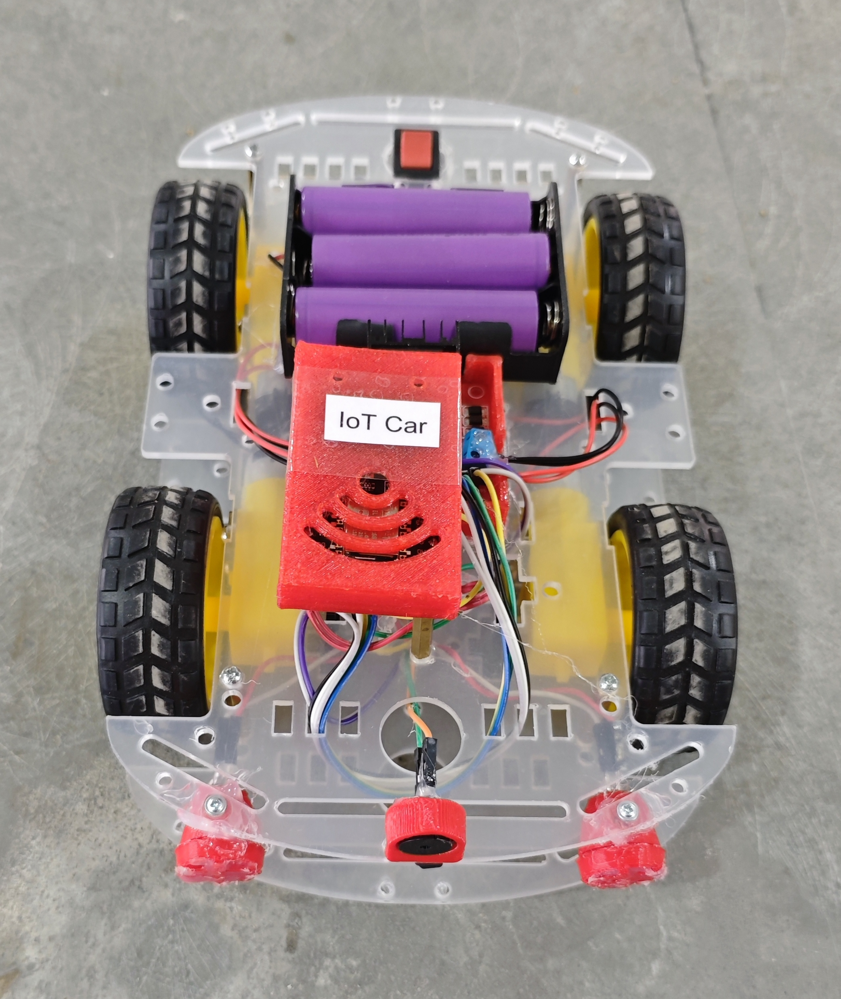

# 🚗 IoT Car

This project implements an IoT-based smart car using an **ESP8266 (NodeMCU)**, **L298N Motor Driver**, and the **Blynk IoT platform**.  
The car is controlled using a **Joystick widget** from the Blynk mobile app and includes additional features like **Speed Control, Horn, and Dual Headlights**. This version supports real-time cloud control over Wi-Fi.

## 🧩 Required Components
- 1 x ESP8266 (NodeMCU)  
- 1 x L298N Motor Driver Module  
- 1 x 4-Wheel Drive Chassis Kit (4 DC Motors)  
- 1 x Buzzer (Horn)  
- 2 x LEDs (Headlights)  
- 2 x 220Ω Resistors  
- 3 x 18650 Li-ion Cells with Holder
- Breadboard & Jumper Wires
- USB Cable / Power Supply  
- 3D Model (Reference): [**Thingiverse**](https://www.thingiverse.com)

## 🔌 Connections

*1. Control Circuit (ESP8266 & Modules)*

<table>
  <thead>
    <tr>
      <th align="center">Component</th>
      <th align="center">Pin</th>
      <th align="center">ESP8266 Pin</th>
    </tr>
  </thead>
  <tbody>
    <tr>
      <td rowspan="6" align="center"><b>L298N Motor Driver</b></td>
      <td align="center">ENA</td>
      <td align="center">D0 (PWM)</td>
    </tr>
    <tr><td align="center">IN1</td><td align="center">D1</td></tr>
    <tr><td align="center">IN2</td><td align="center">D2</td></tr>
    <tr><td align="center">IN3</td><td align="center">D3</td></tr>
    <tr><td align="center">IN4</td><td align="center">D4</td></tr>
    <tr><td align="center">ENB</td><td align="center">D5 (PWM)</td></tr>
    <tr>
      <td rowspan="2" align="center"><b>Horn (Buzzer)</b></td>
      <td align="center">Signal</td>
      <td align="center">D6</td>
    </tr>
    <tr><td align="center">GND</td><td align="center">GND</td></tr>
    <tr>
      <td rowspan="4" align="center"><b>Headlights</b></td>
      <td align="center">LED 1 (+)</td>
      <td align="center">D7 (via 220Ω)</td>
    </tr>
    <tr><td align="center">LED 1 (-)</td><td align="center">GND</td></tr>
    <tr><td align="center">LED 2 (+)</td><td align="center">D8 (via 220Ω)</td></tr>
    <tr><td align="center">LED 2 (-)</td><td align="center">GND</td></tr>
  </tbody>
</table>

*2. Motor Connections to L298N*

<table>
  <thead>
    <tr>
      <th align="center">Motor Group</th>
      <th align="center">Connection Type</th>
      <th align="center">L298N Motor Terminals</th>
    </tr>
  </thead>
  <tbody>
    <tr>
      <td align="center"><b>Left Front + Left Rear</b></td>
      <td align="center">Connected in Parallel</td>
      <td align="center">OUT1 & OUT2</td>
    </tr>
    <tr>
      <td align="center"><b>Right Front + Right Rear</b></td>
      <td align="center">Connected in Parallel</td>
      <td align="center">OUT3 & OUT4</td>
    </tr>
  </tbody>
</table>

*3. Power Connections*

<table>
  <thead>
    <tr>
      <th align="center">Component</th>
      <th align="center">L298N Power Terminal</th>
    </tr>
  </thead>
  <tbody>
    <tr>
      <td align="center"><b> 3 × 18650 Battery Pack (+)</b></td>
      <td align="center">12V</td>
    </tr>
    <tr>
      <td align="center"><b>Battery Pack (-)</b></td>
      <td align="center">GND</td>
    </tr>
    <tr>
      <td align="center"><b>ESP8266 GND</b></td>
      <td align="center">GND</td>
    </tr>
    <tr>
      <td align="center"><b>ESP8266 Vin</b></td>
      <td align="center">5V</td>
    </tr>
  </tbody>
</table>

> ⚠️ **Power Note:**
> - ESP8266 is powered using the L298N 5V output (5V-EN jumper ON).
> - ESP8266 GND and L298N GND must be connected (common ground).

## 💻 Software Used
- [Arduino IDE](https://www.arduino.cc/en/software)  
- [Blynk IoT Platform](https://blynk.io/)

## 📚 Dependencies
Install the following libraries from **Arduino Library Manager**:
- [ESP8266WiFi](https://github.com/esp8266/Arduino)  
- [Blynk Library](https://github.com/blynkkk/blynk-library)
 
> ℹ️ **Make sure you have installed the ESP8266 Board Package from:**
>
> Arduino IDE → Preferences → Additional Boards Manager URLs  
>
> ```
> http://arduino.esp8266.com/stable/package_esp8266com_index.json
> ```

### 📱 Blynk Configuration

- 🔗 [**Blynk Setup Guide**](../../BLYNK_SETUP.md)

- **Required Virtual Pins**  
  - V9  → Joystick X  
  - V10 → Joystick Y  
  - V11 → Speed Slider (0–255)  
  - V12 → Horn Button (PUSH Mode)  
  - V13 → Headlight Switch  

- **Datastream Type**  
  - V9, V10 → Integer  
  - V11 → Integer (0–255)  
  - V12 → Integer (0–1)  
  - V13 → Integer (0–1)  

- **Widget Configuration**  
  - Joystick Widget → V9 & V10  
  - Slider → V11  
  - Button (Push Mode) → V12  
  - Switch → V13 

- **Important Note**  
  - Joystick center position (approx. 50,50) stops the car.  
  - Speed slider controls PWM output (0–255).  
  - Horn works only while button is pressed (Push Mode recommended).  
  - Headlight switch controls both LEDs simultaneously.  
  - Ensure strong Wi-Fi connection for smooth control.

## 📁 Project Files
- 💻 [Source Code](./code/IoT_Car.ino)  
- 📸 [Project Image](./photos/IoT_Car.jpg)

## 📸 Demo
<p align="left">
  
</p>

## ⚙️ Working

- The car is controlled using a **Blynk Joystick widget**, which continuously sends X and Y axis values to the ESP8266.
- Based on joystick position:
  - Y > 70  → Car moves **Forward**
  - Y < 30  → Car moves **Backward**
  - X < 30  → Car turns **Left**
  - X > 70  → Car turns **Right**
  - Near center (~50,50) → Car **Stops**
- The **Speed Slider (V11)** adjusts PWM output (0–255), controlling motor speed via ENA and ENB pins of the L298N motor driver.
- The **Horn Button (V12)** activates the buzzer while pressed (Push mode recommended).
- The **Headlight Switch (V13)** simultaneously controls both front LEDs.
- All commands are processed in real time using `Blynk.run()` inside the main loop, ensuring smooth Wi-Fi-based control.
- The motor driver (L298N) manages directional logic using IN1–IN4 pins and speed control using PWM-enabled ENA and ENB pins.

## 🚀 Future Improvements
- Add obstacle avoidance (Ultrasonic sensor).  
- Add camera module (FPV).  
- Add GPS tracking.  
- Upgrade to ESP32.  
- Add battery level monitoring.
