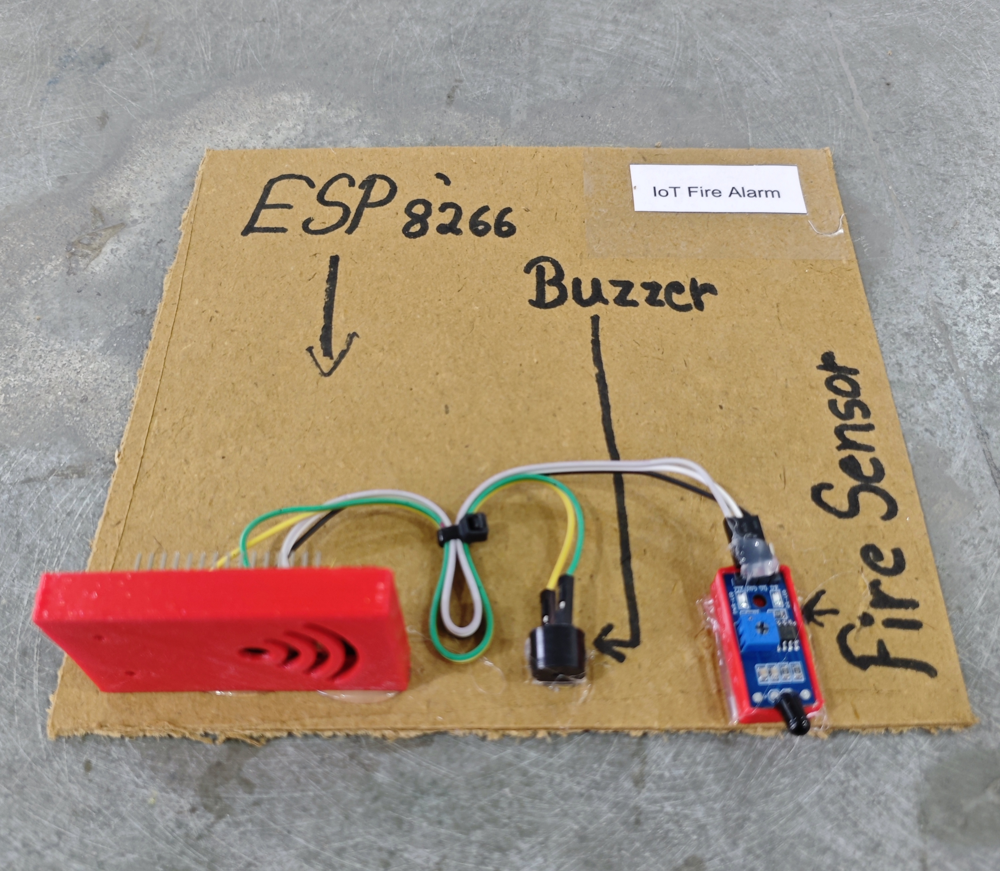

# 🔥 IoT Fire Alarm

This project implements an IoT-based Fire Detection and Alert System using an **ESP8266 (NodeMCU)** and a **Flame Sensor Module**.  
When fire is detected, the system:
- Activates a **buzzer alarm**
- Sends an instant alert message via **Telegram Bot**
- Repeats alerts every 30 seconds until fire is cleared
- Sends a confirmation message when fire is no longer detected
This project is suitable for home safety, labs, server rooms, and industrial monitoring.

## 🧩 Required Components
- 1 x ESP8266 (NodeMCU)
- 1 x Flame Sensor Module (Digital Output)
- 1 x Buzzer
- Breadboard & Jumper Wires
- USB Cable / Power Supply
- 3D Model (Reference): [**Thingiverse**](https://www.thingiverse.com)

## 🔌 Connections

<table>
  <thead>
    <tr>
      <th align="center">Component</th>
      <th align="center">Pin</th>
      <th align="center">ESP8266 Pin</th>
    </tr>
  </thead>
  <tbody>
    <tr>
      <td rowspan="3" align="center"><b>Flame Sensor Module</b></td>
      <td align="center">VCC</td>
      <td align="center">3.3V</td>
    </tr>
    <tr>
      <td align="center">GND</td>
      <td align="center">GND</td>
    </tr>
    <tr>
      <td align="center">D0 (Digital Out)</td>
      <td align="center">D5</td>
    </tr>
    <tr>
      <td rowspan="2" align="center"><b>Buzzer</b></td>
      <td align="center">Positive (+)</td>
      <td align="center">D6</td>
    </tr>
    <tr>
      <td align="center">Negative (-)</td>
      <td align="center">GND</td>
    </tr>
  </tbody>
</table>

> ⚠️ **Note:**  
> - Most flame sensor modules output **LOW when fire is detected**.  
> - Adjust sensor potentiometer to set detection sensitivity.

## 💻 Software Used
- [Arduino IDE](https://www.arduino.cc/en/software)
- [Telegram Bot API](https://core.telegram.org/bots/api)

## 📚 Dependencies

Install from **Arduino Library Manager**:

- [ESP8266WiFi (ESP8266 Core)](https://github.com/esp8266/Arduino)

> ℹ️ **Make sure you have installed the ESP8266 Board Package from:**
>
> Arduino IDE → Preferences → Additional Boards Manager URLs  
>
> ```
> http://arduino.esp8266.com/stable/package_esp8266com_index.json
> ```

## 🤖 Telegram Bot Configuration

- 🔗 [**Telegram Bot Setup Guide**](../../TELEGRAM_BOT_SETUP.md)

*Required Credentials*
- BOT_TOKEN → From @BotFather  
- CHAT_ID → Your personal Telegram chat ID  

*Bot Behavior*
- Sends alert when fire is detected
- Repeats alert every 30 seconds while fire continues
- Sends confirmation when fire is cleared

## 📁 Project Files
- 💻 [Source Code](./code/IoT_Fire_Alarm.ino)
- 📸 [Project Image](./photos/IoT_Fire_Alarm.jpg)

## 📸 Demo
<p align="left">
  
</p>

## ⚙️ Working

- The flame sensor continuously monitors infrared radiation from fire.
- When fire is detected:
  - Sensor output becomes **LOW**
  - Buzzer turns ON immediately
  - Telegram message: **"🔥 Fire Detected!"**
- If fire continues:
  - Alert message repeats every **30 seconds**
- When fire stops:
  - Buzzer turns OFF
  - Telegram message: **"✅ Fire Cleared."**
- All alerts are sent securely over HTTPS using `WiFiClientSecure`.

<details>
<summary><b>🎯 Calibration (Click to Expand)</b></summary>

<br>

- Adjust the flame sensor potentiometer for sensitivity.
- Test detection at:
  - Close flame (~5–10 cm)
  - Moderate distance (~20 cm)
- Avoid false triggers from:
  - Direct sunlight
  - Strong IR sources
- Ensure stable power supply for consistent readings.

</details>

## 🚀 Future Improvements
- Add SMS backup alert
- Add smoke sensor (MQ-2)
- Add cloud data logging
- Add LCD display for local status
- Add fire location detection (multiple sensors)
