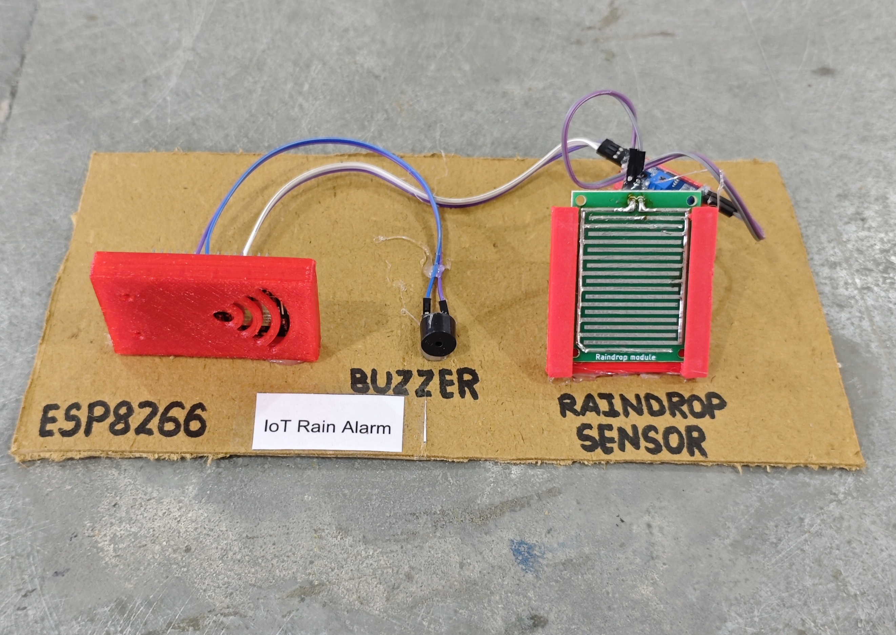

# 🌧️ IoT Rain Alarm

This project implements an IoT-based Rain Detection and Alert System using an **ESP8266 (NodeMCU)** and a **Rain Sensor Module**.  
When rain is detected, the system:

- Activates a **buzzer alert**
- Sends an instant notification via **Telegram Bot**
- Sends a confirmation message when rain stops

This project is suitable for terrace monitoring, agriculture fields, cloth drying alerts, greenhouse systems, and weather-based automation.

## 🧩 Required Components

- 1 x ESP8266 (NodeMCU)
- 1 x Rain Sensor Module (Digital Output)
- 1 x Buzzer
- Breadboard & Jumper Wires
- USB Cable / Power Supply
- 3D Model (Reference): [**Thingiverse**](https://www.thingiverse.com)

## 🔌 Connections

<table>
  <thead>
    <tr>
      <th align="center">Component</th>
      <th align="center">Pin</th>
      <th align="center">ESP8266 Pin</th>
    </tr>
  </thead>
  <tbody>
    <tr>
      <td rowspan="3" align="center"><b>Rain Sensor Module</b></td>
      <td align="center">VCC</td>
      <td align="center">3.3V</td>
    </tr>
    <tr>
      <td align="center">GND</td>
      <td align="center">GND</td>
    </tr>
    <tr>
      <td align="center">D0 (Digital Out)</td>
      <td align="center">D5</td>
    </tr>
    <tr>
      <td rowspan="2" align="center"><b>Buzzer</b></td>
      <td align="center">Positive (+)</td>
      <td align="center">D6</td>
    </tr>
    <tr>
      <td align="center">Negative (-)</td>
      <td align="center">GND</td>
    </tr>
  </tbody>
</table>

> ⚠️ **Note:**  
> - Rain sensor digital output usually becomes **LOW when water is detected**.  
> - The project uses `INPUT_PULLUP`, so default state is HIGH (no rain).  
> - Adjust sensor sensitivity using the onboard potentiometer.

## 💻 Software Used

- [Arduino IDE](https://www.arduino.cc/en/software)
- [Telegram Bot API](https://core.telegram.org/bots/api)

## 📚 Dependencies

- Install **ESP8266 Board Package**:

  - Arduino IDE → Preferences → Additional Boards Manager URLs

```
http://arduino.esp8266.com/stable/package_esp8266com_index.json
```

- Then install from Boards Manager:

  - Tools → Board → Boards Manager → [ESP8266 by ESP8266 Community](https://github.com/esp8266/Arduino)

## 🤖 Telegram Bot Configuration

- 🔗 [**Telegram Bot Setup Guide**](../../TELEGRAM_BOT_SETUP.md)

*Required Credentials*

- BOT_TOKEN → From @BotFather  
- CHAT_ID → Your personal Telegram chat ID  

*Bot Behavior*

- Sends alert when rain starts  
- Activates buzzer for 3 seconds  
- Sends confirmation message when rain stops  

## 📁 Project Files

- 💻 [Source Code](./code/IoT_Rain_Alarm.ino)
- 📸 [Project Image](./photos/IoT_Rain_Alarm.jpg)

## 📸 Demo

<p align="left">
  
</p>

## ⚙️ Working

- The rain sensor monitors water droplets on its detection plate.
- When rain is detected:
  - Sensor output becomes **LOW**
  - Buzzer activates for 3 seconds
  - Telegram message: **"🌧️ Rain Started!"**
- When rain stops:
  - Sensor output returns **HIGH**
  - Telegram message: **"☀️ Rain Stopped."**
- All notifications are sent securely over HTTPS using `WiFiClientSecure`.

<details>
<summary><b>🎯 Calibration (Click to Expand)</b></summary>

<br>

- Adjust the rain sensor potentiometer for sensitivity.
- Test with:
  - Few water drops
  - Continuous water flow
- Avoid false triggering due to:
  - High humidity
  - Condensation
- Keep sensor plate clean and dry when not in use.

</details>

## 🚀 Future Improvements

- Add rainfall intensity monitoring (analog mode)
- Add automatic window closing mechanism
- Add soil moisture integration
- Add cloud data logging
- Add weather dashboard integration

