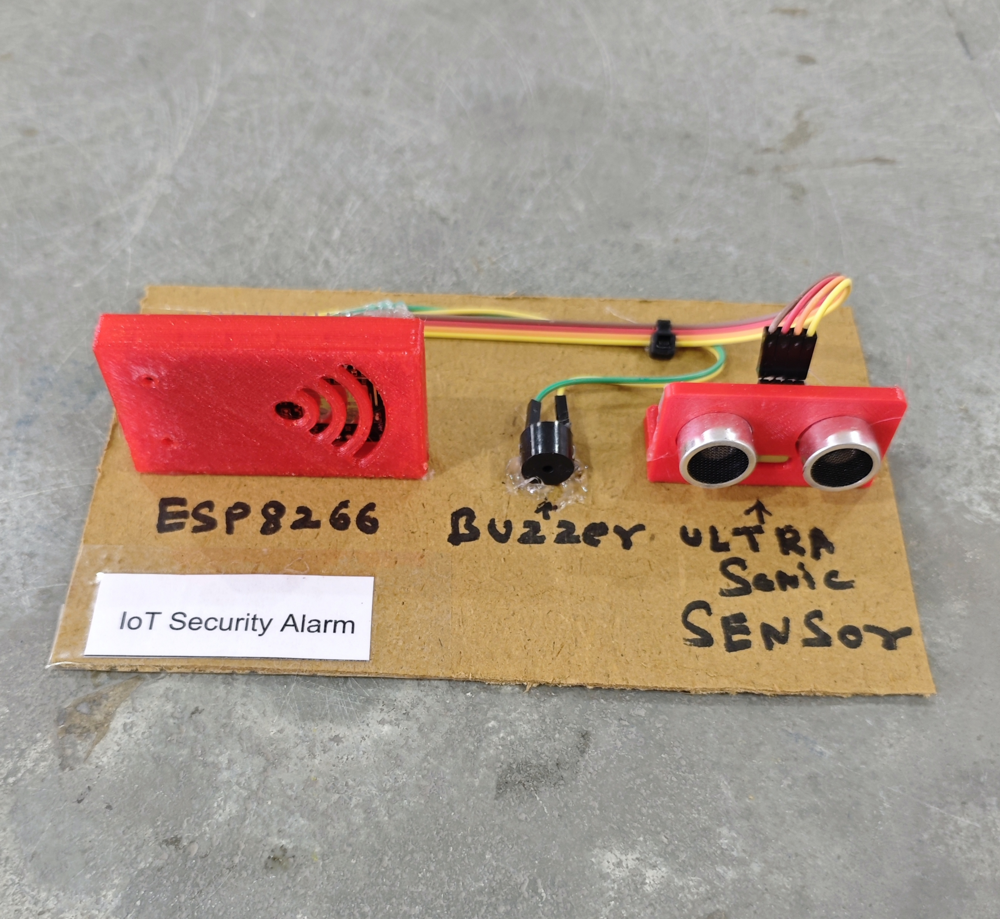

# 🚨 IoT Security Alarm

This project implements an IoT-based Intrusion Detection and Alert System using an **ESP8266 (NodeMCU)** and an **Ultrasonic Sensor (HC-SR04)**.  
When an object is detected within a defined distance, the system:

- Activates a **buzzer and LED alert**
- Sends an instant notification via **Telegram Bot**
- Sends a confirmation message when the area becomes clear

This project is suitable for home security, door monitoring, restricted areas, laboratories, and smart surveillance systems.

## 🧩 Required Components

- 1 x ESP8266 (NodeMCU)
- 1 x Ultrasonic Sensor (HC-SR04)
- 1 x Buzzer
- 1 x LED
- 1 x 220Ω Resistor (for LED)
- Breadboard & Jumper Wires
- USB Cable / Power Supply
- 3D Model (Reference): [**Thingiverse**](https://www.thingiverse.com)

## 🔌 Connections

<table>
  <thead>
    <tr>
      <th align="center">Component</th>
      <th align="center">Pin</th>
      <th align="center">ESP8266 Pin</th>
    </tr>
  </thead>
  <tbody>
    <tr>
      <td rowspan="4" align="center"><b>Ultrasonic Sensor (HC-SR04)</b></td>
      <td align="center">VCC</td>
      <td align="center">5V / VIN</td>
    </tr>
    <tr>
      <td align="center">GND</td>
      <td align="center">GND</td>
    </tr>
    <tr>
      <td align="center">TRIG</td>
      <td align="center">D5</td>
    </tr>
    <tr>
      <td align="center">ECHO</td>
      <td align="center">D6</td>
    </tr>
    <tr>
      <td rowspan="2" align="center"><b>Buzzer</b></td>
      <td align="center">Positive (+)</td>
      <td align="center">D7</td>
    </tr>
    <tr>
      <td align="center">Negative (-)</td>
      <td align="center">GND</td>
    </tr>
    <tr>
      <td rowspan="2" align="center"><b>LED</b></td>
      <td align="center">Anode (+)</td>
      <td align="center">D8 (via 220Ω)</td>
    </tr>
    <tr>
      <td align="center">Cathode (-)</td>
      <td align="center">GND</td>
    </tr>
  </tbody>
</table>

> ⚠️ **Note:**  
> - HC-SR04 ECHO pin outputs **5V**. Use a voltage divider (1kΩ + 2kΩ) before connecting to ESP8266 (3.3V logic).  
> - Adjust detection distance inside code if needed.

## 💻 Software Used

- [Arduino IDE](https://www.arduino.cc/en/software)
- [Telegram Bot API](https://core.telegram.org/bots/api)

## 📚 Dependencies

- Install **ESP8266 Board Package**:

  - Arduino IDE → Preferences → Additional Boards Manager URLs

```
http://arduino.esp8266.com/stable/package_esp8266com_index.json
```

- Then install from Boards Manager:

  - Tools → Board → Boards Manager → [ESP8266 by ESP8266 Community](https://github.com/esp8266/Arduino)

## 🤖 Telegram Bot Configuration

- 🔗 [**Telegram Bot Setup Guide**](../../TELEGRAM_BOT_SETUP.md)

*Required Credentials*

- BOT_TOKEN → From @BotFather  
- CHAT_ID → Your personal Telegram chat ID  

*Bot Behavior*

- Sends alert when intruder is detected  
- Activates buzzer and LED for 5 seconds  
- Sends confirmation message when area is clear  

## 📁 Project Files

- 💻 [Source Code](./code/IoT_Security_Alarm.ino)
- 📸 [Project Image](./photos/IoT_Security_Alarm.jpg)

## 📸 Demo

<p align="left">
  
</p>

## ⚙️ Working

- The ultrasonic sensor continuously measures distance.
- When an object is detected within **10 cm**:
  - Telegram message: **"🚨 Someone is Nearby 🦹"**
  - Buzzer and LED activate for 5 seconds
- When the object moves away (distance > 10 cm):
  - Telegram message: **"✅ Area Clear."**
- The system prevents repeated alerts using internal state control.
- All notifications are sent securely over HTTPS using `WiFiClientSecure`.

<details>
<summary><b>🎯 Calibration (Click to Expand)</b></summary>

<br>

- Adjust detection distance inside code:

```cpp
if (dist < 10)
```

- Increase value for wider coverage area.
- Test detection at:
  - 5 cm
  - 10 cm
  - 20 cm
- Avoid unstable surfaces that may cause false echoes.
- Ensure sensor is mounted at proper height for accurate detection.

</details>

## 🚀 Future Improvements

- Add PIR sensor for better human detection  
- Add camera module integration  
- Add night vision IR LEDs  
- Add cloud event logging  
- Add siren instead of buzzer  
- Add battery backup monitoring  
