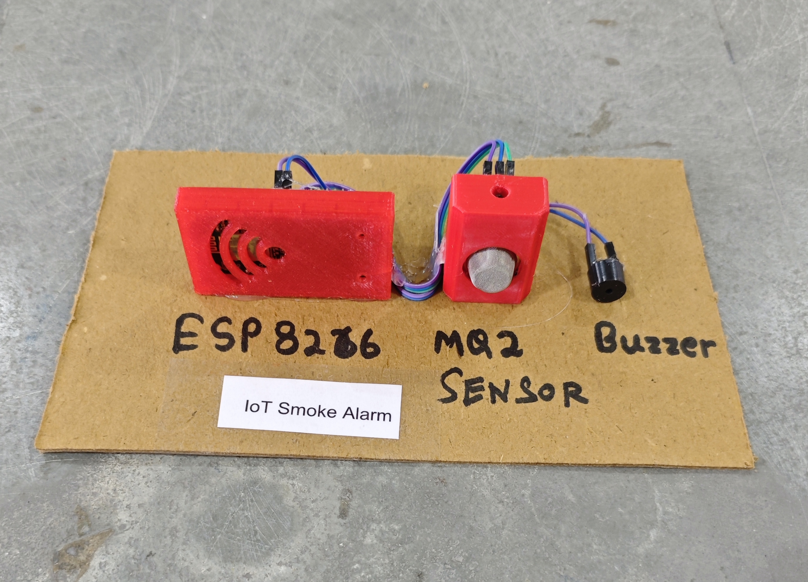

# 💨 IoT Smoke Alarm

This project implements an IoT-based Smoke Detection and Alert System using an **ESP8266 (NodeMCU)** and an **MQ-2 Gas/Smoke Sensor**.  
When smoke concentration exceeds a defined threshold, the system:

- Sends an instant alert via **Telegram Bot**
- Activates a **buzzer alarm for 10 seconds**
- Sends a confirmation message when smoke level returns to normal
- Prevents repeated spam alerts using time-based control logic

This project is suitable for home kitchens, laboratories, server rooms, workshops, and industrial safety monitoring.

## 🧩 Required Components

- 1 x ESP8266 (NodeMCU)
- 1 x MQ-2 Smoke/Gas Sensor Module
- 1 x Buzzer
- Breadboard & Jumper Wires
- USB Cable / Power Supply
- 3D Model (Reference): [**Thingiverse**](https://www.thingiverse.com)

## 🔌 Connections

<table>
  <thead>
    <tr>
      <th align="center">Component</th>
      <th align="center">Pin</th>
      <th align="center">ESP8266 Pin</th>
    </tr>
  </thead>
  <tbody>
    <tr>
      <td rowspan="3" align="center"><b>MQ-2 Smoke Sensor</b></td>
      <td align="center">VCC</td>
      <td align="center">5V / VIN</td>
    </tr>
    <tr>
      <td align="center">GND</td>
      <td align="center">GND</td>
    </tr>
    <tr>
      <td align="center">A0 (Analog Out)</td>
      <td align="center">A0</td>
    </tr>
    <tr>
      <td rowspan="2" align="center"><b>Buzzer</b></td>
      <td align="center">Positive (+)</td>
      <td align="center">D5</td>
    </tr>
    <tr>
      <td align="center">Negative (-)</td>
      <td align="center">GND</td>
    </tr>
  </tbody>
</table>

> ⚠️ **Note:**  
> - MQ-2 requires a warm-up time (20–60 seconds) before accurate readings.  
> - Threshold values may vary depending on environment.  
> - Ensure proper ventilation during testing.

## 💻 Software Used

- [Arduino IDE](https://www.arduino.cc/en/software)
- [Telegram Bot API](https://core.telegram.org/bots/api)

## 📚 Dependencies

- Install **ESP8266 Board Package**:

  - Arduino IDE → Preferences → Additional Boards Manager URLs

```
http://arduino.esp8266.com/stable/package_esp8266com_index.json
```

- Then install from Boards Manager:

  - Tools → Board → Boards Manager → [ESP8266 by ESP8266 Community](https://github.com/esp8266/Arduino)

## 🤖 Telegram Bot Configuration

- 🔗 [**Telegram Bot Setup Guide**](../../TELEGRAM_BOT_SETUP.md)

*Required Credentials*

- `BOT_TOKEN` → From @BotFather  
- `CHAT_ID` → Your personal Telegram chat ID  

*Bot Behavior*

- Sends alert when smoke level exceeds threshold  
- Activates buzzer for 10 seconds  
- Sends confirmation message when smoke clears  
- Repeats alert only after 60 seconds (anti-spam control)

## 📁 Project Files

- 💻 [Source Code](./code/IoT_Smoke_Alarm.ino)
- 📸 [Project Image](./photos/IoT_Smoke_Alarm.jpg)

## 📸 Demo

<p align="left">
  
</p>

## ⚙️ Working

- The MQ-2 sensor continuously monitors smoke/gas concentration.
- When analog value exceeds the defined **threshold (400)**:
  - Telegram message: **"🚨 Smoke Detected!"**
  - Buzzer activates for 10 seconds
- If smoke remains high:
  - Alert repeats only after 60 seconds
- When smoke level drops below **clear level (350)**:
  - Telegram message: **"✅ Smoke Cleared!"**
- All notifications are sent securely over HTTPS using `WiFiClientSecure`.

<details>
<summary><b>🎯 Calibration (Click to Expand)</b></summary>

<br>

- Adjust threshold in code:

```cpp
int threshold  = 400;
int clearLevel = 350;
```

- Increase threshold if false alarms occur.
- Decrease threshold if detection is too slow.
- Allow sensor warm-up time before testing.
- Test using:
  - Matchstick smoke
  - Incense stick
- Avoid testing in closed rooms without ventilation.

</details>

## 🚀 Future Improvements

- Add LPG / Gas leak detection mode  
- Add LCD display for real-time values  
- Add cloud data logging  
- Add automatic exhaust fan control  
- Add multi-sensor fire & smoke integration  
