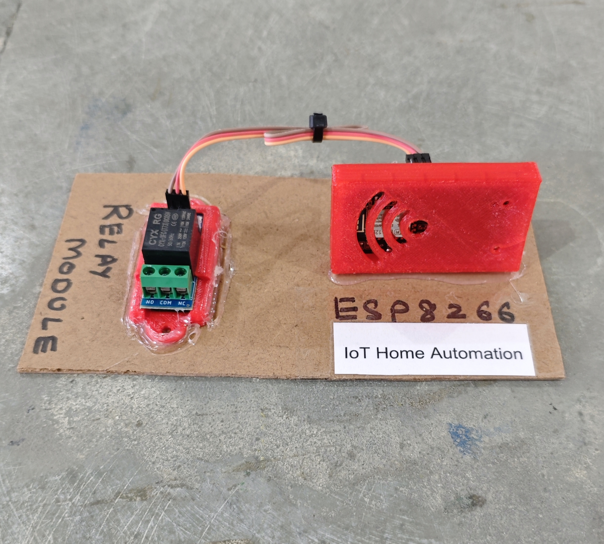

# 🏠 IoT Home Automation

This project implements a simple IoT-based home automation system using an ESP8266 (NodeMCU) and a relay module. The system allows remote ON/OFF control of an electrical appliance through the **Blynk mobile application**.

## 🧩 Required Components
- 1 x ESP8266 (NodeMCU)  
- 1 x Single Channel Relay Module (Active LOW)  
- 1 x Electrical Load (Bulb / Fan / Appliance for testing)  
- Breadboard & Jumper Wires  
- USB Cable / Power Supply  
- 3D Model (Reference): [**Thingiverse**](https://www.thingiverse.com) 

## 🔌 Connections

*1. Control Circuit (ESP8266 & Modules)* 
<table>
  <thead>
    <tr>
      <th align="center">Component</th>
      <th align="center">Pin</th>
      <th align="center">ESP8266 Pin</th>
    </tr>
  </thead>
  <tbody>
    <tr>
      <td rowspan="3" align="center"><b>Relay Module</b></td>
      <td align="center">VCC</td>
      <td align="center">VIN (5V)</td>
    </tr>
    <tr>
      <td align="center">GND</td>
      <td align="center">GND</td>
    </tr>
    <tr>
      <td align="center">IN</td>
      <td align="center">D5</td>
    </tr>
  </tbody>
</table>

> ℹ️ **Relay Note:**  
> - This project is configured for an **Active LOW relay module**.  
> - If you are using an **Active HIGH relay**, you may need to invert the relay logic in the code.

*2. Appliance Connection (AC / High Power Side)*  
<table>
  <thead>
    <tr>
      <th align="center">Appliance Wire</th>
      <th align="center">Relay Terminal</th>
    </tr>
  </thead>
  <tbody>
    <tr>
      <td align="center">Live / +</td>
      <td align="center">COM</td>
    </tr>
    <tr>
      <td align="center">Load</td>
      <td align="center">NO</td>
    </tr>
  </tbody>
</table>

> ⚠️ **Safety:**  
> - Connect the appliance through a relay module, not directly to ESP8266.  
> - Be careful while working with AC loads.

## 💻 Software Used
- [Arduino IDE](https://www.arduino.cc/en/software)  
- [Blynk IoT Platform](https://blynk.io/)

## 📚 Dependencies
Install the following libraries from **Arduino Library Manager**:

- [ESP8266WiFi](https://github.com/esp8266/Arduino)  
- [Blynk Library](https://github.com/blynkkk/blynk-library)  

> ℹ️ **Make sure you have installed the ESP8266 Board Package from:**
>
> Arduino IDE → Preferences → Additional Boards Manager URLs  
>
> ```
> http://arduino.esp8266.com/stable/package_esp8266com_index.json
> ```

## 📱 Blynk Configuration

- 🔗 **Setup Guide:**  
  - [Blynk Setup Guide](../../BLYNK_SETUP.md)

- **Required Virtual Pins**  
  - V1 → Relay Control  

- **Datastream Type**  
  - V1 → Integer (0 – 1)  

- **Widget Configuration**  
  - Button Widget → V1 (Switch Mode)  

- **Update Behavior**  
  - Relay state changes immediately when V1 value changes.

## 📁 Project Files
- 💻 [Source Code](./code/IoT_Home_Automation.ino)  
- 📸 [Project Image](./photos/IoT_Home_Automation.jpg)

## 📸 Demo
<p align="left">
  
</p>

## ⚙️ Working
- The ESP8266 connects to WiFi and the Blynk cloud.  
- When the Blynk button (V1) is pressed:
  - Value `1` → Relay turns ON  
  - Value `0` → Relay turns OFF  
- The function `applyRelay()` ensures compatibility with both:
  - Active-LOW relays  
  - Active-HIGH relays  
- Debug information is printed to the **Serial Monitor**.

## 🚀 Future Improvements
- Add multiple relay channels.  
- Add device status sync on startup.
- Add scheduling feature.  
- Add voice assistant integration (Google / Alexa).
