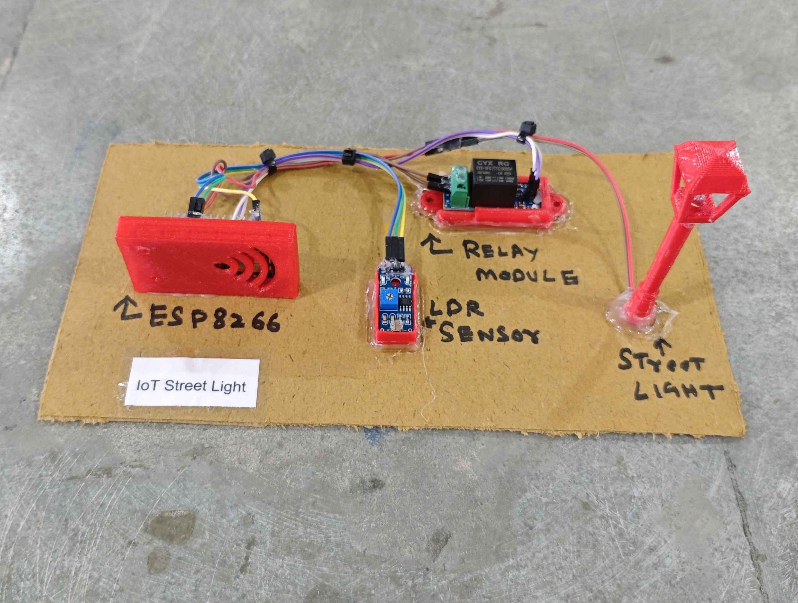

# 💡 IoT Street Light

This project implements an IoT-based smart street light system using an ESP8266 (NodeMCU) and an LDR Module. The system automatically turns ON the street light when it gets dark and turns it OFF during daylight. It also provides **Manual / Auto mode switching** using the Blynk mobile application.
## 🧩 Required Components
- 1 x ESP8266 (NodeMCU)  
- 1 x LDR Light Sensor Module  
- 1 x Single Channel Relay Module (Active LOW)  
- 1 x AC Bulb / LED (via relay)  
- Breadboard & Jumper Wires  
- USB Cable / Power Supply  
- 3D Model (Reference): [**Thingiverse**](https://www.thingiverse.com)

## 🔌 Connections

*1. Control Circuit (ESP8266 & Modules)*
<table>
  <thead>
    <tr>
      <th align="center">Component</th>
      <th align="center">Pin</th>
      <th align="center">ESP8266 Pin</th>
    </tr>
  </thead>
  <tbody>
    <tr>
      <td rowspan="3" align="center"><b>LDR Module</b></td>
      <td align="center">VCC</td>
      <td align="center">3.3V</td>
    </tr>
    <tr>
      <td align="center">GND</td>
      <td align="center">GND</td>
    </tr>
    <tr>
      <td align="center">AO</td>
      <td align="center">A0</td>
    </tr>
    <tr>
      <td rowspan="3" align="center"><b>Relay Module</b></td>
      <td align="center">IN</td>
      <td align="center">D5</td>
    </tr>
    <tr>
      <td align="center">VCC</td>
      <td align="center">VIN (5V)</td>
    </tr>
    <tr>
      <td align="center">GND</td>
      <td align="center">GND</td>
    </tr>
  </tbody>
</table>

> ℹ️ **Note:**  
> - This project is configured for an **Active LOW relay module**.  
> - If you are using an **Active HIGH relay**, you may need to invert the relay logic in the code.
> - Adjust the LDR module potentiometer to set sensitivity.

*2. Appliance Connection (AC / High Power Side)*  
<table>
  <thead>
    <tr>
      <th align="center">Appliance Wire</th>
      <th align="center">Relay Terminal</th>
    </tr>
  </thead>
  <tbody>
    <tr>
      <td align="center">Live / +</td>
      <td align="center">COM</td>
    </tr>
    <tr>
      <td align="center">Load</td>
      <td align="center">NO</td>
    </tr>
  </tbody>
</table>

> ⚠️ **Safety:**  
> - Connect the appliance through a relay module, not directly to ESP8266.  
> - Be careful while working with AC loads.

## 💻 Software Used
- [Arduino IDE](https://www.arduino.cc/en/software)  
- [Blynk IoT Platform](https://blynk.io/)

## 📚 Dependencies
Install the following libraries from **Arduino Library Manager**:

- [ESP8266WiFi](https://github.com/esp8266/Arduino)  
- [Blynk Library](https://github.com/blynkkk/blynk-library)  

> ℹ️ **Make sure you have installed the ESP8266 Board Package from:**
>
> Arduino IDE → Preferences → Additional Boards Manager URLs  
>
> ```
> http://arduino.esp8266.com/stable/package_esp8266com_index.json
> ```

## 📱 Blynk Configuration

- 🔗 [**Blynk Setup Guide**](../../BLYNK_SETUP.md)

- **Required Virtual Pins**  
  - V0 → Mode Selection (AUTO / MANUAL)  
  - V1 → Relay Control  

- **Datastream Type**  
  - V0 → Integer (0 – 1)  
  - V1 → Integer (0 – 1)  

- **Widget Configuration**  
  - Switch Widget → V0 (Mode Control)  
  - Switch Widget → V1 (Light ON/OFF)  

- **Update Behavior**
  - In AUTO mode → LDR controls the light.  
  - In MANUAL mode → Blynk controls the light.

## 📁 Project Files
- 💻 [Source Code](./code/IoT_Street_Light.ino)  
- 📸 [Project Image](./photos/IoT_Street_Light.jpg)

## 📸 Demo
<p align="left">
  
</p>

## ⚙️ Working
- The LDR module measures ambient light intensity.  
- If the light level falls below the defined threshold, the relay turns ON the street light.  
- During daylight, the relay turns OFF the light automatically.  
- **AUTO Mode (V0 = 0):**
  - LDR controls the relay.  
- **MANUAL Mode (V0 = 1):**
  - User can control the street light via Virtual Pin V1.  
- The relay state is synced with the Blynk app.

<details>
<summary><b>🎯 Calibration (Click to Expand)</b></summary>

<br>

- Adjust the LDR threshold in code:

```cpp
int ldrThreshold = 400;
```

- Increase value if light turns ON too early.
- Decrease value if light turns ON too late.
- Test readings in:
  - Bright sunlight
  - Evening
  - Complete darkness

</details>

## 🚀 Future Improvements
- Add motion sensor for energy saving.  
- Add dimming control (PWM based).  
- Add solar panel integration.  
- Add cloud-based data logging.  
- Add multiple street light network control.
